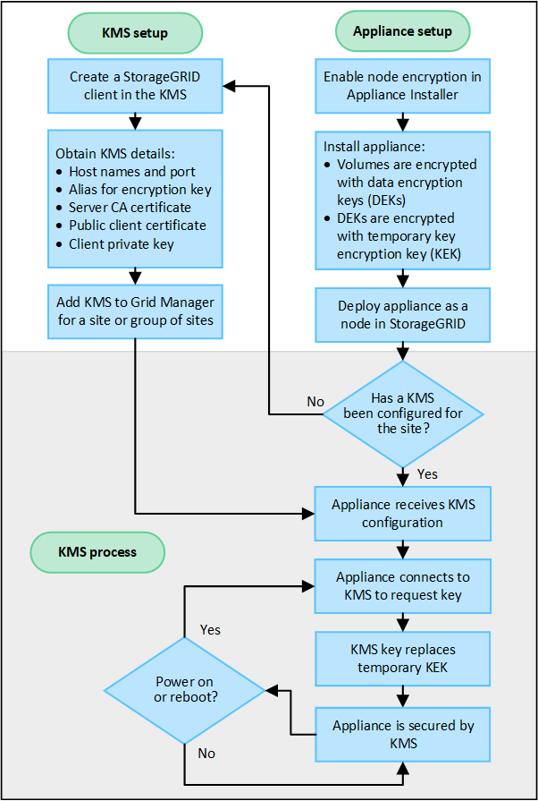

= KMS und Appliance-Konfiguration
:allow-uri-read: 
:icons: font
:imagesdir: ../media/

[role="lead"]
Bevor der Verschlüsselungsmanagement-Server (KMS) die StorageGRID-Daten auf Appliance-Nodes sichern kann, müssen zwei Konfigurationsaufgaben durchgeführt werden: Ein oder mehrere KMS-Server einrichten und die Node-Verschlüsselung für die Appliance-Nodes aktivieren. Wenn diese beiden Konfigurationsaufgaben abgeschlossen sind, erfolgt automatisch der Verschlüsselungsmanagementprozess.

Das Flussdiagramm zeigt die grundlegenden Schritte bei der Verwendung eines KMS zur Sicherung von StorageGRID-Daten auf Appliance-Nodes.

Das Flussdiagramm zeigt die parallele Einrichtung von KMS und die Einrichtung der Appliance. Sie können jedoch die Verschlüsselungsmanagement-Server je nach Ihren Anforderungen vor oder nach Aktivierung der Node-Verschlüsselung für neue Appliance-Nodes einrichten.

== Einrichten des Verschlüsselungsmanagement-Servers (KMS)

Die Einrichtung eines Schlüsselverwaltungsservers umfasst die folgenden grundlegenden Schritte.

[cols="1a,1a"]
|===
| Schritt | Siehe 

 a| 
Greifen Sie auf die KMS-Software zu und fügen Sie jedem KMS- oder KMS-Cluster einen Client für StorageGRID hinzu.
 a| 
link:kms-configuring-storagegrid-as-client.html["Konfigurieren Sie StorageGRID als Client im KMS"]

 a| 
Erhalten Sie die erforderlichen Informationen für den StorageGRID-Client auf dem KMS.
 a| 
link:kms-configuring-storagegrid-as-client.html["Konfigurieren Sie StorageGRID als Client im KMS"]

 a| 
Fügen Sie den KMS dem Grid Manager hinzu, weisen Sie ihn einer einzelnen Site oder einer Standardgruppe von Standorten zu, laden Sie die erforderlichen Zertifikate hoch und speichern Sie die KMS-Konfiguration.
 a| 
link:kms-adding.html["Hinzufügen eines Verschlüsselungsmanagement-Servers (KMS)"]

|===

== Richten Sie das Gerät ein

Die Einrichtung eines Appliance-Nodes für die KMS-Nutzung umfasst die folgenden grundlegenden Schritte.

. Verwenden Sie während der Hardware-Konfigurationsphase der Appliance-Installation das Installationsprogramm von StorageGRID Appliance, um die Einstellung *Node-Verschlüsselung* für die Appliance zu aktivieren.
+

NOTE: Sie können die Einstellung *Node Encryption* nicht aktivieren, nachdem eine Appliance zum Grid hinzugefügt wurde, und Sie können keine externe Schlüsselverwaltung für Geräte verwenden, für die keine Knotenverschlüsselung aktiviert ist.

. Führen Sie das Installationsprogramm für die StorageGRID-Appliance aus. Während der Installation wird jedem Appliance-Volume ein zufälliger Datenverschlüsselungsschlüssel (random Data Encryption Key, DEK) zugewiesen:
+
** Die DEKs werden verwendet, um die Daten auf jedem Volume zu verschlüsseln. Diese Schlüssel werden mit der Linux Unified Key Setup (LUKS)-Festplattenverschlüsselung im Betriebssystem der Appliance generiert und können nicht geändert werden.
** Jede einzelne DEK wird durch einen Master Key Encryption Key (KEK) verschlüsselt. Bei der ersten KEK handelt es sich um einen temporären Schlüssel, der die DEKs verschlüsselt, bis das Gerät eine Verbindung mit dem KMS herstellen kann.

. Fügen Sie den Appliance-Node StorageGRID hinzu.

Weitere Informationen finden Sie unter https://docs.netapp.com/us-en/storagegrid-appliances/installconfig/optional-enabling-node-encryption.html["Aktivieren Sie die Node-Verschlüsselung"^].

== Verschlüsselungsmanagementprozess (wird automatisch durchgeführt)

Die Verschlüsselung des Verschlüsselungsmanagement umfasst die folgenden grundlegenden Schritte, die automatisch durchgeführt werden.

. Wenn Sie eine Appliance installieren, bei der die Node-Verschlüsselung im Grid aktiviert ist, bestimmt StorageGRID, ob für den Standort, der den neuen Node enthält, eine KMS-Konfiguration vorhanden ist.
+
** Wenn bereits ein KMS für den Standort konfiguriert wurde, erhält die Appliance die KMS-Konfiguration.
** Wenn ein KMS für den Standort noch nicht konfiguriert wurde, werden die Daten auf der Appliance weiterhin durch die temporäre KEK verschlüsselt, bis Sie einen KMS für den Standort konfigurieren und die Appliance die KMS-Konfiguration erhält.

. Die Appliance verwendet die KMS-Konfiguration, um eine Verbindung zum KMS herzustellen und einen Verschlüsselungsschlüssel anzufordern.
. Der KMS sendet einen Verschlüsselungsschlüssel an die Appliance. Der neue Schlüssel des KMS ersetzt die temporäre KEK und wird nun zur Verschlüsselung und Entschlüsselung der DEKs für die Appliance-Volumes verwendet.
+

CAUTION: Alle Daten, die vor der Verbindung des verschlüsselten Appliance-Nodes mit dem konfigurierten KMS vorhanden sind, werden mit einem temporären Schlüssel verschlüsselt. Die Appliance-Volumes sollten jedoch erst dann als vor Entfernung aus dem Datacenter geschützt betrachtet werden, wenn der temporäre Schlüssel durch den KMS-Schlüssel ersetzt wird.

. Wenn die Appliance eingeschaltet oder neu gestartet wird, stellt sie eine Verbindung zum KMS her, um den Schlüssel anzufordern. Der Schlüssel, der im flüchtigen Speicher gespeichert ist, kann einen Stromausfall oder einen Neustart nicht überleben.

