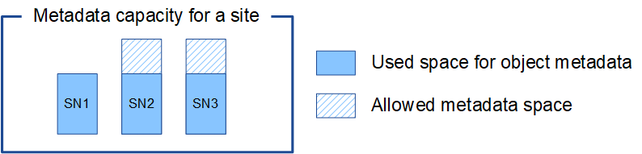

= Management von Objekt-Metadaten-Storage
:allow-uri-read: 
:icons: font
:imagesdir: ../media/

[role="lead"]
Die Kapazität der Objektmetadaten eines StorageGRID Systems steuert die maximale Anzahl an Objekten, die auf diesem System gespeichert werden können. Um sicherzustellen, dass Ihr StorageGRID System über ausreichend Platz zum Speichern neuer Objekte verfügt, müssen Sie wissen, wo und wie StorageGRID Objekt-Metadaten speichert.

== Was sind Objekt-Metadaten?

Objektmetadaten sind alle Informationen, die ein Objekt beschreiben. StorageGRID verwendet Objektmetadaten, um die Standorte aller Objekte im Grid zu verfolgen und den Lebenszyklus eines jeden Objekts mit der Zeit zu managen.

Für ein Objekt in StorageGRID enthalten die Objektmetadaten die folgenden Informationstypen:

* Systemmetadaten, einschließlich einer eindeutigen ID für jedes Objekt (UUID), des Objektnamens, des Namens des S3-Buckets, des Namens oder der ID des Mandantenkontos, der logischen Größe des Objekts, des Datums und der Uhrzeit, zu der das Objekt zum ersten Mal erstellt wurde sowie des Datums und der Uhrzeit, zu der das Objekt zuletzt geändert wurde.
* Alle mit dem Objekt verknüpften Schlüssel-Wert-Paare für benutzerdefinierte Benutzer-Metadaten.
* Bei S3-Objekten sind alle dem Objekt zugeordneten Objekt-Tag-Schlüsselwert-Paare enthalten.
* Der aktuelle Storage-Standort jeder Kopie für replizierte Objektkopien
* Für Objektkopien mit Erasure-Coding-Verfahren wird der aktuelle Speicherort der einzelnen Fragmente gespeichert.
* Bei Objektkopien in einem Cloud Storage Pool befindet sich der Speicherort des Objekts, einschließlich des Namens des externen Buckets und der eindeutigen Kennung des Objekts.
* Für segmentierte Objekte und mehrteilige Objekte, Segment-IDs und Datengrößen.

== Wie werden Objekt-Metadaten gespeichert?

StorageGRID speichert Objektmetadaten in einer Cassandra-Datenbank, die unabhängig von Objektdaten gespeichert werden. Um Redundanz zu gewährleisten und Objekt-Metadaten vor Verlust zu schützen, speichert StorageGRID drei Kopien der Metadaten für alle Objekte im System an jedem Standort.

Diese Abbildung zeigt die Speicherknoten an zwei Standorten. Jeder Standort verfügt über die gleiche Menge an Objektmetadaten. Die Metadaten jedes Standorts werden unter alle Storage-Nodes an diesem Standort unterteilt.

image::../media/metadata_space_across_sites.png[Metadatenspeicherplatz Über Mehrere Standorte Hinweg]

== Wo werden Objekt-Metadaten gespeichert?

Diese Abbildung zeigt die Storage Volumes für einen einzelnen Storage-Node.

image::../media/metadata_space_storage_node.png[Metadaten-Speicherplatz-Storage-Node]

Wie in der Abbildung dargestellt, reserviert StorageGRID Speicherplatz für Objekt-Metadaten auf dem Storage Volume 0 jedes Storage-Nodes. Sie verwendet den reservierten Speicherplatz zum Speichern von Objektmetadaten und zum Ausführen wichtiger Datenbankvorgänge. Alle übrigen Speicherplatz auf dem Storage Volume 0 und allen anderen Storage Volumes im Storage Node werden ausschließlich für Objektdaten (replizierte Kopien und nach Datenkonsistenz) verwendet.

Der Speicherplatz, der für Objektmetadaten auf einem bestimmten Storage Node reserviert ist, hängt von mehreren Faktoren ab, die im Folgenden beschrieben werden.

== Einstellung für reservierten Speicherplatz für Metadaten

Die Einstellung „_Metadata reserved space_“ ist eine systemweite Einstellung, die den Speicherplatz darstellt, der für Metadaten auf Volume 0 jedes Storage-Node reserviert wird. Wie in der Tabelle gezeigt, basiert der Standardwert dieser Einstellung auf:

* Die Softwareversion, die Sie bei der Erstinstallation von StorageGRID verwendet haben.
* Die RAM-Menge auf jedem Storage-Node.

[cols="1a,1a,1a"]
|===
| Für die Erstinstallation von StorageGRID verwendete Version | RAM-Größe auf Speicherknoten | Standardeinstellung für reservierten Speicherplatz für Metadaten 

 a| 
11,5 bis 12,0
 a| 
128 GB oder mehr auf jedem Storage-Node im Grid
 a| 
8 TB (8,000 GB)

 a| 
 a| 
Weniger als 128 GB auf jedem Storage-Node im Grid
 a| 
3 TB (3,000 GB)

 a| 
11.1 bis 11.4
 a| 
128 GB oder mehr auf jedem Speicherknoten an einem beliebigen Standort
 a| 
4 TB (4,000 GB)

 a| 
 a| 
Weniger als 128 GB auf jedem Speicherknoten an jedem Standort
 a| 
3 TB (3,000 GB)

 a| 
11.0 oder früher
 a| 
Beliebiger Betrag
 a| 
2 TB (2,000 GB)

|===

=== Zeigen Sie die Einstellung für den reservierten Speicherplatz für Metadaten an

Befolgen Sie diese Schritte, um die Einstellung für den reservierten Speicherplatz für Metadaten für Ihr StorageGRID-System anzuzeigen.

.Schritte
. Wählen Sie *Konfiguration* > *System* > *Speichereinstellungen*.
. Erweitern Sie auf der Seite Speichereinstellungen den Abschnitt *reservierter Speicherplatz für Metadaten*.

Bei StorageGRID 11.8 oder höher muss der Wert für den reservierten Speicherplatz für Metadaten mindestens 100 GB und nicht mehr als 1 PB betragen.

Die Standardeinstellung für eine neue StorageGRID 11.6 oder höher-Installation, bei der jeder Speicherknoten mindestens 128 GB RAM hat, beträgt 8,000 GB (8 TB).

== Tatsächlich reservierter Speicherplatz für Metadaten

Im Gegensatz zur Einstellung des systemweiten reservierten Speicherplatzes für Metadaten wird für jeden Storage Node der _tatsächliche reservierte Speicherplatz_ für Objektmetadaten ermittelt. Der tatsächlich für Metadaten reservierte Speicherplatz hängt bei jedem Storage-Node von der Größe von Volume 0 für den Node und der Einstellung des für Metadaten reservierten Speicherplatzes für das gesamte System ab.

[cols="1a,1a"]
|===
| Größe von Volume 0 für den Node | Tatsächlich reservierter Speicherplatz für Metadaten 

 a| 
Weniger als 500 GB (nicht in der Produktion)
 a| 
10% des Volumens 0

 a| 
500 GB oder mehr + oder + nur Metadaten-Speicher-Nodes
 a| 
Die kleineren Werte:

* Band 0
* Einstellung für reservierten Speicherplatz für Metadaten

*Hinweis*: Nur ein Rangedb ist für Metadaten-only Storage Nodes erforderlich.

|===

=== Zeigen Sie den tatsächlich reservierten Speicherplatz für Metadaten an

Führen Sie die folgenden Schritte aus, um den tatsächlich reservierten Speicherplatz für Metadaten auf einem bestimmten Storage-Node anzuzeigen.

.Schritte
. Wählen Sie im Grid Manager *Knoten* > *_Speicherknoten_*.
. Wählen Sie die Registerkarte *Storage* aus.
. Setzen Sie den Cursor auf das Diagramm Speicher verwendet - Objekt Metadaten und suchen Sie den Wert *tatsächlich reserviert*.
+
image::../media/storage_used_object_metadata_actual_reserved.png[Verwendeter Speicher - Objektmetadaten - Ist Reserviert]

Im Screenshot beträgt der *tatsächliche reservierte* Wert 8 TB. Dieser Screenshot ist für einen großen Speicherknoten in einer neuen StorageGRID 11.6 Installation. Da die Einstellung für den systemweiten reservierten Speicherplatz für Metadaten für diesen Storage-Node kleiner ist als Volume 0, entspricht der tatsächlich reservierte Speicherplatz für diesen Node der Einstellung für den reservierten Speicherplatz für Metadaten.

=== Beispiel für den tatsächlich reservierten Metadatenspeicherplatz

Angenommen, Sie installieren ein neues StorageGRID System mit Version 11.7 oder höher. Nehmen Sie in diesem Beispiel an, dass jeder Speicherknoten mehr als 128 GB RAM und dieses Volume 0 von Speicherknoten 1 (SN1) 6 TB hat. Basierend auf diesen Werten:

* Der systemweite *Metadaten-reservierte Speicherplatz* ist auf 8 TB eingestellt. (Dies ist der Standardwert für eine neue StorageGRID 11.6-Installation oder höher, wenn jeder Speicherknoten mehr als 128 GB RAM hat.)
* Der tatsächlich reservierte Speicherplatz für Metadaten von SN1 beträgt 6 TB. (Das gesamte Volume ist reserviert, da Volume 0 kleiner ist als die Einstellung *Metadata reserved space*.)

== Zulässiger Metadatenspeicherplatz

Der tatsächlich reservierte Speicherplatz jedes Storage-Node für Metadaten wird in den Speicherplatz für Objekt-Metadaten (den „ _zulässigen Metadatenspeicherplatz_“) und den Platzbedarf für wichtige Datenbankvorgänge (wie Data-Compaction und Reparatur) sowie zukünftige Hardware- und Software-Upgrades unterteilt. Der zulässige Metadatenspeicherplatz bestimmt die gesamte Objektkapazität.

image::../media/metadata_allowed_space_volume_0.png[Platz für Volume 0 durch Metadaten zulässig]

Die folgende Tabelle zeigt, wie StorageGRID den *zulässigen Metadatenspeicherplatz* für verschiedene Storage-Nodes berechnet, basierend auf der Speichermenge für den Node und dem tatsächlich reservierten Speicherplatz für Metadaten.

[cols="1a,1a,2a,2a"]
|===

 a| 
 a| 
 a| 
*Speichermenge auf Speicherknoten*

 a| 
 a| 
 a| 
&Lt; 128 GB
 a| 
>= 128 GB

 a| 
*Tatsächlich reservierter Platz für Metadaten*
 a| 
&Lt;= 4 TB
 a| 
60 % des tatsächlich reservierten Speicherplatzes für Metadaten maximal 1.32 TB
 a| 
60 % des tatsächlich reservierten Speicherplatzes für Metadaten maximal 1.98 TB

 a| 
> 4 TB
 a| 
(Tatsächlicher reservierter Speicherplatz für Metadaten − 1 TB) × 60 %, bis zu einem Maximum von 1.32 TB
 a| 
(Tatsächlicher reservierter Speicherplatz für Metadaten − 1 TB) × 60 %, bis zu einem Maximum von 3.96 TB

|===

=== Zeigen Sie den zulässigen Metadatenbereich an

Führen Sie die folgenden Schritte aus, um den zulässigen Metadatenspeicher für einen Storage-Node anzuzeigen.

.Schritte
. Wählen Sie im Grid Manager *Knoten* aus.
. Wählen Sie den Speicherknoten aus.
. Wählen Sie die Registerkarte *Storage* aus.
. Setzen Sie den Cursor auf das Diagramm Speicher verwendet - Objekt Metadaten und suchen Sie den Wert *erlaubt*.
+
image::../media/storage_used_object_metadata_allowed.png[Verwendeter Speicher - Objekt-Metadaten - Zulässig]

Im Screenshot ist der *allowed*-Wert 3.96 TB, was der Maximalwert für einen Storage Node ist, dessen tatsächlicher reservierter Speicherplatz für Metadaten mehr als 4 TB beträgt.

Der *zulässige*-Wert entspricht dieser Prometheus-Metrik:

`storagegrid_storage_utilization_metadata_allowed_bytes`

== Beispiel für zulässigen Metadatenspeicherplatz

Angenommen, Sie installieren ein StorageGRID System mit Version 11.6. Nehmen Sie in diesem Beispiel an, dass jeder Speicherknoten mehr als 128 GB RAM und dieses Volume 0 von Speicherknoten 1 (SN1) 6 TB hat. Basierend auf diesen Werten:

* Der systemweite *Metadaten-reservierte Speicherplatz* ist auf 8 TB eingestellt. (Dies ist der Standardwert für StorageGRID 11.6 oder höher, wenn jeder Speicher-Node mehr als 128 GB RAM hat.)
* Der tatsächlich reservierte Speicherplatz für Metadaten von SN1 beträgt 6 TB. (Das gesamte Volume ist reserviert, da Volume 0 kleiner ist als die Einstellung *Metadata reserved space*.)
* Der erlaubte Platz für Metadaten auf SN1 ist 3 TB, basierend auf der Berechnung in der gezeigt <<table-allowed-space-for-metadata,Tabelle für zulässigem Speicherplatz für Metadaten>>: (tatsächlich reservierter Speicherplatz für Metadaten − 1 TB) × 60%, bis zu einem Maximum von 3.96 TB.

== Storage-Nodes unterschiedlicher Größen beeinflussen die Objektkapazität

Wie oben beschrieben, verteilt StorageGRID Objektmetadaten gleichmäßig über Storage-Nodes an jedem Standort. Wenn ein Standort Storage-Nodes unterschiedlicher Größen enthält, bestimmt der kleinste Node am Standort die Metadaten-Kapazität des Standorts.

Beispiel:

* Sie haben ein Raster mit drei Storage Nodes unterschiedlicher Größe an einem einzigen Standort.
* Die Einstellung *Metadaten reservierter Speicherplatz* beträgt 4 TB.
* Die Storage-Nodes haben die folgenden Werte für den tatsächlich reservierten Metadatenspeicherplatz und den zulässigen Metadatenspeicherplatz.
+
[cols="1a,1a,1a,1a"]
|===
| Storage-Node | Größe von Volumen 0 | Tatsächlich reservierter Metadatenspeicherplatz | Zulässiger Metadatenspeicherplatz 

 a| 
SN1
 a| 
2,2TB
 a| 
2,2TB
 a| 
1,32TB

 a| 
SN2
 a| 
5TB
 a| 
4TB
 a| 
1,98TB

 a| 
SN3
 a| 
6TB
 a| 
4TB
 a| 
1,98TB

|===

Da Objektmetadaten gleichmäßig auf die Storage-Nodes an einem Standort verteilt werden, kann jeder Node in diesem Beispiel nur 1.32 TB Metadaten enthalten. Die zusätzlichen 0.66 TB an erlaubten Metadaten für SN2 und SN3 können nicht verwendet werden.

Da StorageGRID alle Objektmetadaten für ein StorageGRID System an jedem Standort speichert, wird die Gesamtkapazität der Metadaten eines StorageGRID Systems durch die Objektmetadaten des kleinsten Standorts bestimmt.

Und da die Objektmetadaten die maximale Objektanzahl steuern, wenn einem Node die Metadatenkapazität ausgeht, ist das Grid effektiv voll.

.Verwandte Informationen
* Informationen zum Überwachen der Objektmetadatenkapazität für jeden Speicher-Node finden Sie in den Anweisungen für link:../monitor/index.html["Monitoring von StorageGRID"].
* Um die Objektmetadatenkapazität Ihres Systems durch Hinzufügen neuer Storage-Nodes zu erhöhenlink:../expand/index.html["Erweitern Sie ein Raster"].

