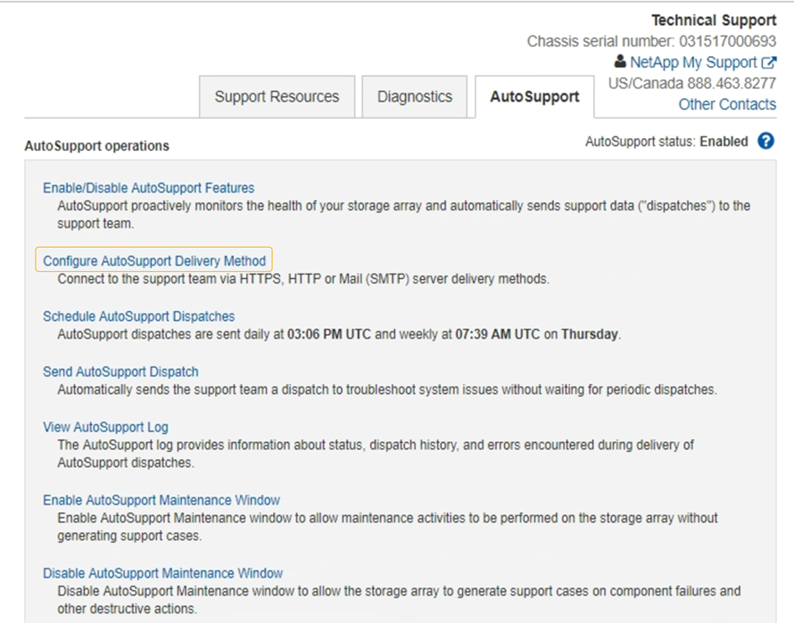

= Senden Sie E-Series AutoSupport-Pakete über StorageGRID
:allow-uri-read: 
:icons: font
:imagesdir: ../media/

[role="lead"]
Sie können AutoSupport-Pakete für den E-Series SANtricity System Manager über einen StorageGRID-Administratorknoten anstatt über den Management-Port der Storage Appliance an den technischen Support senden.

Unter finden https://docs.netapp.com/us-en/e-series-santricity/sm-support/autosupport-feature-overview.html["E-Series Hardware AutoSupport"^] Sie weitere Informationen zur Verwendung von AutoSupport mit E-Series Appliances.

.Bevor Sie beginnen
* Sie sind mit einem beim Grid-Manager angemeldetlink:../admin/web-browser-requirements.html["Unterstützter Webbrowser"].
* Sie haben die link:admin-group-permissions.html["Zugriffsberechtigung für den Administrator der Storage-Appliance oder den Root-Zugriff"].
* Sie haben SANtricity AutoSupport konfiguriert:
+
** Für SG6000 und SG5700 Appliances, https://docs.netapp.com/us-en/storagegrid-appliances/installconfig/accessing-and-configuring-santricity-system-manager.html["Konfigurieren Sie AutoSupport in SANtricity System Manager"^]

NOTE: Sie müssen über SANtricity-Firmware 8.70 oder höher verfügen, um mit dem Grid Manager auf SANtricity System Manager zuzugreifen.

.Über diese Aufgabe
Die AutoSupport-Pakete der E-Series enthalten Details zur Storage Hardware und sind spezifischer als andere AutoSupport-Pakete, die vom StorageGRID System gesendet werden.

Sie können eine spezielle Proxy-Server-Adresse im SANtricity-System-Manager konfigurieren, um AutoSupport-Pakete über einen StorageGRID-Admin-Knoten ohne Verwendung des Management-Ports der Appliance zu übertragen. AutoSupport-Pakete, die auf diese Weise übertragen werdenlink:../primer/what-admin-node-is.html["Administratorknoten des bevorzugten Absenders"], werden von der gesendet und verwenden allelink:../admin/configuring-admin-proxy-settings.html["Administrator-Proxy-Einstellungen"], die im Grid-Manager konfiguriert wurden.

NOTE: Dieses Verfahren gilt nur für die Konfiguration eines StorageGRID-Proxyservers für E-Series AutoSupport-Pakete. Weitere Informationen zur AutoSupport Konfiguration der E-Series finden Sie im https://docs.netapp.com/us-en/e-series-family/index.html["NetApp E-Series und SANtricity Dokumentation"^].

.Schritte
. Wählen Sie im Grid Manager *Knoten* aus.
. Wählen Sie in der Liste der Knoten links den Speicher-Appliance-Node aus, den Sie konfigurieren möchten.
. Wählen Sie *SANtricity System Manager*.
+
Die Startseite von SANtricity System Manager wird angezeigt.

+
image::../media/autosupport_santricity_home_page.png[Startseite von AutoSupport SANtricity]

. Wählen Sie *Support* > *Supportcenter* > * AutoSupport*.
+
Die Seite AutoSupport-Vorgänge wird angezeigt.

+

. Wählen Sie *AutoSupport-Bereitstellungsmethode konfigurieren*.
+
Die Seite AutoSupport-Bereitstellungsmethode konfigurieren wird angezeigt.

+
image::../media/autosupport_configure_delivery_santricity.png[AutoSupport konfigurieren AutoSupport-Bereitstellungsmethode SANtricity]

. Wählen Sie *HTTPS* für die Liefermethode aus.
+

NOTE: Das Zertifikat, das HTTPS aktiviert, ist vorinstalliert.

. Wählen Sie *über Proxy-Server*.
. Geben Sie für die *Host-Adresse* ein `tunnel-host`.
+
`tunnel-host` Ist die besondere Adresse, an die Sie einen Admin-Node zum Senden von E-Series AutoSupport-Paketen verwenden können.

. Geben Sie für die *Portnummer* ein `10225`.
+
`10225` Ist die Portnummer auf dem StorageGRID-Proxyserver, der AutoSupport-Pakete vom E-Series Controller der Appliance empfängt.

. Wählen Sie *Testkonfiguration* aus, um die Routing- und Konfigurationseinstellungen Ihres AutoSupport Proxy-Servers zu testen.
+
Wenn Sie richtig sind, wird in einem grünen Banner die Meldung „Ihre AutoSupport-Konfiguration wurde überprüft“ angezeigt.

+
Wenn der Test fehlschlägt, wird eine Fehlermeldung in einem roten Banner angezeigt. Überprüfen Sie Ihre StorageGRID-DNS-Einstellungen und Netzwerk, stellen Sie sicher, dass der link:../primer/what-admin-node-is.html["Administratorknoten des bevorzugten Absenders"]eine Verbindung zur NetApp-Supportwebsite herstellen kann, und versuchen Sie den Test erneut.

. Wählen Sie *Speichern*.
+
Die Konfiguration wird gespeichert, und es wird eine Bestätigungsmeldung angezeigt: „AutoSupport-Bereitstellungsmethode wurde konfiguriert.“

