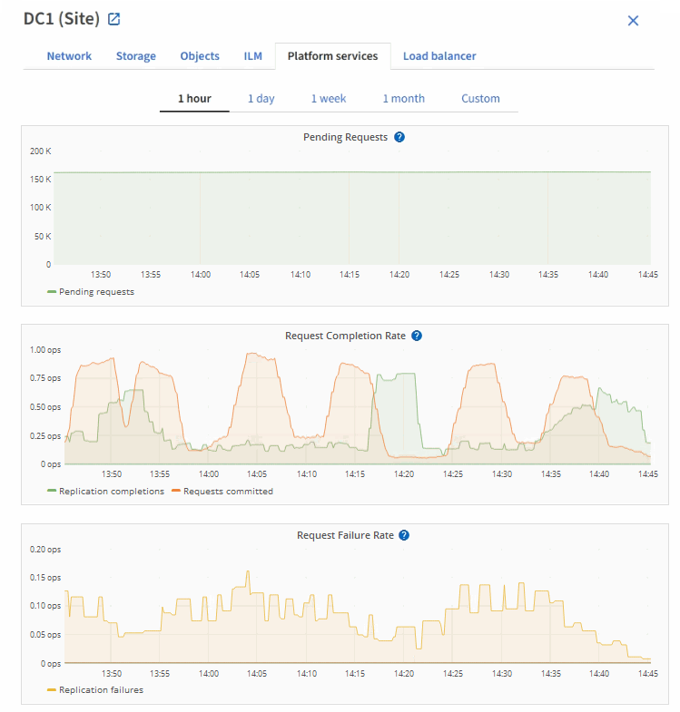

= Fehlerbehebung bei Plattform-Services
:allow-uri-read: 
:icons: font
:imagesdir: ../media/

[role="lead"]
Die in Plattform-Services verwendeten Endpunkte werden von Mandantenbenutzern im Mandanten-Manager erstellt und gewartet. Falls jedoch Probleme bei der Konfiguration oder Verwendung von Plattformservices bei einem Mandanten auftreten, können Sie das Problem mithilfe des Grid Manager beheben.

== Probleme mit neuen Endpunkten

Bevor ein Mandant Plattform-Services nutzen kann, muss er mithilfe des Mandanten-Manager einen oder mehrere Endpunkte erstellen. Jeder Endpunkt ist ein externes Ziel für einen Plattformservice, z. B. einen StorageGRID S3-Bucket, einen Amazon Web Services-Bucket, ein Thema „Amazon Simple Notification Service“, ein Kafka-Thema oder ein Elasticsearch-Cluster, das lokal oder in AWS gehostet wird. Jeder Endpunkt umfasst sowohl den Standort der externen Ressource als auch die für den Zugriff auf diese Ressource erforderlichen Zugangsdaten.

Wenn ein Mandant einen Endpunkt erstellt, überprüft das StorageGRID System, ob der Endpunkt vorhanden ist und ob er mit den angegebenen Zugangsdaten erreicht werden kann. Die Verbindung zum Endpunkt wird von einem Node an jedem Standort validiert.

Wenn die Endpoint-Validierung fehlschlägt, erklärt eine Fehlermeldung, warum die Endpoint-Validierung fehlgeschlagen ist. Der Mandantenbenutzer sollte das Problem lösen, und versuchen Sie dann erneut, den Endpunkt zu erstellen.

NOTE: Die Erstellung von Endpunkten schlägt fehl, wenn Plattformdienste für das Mandantenkonto nicht aktiviert sind.

== Probleme mit vorhandenen Endpunkten

Wenn ein Fehler auftritt, wenn StorageGRID versucht, einen vorhandenen Endpunkt zu erreichen, wird im Mandantenmanager eine Meldung auf dem Dashboard angezeigt.

image::../media/tenant_dashboard_endpoint_error.png[endpunktfehlermeldung auf dem Dashboard]

Mandantenbenutzer können auf der Seite Endpunkte die aktuellste Fehlermeldung für jeden Endpunkt lesen und herausfinden, wie lange der Fehler bereits aufgetreten ist. Die Spalte *Letzter Fehler* zeigt die aktuellste Fehlermeldung für jeden Endpunkt an und gibt an, wie lange der Fehler aufgetreten ist. Fehler, die das  Symbol enthaltenimage:../media/icon_alert_red_critical.png["Rotes X-Symbol"], traten innerhalb der letzten 7 Tage auf.

image::../media/endpoints_last_error.png[Screenshot der Seite Endpoints mit der Spalte Letzter Fehler]

NOTE: Einige Fehlermeldungen in der Spalte *Letzter Fehler* können eine LOGID in Klammern enthalten. Ein Grid-Administrator oder technischer Support kann diese ID verwenden, um ausführlichere Informationen über den Fehler im bycast.log zu finden.

== Probleme im Zusammenhang mit Proxy-Servern

Wenn Sie ein  zwischen Storage-Nodes und Plattform-Service-Endpunkten konfiguriert habenlink:configuring-storage-proxy-settings.html["Storage-Proxy"], können Fehler auftreten, wenn Ihr Proxy-Service keine Meldungen von StorageGRID zulässt. Um diese Probleme zu beheben, überprüfen Sie die Einstellungen Ihres Proxy-Servers, um sicherzustellen, dass keine Nachrichten im Zusammenhang mit dem Plattformdienst blockiert werden.

== Ermitteln Sie, ob ein Fehler aufgetreten ist

Wenn in den letzten 7 Tagen Endpunktfehler aufgetreten sind, zeigt das Dashboard im Tenant Manager eine Warnmeldung an. Sie können die Seite Endpoints aufrufen, um weitere Details über den Fehler zu sehen.

== Client-Betrieb schlägt fehl

Einige Probleme bei Plattform-Services können zum Ausfall von Client-Operationen auf dem S3-Bucket führen. Beispielsweise schlägt der S3-Client-Betrieb fehl, wenn der interne RSM-Service (Replicated State Machine) ausfällt oder es zu viele Plattformservices-Nachrichten in Warteschlange für die Lieferung gibt.

So überprüfen Sie den Status der Dienste:

. Wählen Sie *SUPPORT* > *Tools* > *Grid-Topologie* aus.
. Wählen Sie *_site_* > *_Storage Node_* > *SSM* > *Services* aus.

== Behebbare und nicht wiederherstellbare Endpunktfehler

Nach der Erstellung von Endpunkten können Fehler bei Plattformservice-Anfragen aus verschiedenen Gründen auftreten. Einige Fehler lassen sich durch Benutzereingriffe wiederherstellen. Beispielsweise können behebbare Fehler aus den folgenden Gründen auftreten:

* Die Anmeldedaten des Benutzers wurden gelöscht oder abgelaufen.
* Der Ziel-Bucket ist nicht vorhanden.
* Die Benachrichtigung kann nicht zugestellt werden.

Wenn bei StorageGRID ein wiederherstellbarer Fehler auftritt, wird die Serviceanfrage für die Plattform erneut versucht, bis sie erfolgreich ist.

Andere Fehler können nicht behoben werden. Beispielsweise tritt ein nicht behebbarer Fehler auf, wenn der Endpunkt gelöscht wird.

Wenn bei StorageGRID ein nicht behebbarer Endpunktfehler auftritt:

* Rufen Sie im Grid Manager *Support* > *Tools* > *Metrics* > *Grafana* > *Platform Services Overview* auf, um Fehlerdetails anzuzeigen.
* Gehen Sie im Tenant Manager zu *STORAGE (S3)* > *Platform Services Endpoints*, um die Fehlerdetails anzuzeigen.
* Prüfen Sie die `/var/local/log/bycast-err.log` auf zugehörige Fehler. Storage-Nodes mit dem ADC-Dienst enthalten diese Protokolldatei.

== Nachrichten zu Plattform-Services können nicht bereitgestellt werden

Wenn im Ziel ein Problem auftritt, das verhindert, dass Plattformdienste-Meldungen akzeptiert werden, wird der Client-Vorgang auf dem Bucket erfolgreich ausgeführt, die Plattform-Services-Meldung wird jedoch nicht geliefert. Dieser Fehler kann z. B. auftreten, wenn die Anmeldeinformationen auf dem Ziel aktualisiert werden, sodass sich StorageGRID nicht mehr beim Ziel-Service authentifizieren kann.

Prüfen Sie, ob entsprechende Warnmeldungen vorhanden sind.

== Langsamere Performance für Plattform-Service-Anfragen

StorageGRID kann eingehende S3-Anfragen für einen Bucket drosseln, wenn die Rate, mit der die Anforderungen gesendet werden, die Rate übersteigt, mit der der Zielendpunkt die Anforderungen empfangen kann. Eine Drosselung tritt nur auf, wenn ein Rückstand von Anfragen besteht, die auf den Zielendpunkt warten.

Der einzige sichtbare Effekt besteht darin, dass die eingehenden S3-Anforderungen länger in Anspruch nehmen. Wenn Sie die Performance deutlich schlechter erkennen, sollten Sie die Aufnahmerate reduzieren oder einen Endpunkt mit höherer Kapazität verwenden. Falls der Rückstand von Anforderungen weiterhin wächst, scheitern Client-S3-Vorgänge (wie Z. B. PUT-Anforderungen) letztendlich.

CloudMirror-Anforderungen sind wahrscheinlicher von der Performance des Zielendpunkts betroffen, da diese Anfragen in der Regel mehr Datentransfer beinhalten als Anfragen zur Suchintegration oder Ereignisbenachrichtigung.

== Plattformdienstanfragen schlagen fehl

So zeigen Sie die Ausfallrate der Anfrage für Plattformdienste an:

. Wählen Sie *KNOTEN*.
. Wählen Sie *_site_* > *Platform Services*.
. Zeigen Sie das Diagramm Fehlerrate anfordern an.
+

== Plattformdienste – Warnung nicht verfügbar

Die Warnmeldung *Platform Services nicht verfügbar* zeigt an, dass an einem Standort keine Plattformservicevorgänge ausgeführt werden können, da zu wenige Speicherknoten mit dem RSM-Dienst ausgeführt oder verfügbar sind.

Der RSM-Dienst stellt sicher, dass Plattformserviceanforderungen an die jeweiligen Endpunkte gesendet werden.

Um diese Warnmeldung zu beheben, legen Sie fest, welche Speicherknoten am Standort den RSM-Service enthalten. (Der RSM-Dienst ist auf Storage Nodes vorhanden, die auch den ADC-Dienst enthalten.) Stellen Sie dann sicher, dass eine einfache Mehrheit dieser Storage-Nodes ausgeführt und verfügbar ist.

NOTE: Wenn mehr als ein Speicherknoten, der den RSM-Dienst enthält, an einem Standort ausfällt, verlieren Sie alle ausstehenden Plattformserviceanforderungen für diesen Standort.

== Zusätzliche Anleitung zur Fehlerbehebung für Endpunkte von Plattformservices

Weitere Informationen finden Sie unter link:../tenant/troubleshooting-platform-services-endpoint-errors.html["Verwenden Sie ein Mandantenkonto > Troubleshooting der Endpunkte für Plattformservices"].

.Verwandte Informationen
link:../troubleshoot/index.html["Fehlerbehebung für das StorageGRID-System"]
