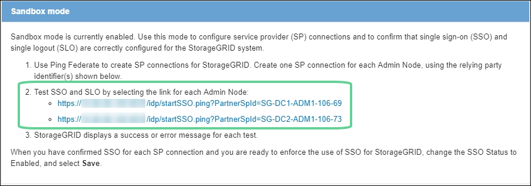

= Verwenden Sie den Sandbox-Modus
:allow-uri-read: 
:icons: font
:imagesdir: ../media/

[role="lead"]
Sie können den Sandbox-Modus verwenden, um Single Sign-On (SSO) zu konfigurieren und zu testen, bevor Sie es für alle StorageGRID-Benutzer aktivieren. Nachdem SSO aktiviert wurde, können Sie jederzeit wieder in den Sandbox-Modus wechseln, wenn Sie die Konfiguration ändern oder erneut testen müssen.

.Bevor Sie beginnen
* Sie sind im Grid Manager mit einem angemeldetlink:../admin/web-browser-requirements.html["Unterstützter Webbrowser"].
* Sie haben die link:admin-group-permissions.html["Root-Zugriffsberechtigung"].
* Sie haben eine Identitätsföderation für Ihr StorageGRID System konfiguriert.
* Für die Identitätsföderation *LDAP-Diensttyp* haben Sie entweder Active Directory oder Azure ausgewählt, basierend auf dem SSO-Identitäts-Provider, den Sie verwenden möchten.
+
[cols="1a,1a"]
|===
| Konfigurierter LDAP-Servicetyp | Optionen für SSO-Identitätsanbieter 

 a| 
Active Directory
 a| 
** Active Directory
** Azure
** PingFederate

 a| 
Azure
 a| 
Azure

|===

.Über diese Aufgabe
Wenn SSO aktiviert ist und ein Benutzer versucht, sich bei einem Admin-Node anzumelden, sendet StorageGRID eine Authentifizierungsanforderung an den SSO-Identitäts-Provider. Der SSO-Identitäts-Provider sendet wiederum eine Authentifizierungsantwort zurück an StorageGRID, die angibt, ob die Authentifizierungsanforderung erfolgreich war. Für erfolgreiche Anfragen:

* Die Antwort von Active Directory oder PingFederate enthält eine Universally Unique Identifier (UUID) für den Benutzer.
* Die Antwort von Azure umfasst einen User Principal Name (UPN).

Damit StorageGRID (der Service-Provider) und der SSO-Identitäts-Provider sicher über Benutzerauthentifizierungsanforderungen kommunizieren können, müssen Sie bestimmte Einstellungen in StorageGRID konfigurieren. Als Nächstes müssen Sie die Software des SSO-Identitätsanbieters verwenden, um für jeden Admin-Node ein Vertrauensverhältnis (AD FS), eine Enterprise-Applikation (Azure) oder einen Serviceprovider (PingFederate) zu erstellen. Abschließend müssen Sie zu StorageGRID zurückkehren, um SSO zu aktivieren.

Im Sandbox-Modus ist es einfach, diese Rückkehrkonfiguration durchzuführen und alle Einstellungen zu testen, bevor Sie SSO aktivieren. Wenn Sie den Sandbox-Modus verwenden, können sich Benutzer nicht mit SSO anmelden.

== Zugriff auf den Sandbox-Modus

.Schritte
. Wählen Sie *KONFIGURATION* > *Zugriffskontrolle* > *Single Sign-On*.
+
Die Seite Single Sign-On wird angezeigt, wobei die Option *deaktiviertes* ausgewählt ist.

+
image::../media/sso_status_disabled.png[Single Sign-on-Seite mit deaktiviertem SSO-Status]

+

NOTE: Wenn die SSO-Statusoptionen nicht angezeigt werden, vergewissern Sie sich, dass Sie den Identitätsanbieter als föderierte Identitätsquelle konfiguriert haben. Siehe link:requirements-for-sso.html["Voraussetzungen und Überlegungen für Single Sign-On"].

. Wählen Sie *Sandbox-Modus*.
+
Der Abschnitt „Identitätsanbieter“ wird angezeigt.

== Geben Sie die Daten des Identitätsanbieters ein

.Schritte
. Wählen Sie aus der Dropdown-Liste den *SSO-Typ* aus.
. Füllen Sie die Felder im Abschnitt Identitäts-Provider basierend auf dem von Ihnen ausgewählten SSO-Typ aus.
+
[role="tabbed-block"]
====
.Active Directory
--
.. Geben Sie den *Federationsdienstnamen* für den Identitätsanbieter ein, genau wie er im Active Directory Federation Service (AD FS) angezeigt wird.
+

NOTE: Um den Namen des Föderationsdienstes zu finden, gehen Sie zu Windows Server Manager. Wählen Sie *Tools* > *AD FS Management*. Wählen Sie im Menü Aktion die Option *Eigenschaften des Föderationsdienstes bearbeiten* aus. Der Name des Föderationsdienstes wird im zweiten Feld angezeigt.

.. Geben Sie an, welches TLS-Zertifikat zur Sicherung der Verbindung verwendet wird, wenn der Identitäts-Provider SSO-Konfigurationsinformationen als Antwort auf StorageGRID-Anforderungen sendet.
+
*** *Verwenden Sie das Betriebssystem CA-Zertifikat*: Verwenden Sie das auf dem Betriebssystem installierte Standard-CA-Zertifikat, um die Verbindung zu sichern.
*** *Benutzerdefiniertes CA-Zertifikat verwenden*: Verwenden Sie ein benutzerdefiniertes CA-Zertifikat, um die Verbindung zu sichern.
+
Wenn Sie diese Einstellung auswählen, kopieren Sie den Text des benutzerdefinierten Zertifikats und fügen Sie ihn in das Textfeld *CA-Zertifikat* ein.

*** *Verwenden Sie keine TLS*: Verwenden Sie kein TLS-Zertifikat, um die Verbindung zu sichern.
+

CAUTION: Wenn Sie das Zertifizierungsstellenzertifikat ändern, führen Sie sofort link:../maintain/starting-or-restarting-service.html["Starten Sie den Management-API-Service auf den Admin-Nodes neu"]eine erfolgreiche SSO-Prüfung im Grid Manager durch.

.. Geben Sie im Abschnitt „Einvertrauende Partei“ die *bezeichner der bevertrauenden Partei* für StorageGRID an. Dieser Wert steuert den Namen, den Sie für jedes Vertrauen der betreffenden Partei in AD FS verwenden.
+
*** Wenn Ihr Grid beispielsweise nur über einen Admin-Knoten verfügt und Sie in Zukunft nicht mehr Admin-Knoten hinzufügen möchten, geben Sie `SG` oder `StorageGRID`ein.
*** Wenn Ihr Raster mehr als einen Admin-Knoten enthält, fügen Sie die Zeichenfolge `[HOSTNAME]` in die Kennung ein.  `SG-[HOSTNAME]`Beispiel: . Dadurch wird eine Tabelle erstellt, die die ID der betreffenden Partei für jeden Admin-Knoten in Ihrem System anhand des Hostnamen des Knotens anzeigt.
+
image::../media/sso_status_sandbox_mode_active_directory.png[Single Sign On,Sandbox mode enabled,Relying party identifiers shown for several Admin Nodes]

+

NOTE: Sie müssen für jeden Admin-Knoten in Ihrem StorageGRID-System ein Vertrauensverhältnis aufbauen. Mit einer Vertrauensbasis für jeden Admin-Knoten wird sichergestellt, dass Benutzer sich sicher bei und aus jedem Admin-Knoten anmelden können.

.. Wählen Sie *Speichern*.
+
Ein grünes Häkchen wird für einige Sekunden auf der Schaltfläche *Speichern* angezeigt.

+
image::../media/save_button_green_checkmark.gif[Schaltfläche „Speichern“ mit einem grünen Häkchen]

--
.Azure
--
.. Geben Sie an, welches TLS-Zertifikat zur Sicherung der Verbindung verwendet wird, wenn der Identitäts-Provider SSO-Konfigurationsinformationen als Antwort auf StorageGRID-Anforderungen sendet.
+
*** *Verwenden Sie das Betriebssystem CA-Zertifikat*: Verwenden Sie das auf dem Betriebssystem installierte Standard-CA-Zertifikat, um die Verbindung zu sichern.
*** *Benutzerdefiniertes CA-Zertifikat verwenden*: Verwenden Sie ein benutzerdefiniertes CA-Zertifikat, um die Verbindung zu sichern.
+
Wenn Sie diese Einstellung auswählen, kopieren Sie den Text des benutzerdefinierten Zertifikats und fügen Sie ihn in das Textfeld *CA-Zertifikat* ein.

*** *Verwenden Sie keine TLS*: Verwenden Sie kein TLS-Zertifikat, um die Verbindung zu sichern.
+

CAUTION: Wenn Sie das Zertifizierungsstellenzertifikat ändern, führen Sie sofort link:../maintain/starting-or-restarting-service.html["Starten Sie den Management-API-Service auf den Admin-Nodes neu"]eine erfolgreiche SSO-Prüfung im Grid Manager durch.

.. Geben Sie im Abschnitt Enterprise-Anwendung den *Enterprise-Anwendungsnamen* für StorageGRID an. Dieser Wert steuert den Namen, den Sie für die einzelnen Enterprise-Applikationen in Azure AD verwenden.
+
*** Wenn Ihr Grid beispielsweise nur über einen Admin-Knoten verfügt und Sie in Zukunft nicht mehr Admin-Knoten hinzufügen möchten, geben Sie `SG` oder `StorageGRID`ein.
*** Wenn Ihr Raster mehr als einen Admin-Knoten enthält, fügen Sie die Zeichenfolge `[HOSTNAME]` in die Kennung ein.  `SG-[HOSTNAME]`Beispiel: . Dadurch wird eine Tabelle mit dem Namen einer Enterprise-Anwendung für jeden Admin-Knoten in Ihrem System generiert, basierend auf dem Hostnamen des Knotens.
+
image::../media/sso_status_sandbox_mode_azure.png[Single Sign On,Sandbox mode enabled,Relying party identifiers shown for several Admin Nodes]

+

NOTE: Sie müssen eine Enterprise-Anwendung für jeden Admin-Knoten in Ihrem StorageGRID-System erstellen. Mit einer Enterprise-Anwendung für jeden Admin-Node wird sichergestellt, dass Benutzer sich sicher bei und aus jedem Admin-Node anmelden können.

.. Führen Sie die Schritte unter link:../admin/creating-enterprise-application-azure.html["Erstellen von Enterprise-Applikationen in Azure AD"]aus, um für jeden in der Tabelle aufgeführten Admin-Node eine Unternehmensanwendungen zu erstellen.
.. Kopieren Sie in Azure AD die Federungs-Metadaten-URL für jede Enterprise-Applikation. Fügen Sie dann diese URL in das entsprechende Feld *Federation Metadaten URL* in StorageGRID ein.
.. Nachdem Sie eine URL für die Federation Metadaten für alle Administratorknoten kopiert und eingefügt haben, wählen Sie *Speichern*.
+
Ein grünes Häkchen wird für einige Sekunden auf der Schaltfläche *Speichern* angezeigt.

+
image::../media/save_button_green_checkmark.gif[Schaltfläche „Speichern“ mit einem grünen Häkchen]

--
.PingFederate
--
.. Geben Sie an, welches TLS-Zertifikat zur Sicherung der Verbindung verwendet wird, wenn der Identitäts-Provider SSO-Konfigurationsinformationen als Antwort auf StorageGRID-Anforderungen sendet.
+
*** *Verwenden Sie das Betriebssystem CA-Zertifikat*: Verwenden Sie das auf dem Betriebssystem installierte Standard-CA-Zertifikat, um die Verbindung zu sichern.
*** *Benutzerdefiniertes CA-Zertifikat verwenden*: Verwenden Sie ein benutzerdefiniertes CA-Zertifikat, um die Verbindung zu sichern.
+
Wenn Sie diese Einstellung auswählen, kopieren Sie den Text des benutzerdefinierten Zertifikats und fügen Sie ihn in das Textfeld *CA-Zertifikat* ein.

*** *Verwenden Sie keine TLS*: Verwenden Sie kein TLS-Zertifikat, um die Verbindung zu sichern.
+

CAUTION: Wenn Sie das Zertifizierungsstellenzertifikat ändern, führen Sie sofort link:../maintain/starting-or-restarting-service.html["Starten Sie den Management-API-Service auf den Admin-Nodes neu"]eine erfolgreiche SSO-Prüfung im Grid Manager durch.

.. Geben Sie im Abschnitt Dienstanbieter (SP) die *SP-Verbindungs-ID* für StorageGRID an. Dieser Wert steuert den Namen, den Sie für jede SP-Verbindung in PingFederate verwenden.
+
*** Wenn Ihr Grid beispielsweise nur über einen Admin-Knoten verfügt und Sie in Zukunft nicht mehr Admin-Knoten hinzufügen möchten, geben Sie `SG` oder `StorageGRID`ein.
*** Wenn Ihr Raster mehr als einen Admin-Knoten enthält, fügen Sie die Zeichenfolge `[HOSTNAME]` in die Kennung ein.  `SG-[HOSTNAME]`Beispiel: . Dadurch wird basierend auf dem Hostnamen des Node eine Tabelle mit der SP-Verbindungs-ID für jeden Admin-Node im System generiert.
+
image::../media/sso_status_sandbox_mode_ping_federated.png[Single Sign On,Sandbox mode enabled,Relying party identifiers shown for several Admin Nodes]

+

NOTE: Sie müssen für jeden Admin-Knoten in Ihrem StorageGRID-System eine SP-Verbindung erstellen. Durch eine SP-Verbindung für jeden Admin-Node wird sichergestellt, dass Benutzer sich sicher bei und aus jedem Admin-Node anmelden können.

.. Geben Sie im Feld *Federation Metadaten-URL* die URL der Federation Metadaten für jeden Admin-Node an.
+
Verwenden Sie das folgende Format:

+
[listing]
----
https://<Federation Service Name>:<port>/pf/federation_metadata.ping?PartnerSpId=<SP Connection ID>
----
.. Wählen Sie *Speichern*.
+
Ein grünes Häkchen wird für einige Sekunden auf der Schaltfläche *Speichern* angezeigt.

+
image::../media/save_button_green_checkmark.gif[Schaltfläche „Speichern“ mit einem grünen Häkchen]

--
====

== Konfigurieren Sie Vertrauensstellungen von Drittanbietern, Unternehmensanwendungen oder SP-Verbindungen

Wenn die Konfiguration gespeichert ist, wird die Bestätigungsmeldung des Sandbox-Modus angezeigt. Dieser Hinweis bestätigt, dass der Sandbox-Modus jetzt aktiviert ist und eine Übersicht enthält.

StorageGRID kann so lange wie erforderlich im Sandbox-Modus verbleiben. Wenn jedoch *Sandbox-Modus* auf der Single Sign-On-Seite ausgewählt ist, ist SSO für alle StorageGRID-Benutzer deaktiviert. Nur lokale Benutzer können sich anmelden.

Führen Sie diese Schritte aus, um Trusts (Active Directory) von Vertrauensstellen (Vertrauensstellen), vollständige Enterprise-Applikationen (Azure) zu konfigurieren oder SP-Verbindungen (PingFederate) zu konfigurieren.

[role="tabbed-block"]
====
.Active Directory
--
.Schritte
. Wechseln Sie zu Active Directory Federation Services (AD FS).
. Erstellen Sie eine oder mehrere Treuhänder für StorageGRID, die sich auf der StorageGRID Single Sign-On-Seite in der Tabelle befinden.
+
Sie müssen für jeden in der Tabelle aufgeführten Admin-Node ein Vertrauen erstellen.

+
Anweisungen hierzu finden Sie unter link:../admin/creating-relying-party-trusts-in-ad-fs.html["Erstellen Sie Vertrauensstellungen von vertrauenswürdigen Parteien in AD FS"].

--
.Azure
--
.Schritte
. Wählen Sie auf der Seite Single Sign-On für den Admin-Node, bei dem Sie sich aktuell angemeldet haben, die Schaltfläche zum Herunterladen und Speichern der SAML-Metadaten aus.
. Wiederholen Sie dann für alle anderen Admin-Knoten in Ihrem Raster die folgenden Schritte:
+
.. Melden Sie sich beim Knoten an.
.. Wählen Sie *KONFIGURATION* > *Zugriffskontrolle* > *Single Sign-On*.
.. Laden Sie die SAML-Metadaten für diesen Node herunter, und speichern Sie sie.

. Wechseln Sie zum Azure-Portal.
. Befolgen Sie die Schritte inlink:../admin/creating-enterprise-application-azure.html["Erstellen von Enterprise-Applikationen in Azure AD"], um die SAML-Metadatendatei für jeden Admin-Node in die entsprechende Azure-Unternehmensanwendung hochzuladen.

--
.PingFederate
--
.Schritte
. Wählen Sie auf der Seite Single Sign-On für den Admin-Node, bei dem Sie sich aktuell angemeldet haben, die Schaltfläche zum Herunterladen und Speichern der SAML-Metadaten aus.
. Wiederholen Sie dann für alle anderen Admin-Knoten in Ihrem Raster die folgenden Schritte:
+
.. Melden Sie sich beim Knoten an.
.. Wählen Sie *KONFIGURATION* > *Zugriffskontrolle* > *Single Sign-On*.
.. Laden Sie die SAML-Metadaten für diesen Node herunter, und speichern Sie sie.

. Fahren Sie zur PingFederate.
. link:../admin/creating-sp-connection-ping.html["Erstellen Sie eine oder mehrere SP-Verbindungen (Service-Provider) für StorageGRID"]. Verwenden Sie die SP-Verbindungs-ID für jeden Admin-Node (siehe Tabelle auf der Seite StorageGRID Single Sign-On) und die SAML-Metadaten, die Sie für diesen Admin-Node heruntergeladen haben.
+
Für jeden in der Tabelle aufgeführten Admin-Node müssen Sie eine SP-Verbindung erstellen.

--
====

== Testen Sie SSO-Verbindungen

Bevor Sie die Verwendung von Single Sign-On für Ihr gesamtes StorageGRID-System erzwingen, sollten Sie bestätigen, dass Single Sign-On und Single Logout für jeden Admin-Knoten korrekt konfiguriert sind.

[role="tabbed-block"]
====
.Active Directory
--
.Schritte
. Suchen Sie auf der StorageGRID Single Sign-On-Seite den Link in der Meldung Sandbox-Modus.
+
Die URL wird aus dem Wert abgeleitet, den Sie im Feld *Federation Service Name* eingegeben haben.

+
image::../media/sso_sandbox_mode_url.gif[URL für die Anmeldeseite des Identitätsanbieters]

. Wählen Sie den Link aus, oder kopieren Sie die URL in einen Browser, um auf die Anmeldeseite Ihres Identitätsanbieters zuzugreifen.
. Um zu bestätigen, dass Sie SSO zur Anmeldung bei StorageGRID verwenden können, wählen Sie *Anmelden bei einer der folgenden Sites*, wählen Sie die bevertrauenden Partei-ID für Ihren primären Admin-Knoten und wählen Sie *Anmelden*.
+
image::../media/sso_sandbox_mode_testing.gif[Testen Sie die Vertrauensstellungen von Drittanbietern im SSO-Sandbox-Modus]

. Geben Sie Ihren föderierten Benutzernamen und Ihr Kennwort ein.
+
** Wenn die SSO-Anmelde- und -Abmeldevorgänge erfolgreich sind, wird eine Erfolgsmeldung angezeigt.
+
image::../media/sso_sandbox_mode_sign_in_success.gif[SSO-Authentifizierung und Meldung zum Abmeldung des Testerfolgs]

** Wenn der SSO-Vorgang nicht erfolgreich ist, wird eine Fehlermeldung angezeigt. Beheben Sie das Problem, löschen Sie die Cookies des Browsers, und versuchen Sie es erneut.

. Wiederholen Sie diese Schritte, um die SSO-Verbindung für jeden Admin-Node in Ihrem Raster zu überprüfen.

--
.Azure
--
.Schritte
. Wechseln Sie im Azure-Portal zur Seite Single Sign On.
. Wählen Sie *Diese Anwendung testen*.
. Geben Sie die Anmeldeinformationen eines föderierten Benutzers ein.
+
** Wenn die SSO-Anmelde- und -Abmeldevorgänge erfolgreich sind, wird eine Erfolgsmeldung angezeigt.
+
image::../media/sso_sandbox_mode_sign_in_success.gif[SSO-Authentifizierung und Meldung zum Abmeldung des Testerfolgs]

** Wenn der SSO-Vorgang nicht erfolgreich ist, wird eine Fehlermeldung angezeigt. Beheben Sie das Problem, löschen Sie die Cookies des Browsers, und versuchen Sie es erneut.

. Wiederholen Sie diese Schritte, um die SSO-Verbindung für jeden Admin-Node in Ihrem Raster zu überprüfen.

--
.PingFederate
--
.Schritte
. Wählen Sie auf der StorageGRID-Seite Single Sign-On den ersten Link in der Meldung Sandbox-Modus aus.
+
Wählen Sie jeweils einen Link aus, und testen Sie ihn.

+

. Geben Sie die Anmeldeinformationen eines föderierten Benutzers ein.
+
** Wenn die SSO-Anmelde- und -Abmeldevorgänge erfolgreich sind, wird eine Erfolgsmeldung angezeigt.
+
image::../media/sso_sandbox_mode_sign_in_success.gif[SSO-Authentifizierung und Meldung zum Abmeldung des Testerfolgs]

** Wenn der SSO-Vorgang nicht erfolgreich ist, wird eine Fehlermeldung angezeigt. Beheben Sie das Problem, löschen Sie die Cookies des Browsers, und versuchen Sie es erneut.

. Wählen Sie den nächsten Link aus, um die SSO-Verbindung für jeden Admin-Node in Ihrem Raster zu überprüfen.
+
Wenn eine Nachricht mit abgelaufener Seite angezeigt wird, wählen Sie in Ihrem Browser die Schaltfläche *Zurück* aus, und senden Sie Ihre Anmeldedaten erneut.

--
====

== Aktivieren Sie Single Sign On

Wenn Sie bestätigt haben, dass Sie sich mit SSO bei jedem Admin-Node anmelden können, können Sie SSO für Ihr gesamtes StorageGRID System aktivieren.

TIP: Wenn SSO aktiviert ist, müssen alle Benutzer SSO verwenden, um auf den Grid Manager, den Mandanten-Manager, die Grid-Management-API und die Mandanten-Management-API zuzugreifen. Lokale Benutzer können nicht mehr auf StorageGRID zugreifen.

.Schritte
. Wählen Sie *KONFIGURATION* > *Zugriffskontrolle* > *Single Sign-On*.
. Ändern Sie den SSO-Status in *aktiviert*.
. Wählen Sie *Speichern*.
. Überprüfen Sie die Warnmeldung, und wählen Sie *OK*.
+
Single Sign-On ist jetzt aktiviert.

TIP: Wenn Sie das Azure-Portal verwenden und über denselben Computer auf StorageGRID zugreifen, mit dem Sie auf Azure zugreifen, stellen Sie sicher, dass der Azure-Portal-Benutzer auch ein autorisierter StorageGRID-Benutzer ist (ein Benutzer in einer föderierten Gruppe, die in StorageGRID importiert wurde). Oder melden Sie sich vom Azure-Portal ab, bevor Sie sich bei StorageGRID anmelden.
