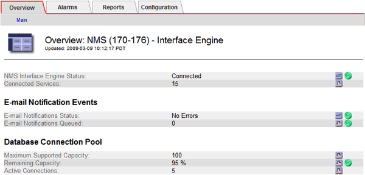

= Benachrichtigungsstatus und -Warteschlangen anzeigen
:allow-uri-read: 
:icons: font
:imagesdir: ../media/

[role="lead"]
Der NMS-Dienst (Network Management System) auf Admin Nodes sendet Benachrichtigungen an den Mail-Server. Sie können den Status des NMS-Dienstes und die Größe seiner Benachrichtigungswarteschlange auf der Seite Interface Engine anzeigen.

Um auf die Seite Interface Engine zuzugreifen, wählen Sie *SUPPORT* > *Tools* > *Grid-Topologie*. Wählen Sie dann *_site_* > *_Admin Node_* > *NMS* > *Interface Engine*.

Das System sendet nacheinander Benachrichtigungen in der Reihenfolge, in der sie ausgelöst werden.

Wenn ein Problem auftritt, z. B. ein Netzwerkverbindungsfehler, und der Mailserver nicht verfügbar ist, versucht das System erneut, eine Benachrichtigung für 60 Sekunden zu senden. Wenn die Benachrichtigung nicht nach 60 Sekunden gesendet wird, wird die Benachrichtigung vom System aus der Warteschlange entfernt und versucht, die nächste zu senden.
