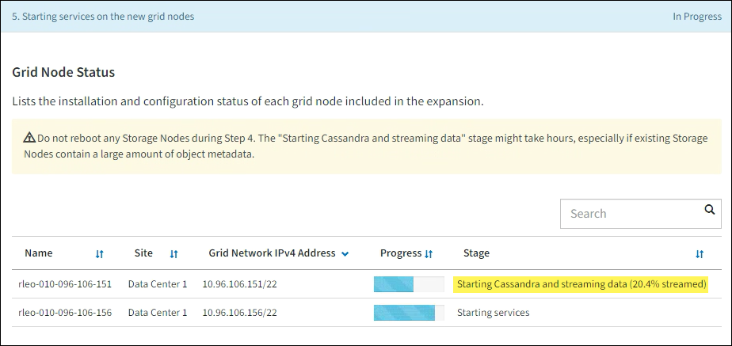

= Erweiterung durchführen
:allow-uri-read: 
:icons: font
:imagesdir: ../media/

[role="lead"]
Wenn die Erweiterung durchgeführt wird, werden die neuen Grid-Nodes zu Ihrer bestehenden StorageGRID Implementierung hinzugefügt.

.Bevor Sie beginnen
* Sie sind im Grid Manager mit einem angemeldetlink:../admin/web-browser-requirements.html["Unterstützter Webbrowser"].
* Sie haben die Provisionierungs-Passphrase.
* Sie haben alle Grid-Nodes implementiert, die in dieser Erweiterung hinzugefügt werden.
* Sie haben die link:../admin/admin-group-permissions.html["Berechtigung für Wartung oder Root-Zugriff"].
* Beim Hinzufügen von Speicherknoten haben Sie bestätigt, dass alle Datenreparaturvorgänge im Rahmen einer Wiederherstellung abgeschlossen sind. Siehe link:../maintain/checking-data-repair-jobs.html["Prüfen Sie die Reparatur von Daten"].
* Wenn Sie Storage-Nodes hinzufügen und diesen Knoten eine benutzerdefinierte Speicherklasse zuweisen möchten, haben Sie bereits link:../ilm/creating-and-assigning-storage-grades.html["Individuelle Storage-Klasse wurde erstellt"]. Außerdem verfügen Sie entweder über die Root-Zugriffsberechtigung oder über die Wartungs- und ILM-Berechtigungen.
* Wenn Sie einen neuen Standort hinzufügen, haben Sie die ILM-Regeln geprüft und aktualisiert. Sie müssen sicherstellen, dass Objektkopien erst nach Abschluss der Erweiterung am neuen Standort gespeichert werden. Wenn beispielsweise eine Regel den Standardspeicherpool (*Alle Storage-Nodes*) verwendet, müssen Sie link:../ilm/creating-storage-pool.html["Erstellen Sie einen neuen Speicherpool"]nur die vorhandenen Storage-Nodes und die ILM-Richtlinie enthaltenlink:../ilm/working-with-ilm-rules-and-ilm-policies.html["Aktualisieren Sie die ILM-Regeln"], um diesen neuen Speicherpool zu verwenden. Andernfalls werden Objekte auf den neuen Standort kopiert, sobald der erste Node an diesem Standort aktiv ist.

.Über diese Aufgabe
Die Durchführung der Erweiterung umfasst folgende Hauptaufgaben:

. Konfigurieren Sie die Erweiterung.
. Starten Sie die Erweiterung.
. Laden Sie eine neue Wiederherstellungspaket-Datei herunter.
. Überwachen Sie die Erweiterungsschritte und -Stufen, bis alle neuen Knoten installiert und konfiguriert sind und alle Dienste gestartet sind.
+

CAUTION: Einige Erweiterungsschritte und -Phasen können eine erhebliche Zeit in Anspruch nehmen, um auf einem großen Grid ausgeführt zu werden. Das Streaming von Cassandra auf einen neuen Storage-Node kann beispielsweise nur wenige Minuten dauern, wenn die Cassandra-Datenbank leer ist. Wenn die Cassandra-Datenbank jedoch eine große Menge an Objekt-Metadaten enthält, kann diese Phase mehrere Stunden oder länger dauern. Starten Sie keine Storage-Nodes während der Phasen „erweitern des Cassandra-Clusters“ oder „Starten von Cassandra und Streaming-Daten“ neu.

.Schritte
. Wählen Sie *MAINTENANCE* > *Tasks* > *Expansion*.
+
Die Seite Rastererweiterung wird angezeigt. Im Abschnitt Ausstehende Knoten werden die Knoten aufgeführt, die zum Hinzufügen bereit sind.

+
image::../media/grid_expansion_page.png[Screenshot mit der Seite „Rastererweiterung“]

. Wählen Sie *Erweiterung Konfigurieren*.
+
Das Dialogfeld Standortauswahl wird angezeigt.

. Wählen Sie den Erweiterungstyp aus, den Sie starten:
+
** Wenn Sie eine neue Site hinzufügen, wählen Sie *Neu*, und geben Sie den Namen der neuen Site ein.
** Wenn Sie einen oder mehrere Knoten zu einem bestehenden Standort hinzufügen, wählen Sie *existing* aus.

. Wählen Sie *Speichern*.
. Überprüfen Sie die Liste *Ausstehende Knoten* und vergewissern Sie sich, dass alle von Ihnen bereitgestellten Grid-Knoten angezeigt werden.
+
Bei Bedarf können Sie den Cursor über die MAC-Adresse des *Grid Network* eines Knotens platzieren, um Details zu diesem Knoten anzuzeigen.

+
image::../media/grid_node_details.png[Screenshot mit Grid Node-Details]

+

NOTE: Wenn ein Node fehlt, vergewissern Sie sich, dass er erfolgreich bereitgestellt wurde.

. Genehmigen Sie in der Liste der ausstehenden Knoten die Knoten, die Sie in dieser Erweiterung hinzufügen möchten.
+
.. Aktivieren Sie das Optionsfeld neben dem ersten ausstehenden Rasterknoten, den Sie genehmigen möchten.
.. Wählen Sie *Genehmigen*.
+
Das Konfigurationsformular für den Grid-Node wird angezeigt.

.. Ändern Sie bei Bedarf die allgemeinen Einstellungen:
+
[cols="1a,2a"]
|===
| Feld | Beschreibung 

 a| 
Standort
 a| 
Der Name des Standorts, dem der Grid-Node zugeordnet wird. Wenn Sie mehrere Nodes hinzufügen, vergewissern Sie sich, dass Sie für jeden Node den korrekten Standort auswählen. Wenn Sie einen neuen Standort hinzufügen, werden alle Nodes zum neuen Standort hinzugefügt.

 a| 
Name
 a| 
Der Systemname für den Node. Systemnamen sind für interne StorageGRID-Vorgänge erforderlich und können nicht geändert werden.

 a| 
Storage-Typ (nur Storage Nodes)
 a| 
*** *Daten und Metadaten* ("kombiniert"): Objekt-Daten und Metadaten Speicher-Knoten
*** *Nur Daten*: Storage Node, der nur Objektdaten enthält (keine Metadaten)
*** *Nur Metadaten*: Storage-Node mit nur Metadaten (keine Objektdaten)

 a| 
NTP-Rolle
 a| 
Die Rolle des Network Time Protocol (NTP) des Grid-Node:

*** Wählen Sie *automatisch* (Standard), um dem Knoten automatisch die NTP-Rolle zuzuweisen. Die primäre Rolle wird Admin-Nodes, Storage-Nodes mit ADC-Diensten, Gateway-Nodes und allen Grid-Nodes mit nicht-statischen IP-Adressen zugewiesen. Die Clientrolle wird allen anderen Grid-Knoten zugewiesen.
*** Wählen Sie *Primary*, um dem Knoten die primäre NTP-Rolle manuell zuzuweisen. Mindestens zwei Knoten an jedem Standort sollten über die primäre Rolle verfügen, um einen redundanten Systemzugriff auf externe Zeitquellen zu ermöglichen.
*** Wählen Sie *Client*, um die Client-NTP-Rolle manuell dem Knoten zuzuweisen.

 a| 
ADC-Service (kombinierte oder nur Metadaten-Storage-Nodes)
 a| 
Gibt an, ob dieser Storage Node den Dienst Administrative Domain Controller (ADC) ausführen soll. Der ADC-Dienst verfolgt den Standort und die Verfügbarkeit von Grid-Services. Mindestens drei Storage-Nodes an jedem Standort müssen den ADC-Service enthalten. Sie können den ADC-Dienst nicht zu einem Knoten hinzufügen, nachdem er bereitgestellt wurde.

*** Wählen Sie *Yes* aus, wenn der zu ersetzende Speicher-Node den ADC-Dienst enthält. Da ein Storage Node nicht stillgelegt werden kann, wenn zu wenige ADC-Dienste verbleiben, wird dadurch sichergestellt, dass ein neuer ADC-Service verfügbar ist, bevor der alte Service entfernt wird.
*** Wählen Sie *automatisch*, damit das System bestimmen kann, ob dieser Knoten den ADC-Dienst benötigt.

Erfahren Sie mehr über link:../maintain/understanding-adc-service-quorum.html["ADC-Quorum"].

 a| 
Storage-Klasse (kombiniert oder rein datenrein Storage-Nodes)
 a| 
Verwenden Sie die Speicherklasse *Default*, oder wählen Sie die benutzerdefinierte Speicherklasse aus, die Sie diesem neuen Knoten zuweisen möchten.

Storage-Grade werden von ILM-Speicherpools verwendet. Ihre Auswahl kann sich also darauf auswirken, welche Objekte auf dem Storage Node platziert werden.

|===
.. Ändern Sie bei Bedarf die Einstellungen für das Grid-Netzwerk, das Admin-Netzwerk und das Client-Netzwerk.
+
*** *IPv4-Adresse (CIDR)*: Die CIDR-Netzwerkadresse für die Netzwerkschnittstelle. Zum Beispiel: 172.16.10.100/24
+

NOTE: Wenn Sie feststellen, dass Nodes doppelte IP-Adressen im Grid-Netzwerk aufweisen, während Sie Nodes genehmigen, müssen Sie die Erweiterung abbrechen, die Virtual Machines oder Appliances mit einer nicht doppelten IP neu bereitstellen und die Erweiterung neu starten.

*** *Gateway*: Das Standard-Gateway des Grid-Knotens. Beispiel: 172.16.10.1
*** *Subnetze (CIDR)*: Ein oder mehrere Unternetzwerke für das Admin-Netzwerk.

.. Wählen Sie *Speichern*.
+
Der genehmigte Grid-Node wird in die Liste der genehmigten Nodes verschoben.

+
*** Um die Eigenschaften eines genehmigten Grid-Knotens zu ändern, wählen Sie das entsprechende Optionsfeld aus, und wählen Sie *Bearbeiten*.
*** Um einen genehmigten Rasterknoten zurück in die Liste ausstehender Knoten zu verschieben, wählen Sie dessen Optionsfeld aus und wählen Sie *Zurücksetzen*.
*** Um einen genehmigten Grid-Node dauerhaft zu entfernen, schalten Sie den Node aus. Wählen Sie dann das entsprechende Optionsfeld aus, und wählen Sie *Entfernen*.

.. Wiederholen Sie diese Schritte für jeden ausstehenden Rasterknoten, den Sie genehmigen möchten.
+

NOTE: Wenn möglich, sollten Sie alle ausstehenden Grid-Notizen genehmigen und eine einzelne Erweiterung durchführen. Wenn Sie mehrere kleine Erweiterungen durchführen, ist mehr Zeit erforderlich.

. Wenn Sie alle Grid-Nodes genehmigt haben, geben Sie die *Provisioning-Passphrase* ein, und wählen Sie *Expand*.
+
Nach einigen Minuten wird diese Seite aktualisiert, um den Status des Erweiterungsverfahrens anzuzeigen. Wenn Aufgaben ausgeführt werden, die sich auf einzelne Grid-Knoten auswirken, wird im Abschnitt Grid Node Status der aktuelle Status für jeden Grid-Knoten aufgeführt.

+

NOTE: Während des Schritts „Installation von Grid Nodes“ für eine neue Appliance zeigt der StorageGRID-Appliance-Installer, wie die Installation von Phase 3 auf Phase 4 verschoben und abgeschlossen wird. Wenn Phase 4 abgeschlossen ist, wird der Controller neu gestartet.

+
image::../media/grid_expansion_progress.png[Dieses Bild wird durch den umgebenden Text erläutert.]

+

NOTE: Eine Standorterweiterung umfasst eine zusätzliche Aufgabe zur Konfiguration von Cassandra für den neuen Standort.

. Sobald der Link *Download Recovery Package* angezeigt wird, laden Sie die Recovery Package Datei herunter.
+
Sie müssen eine aktualisierte Kopie der Wiederherstellungspaket-Datei so schnell wie möglich herunterladen, nachdem Grid-Topologieänderungen am StorageGRID-System vorgenommen wurden. Die Recovery Package-Datei ermöglicht es Ihnen, das System wiederherzustellen, wenn ein Fehler auftritt.

+
.. Wählen Sie den Download-Link aus.
.. Geben Sie die Provisionierungs-Passphrase ein, und wählen Sie *Download starten*.
.. Öffnen Sie nach Abschluss des Downloads die `.zip` Datei, und bestätigen Sie, dass Sie auf den Inhalt einschließlich der Datei zugreifen können `Passwords.txt`.
.. Kopieren Sie die heruntergeladene Wiederherstellungspaket-Datei (`.zip`) in zwei sichere und separate Speicherorte.
+

CAUTION: Die Recovery Package-Datei muss gesichert sein, weil sie Verschlüsselungsschlüssel und Passwörter enthält, die zum Abrufen von Daten vom StorageGRID-System verwendet werden können.

. Wenn Sie Storage Nodes zu einem vorhandenen Standort hinzufügen oder einen Standort hinzufügen, überwachen Sie die Cassandra-Phasen, die beim Starten von Services auf den neuen Grid-Nodes auftreten.
+

CAUTION: Starten Sie keine Storage-Nodes während der Phasen „erweitern des Cassandra-Clusters“ oder „Starten von Cassandra und Streaming-Daten“ neu. Diese Phasen dauern möglicherweise für jeden neuen Storage Node viele Stunden, insbesondere dann, wenn vorhandene Storage-Nodes eine große Menge an Objekt-Metadaten enthalten.

+
[role="tabbed-block"]
====
.Speicherknoten Werden Hinzugefügt
--
Wenn Sie Storage Nodes zu einem vorhandenen Standort hinzufügen, überprüfen Sie den Prozentsatz, der in der Statusmeldung „Starten von Cassandra und Streamen von Daten“ angezeigt wird.

Dieser Prozentsatz schätzt, wie vollständig der Cassandra-Streaming-Vorgang ist, basierend auf der Gesamtmenge der verfügbaren Cassandra-Daten und der bereits auf den neuen Node geschriebenen Menge.

--
.Site wird hinzugefügt
--
Wenn Sie eine neue Site hinzufügen, verwenden Sie `nodetool status` diese Option, um den Fortschritt des Cassandra-Streamings zu überwachen und zu sehen, wie viele Metadaten während der Phase „erweitern des Cassandra-Clusters“ auf den neuen Standort kopiert wurden. Die gesamte Datenlast am neuen Standort sollte sich innerhalb von etwa 20 % der Gesamtmenge eines aktuellen Standorts befinden.

--
====
. Fahren Sie mit der Überwachung der Erweiterung fort, bis alle Aufgaben abgeschlossen sind und die Schaltfläche *Erweiterung konfigurieren* erneut angezeigt wird.

.Nachdem Sie fertig sind
Je nachdem, welche Typen von Grid-Nodes Sie hinzugefügt haben, führen Sie weitere Integrations- und Konfigurationsschritte durch. Siehe link:configuring-expanded-storagegrid-system.html["Konfiguration Schritte nach Erweiterung"].
