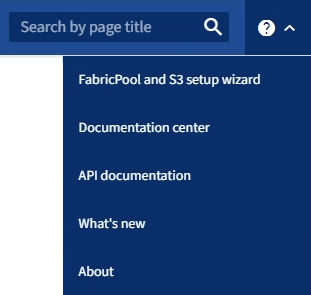

= Öffnen und Abschließen des FabricPool Setup-Assistenten
:allow-uri-read: 
:icons: font
:imagesdir: ../media/

[role="lead"]
Mit dem FabricPool-Einrichtungsassistenten können Sie StorageGRID als Objekt-Storage-System für eine FabricPool Cloud-Tier konfigurieren.

.Bevor Sie beginnen
* Sie haben die  zur Verwendung des FabricPool-Einrichtungsassistenten überprüftlink:../fabricpool/use-fabricpool-setup-wizard.html["Überlegungen und Anforderungen"].
+

NOTE: Wenn Sie StorageGRID für die Verwendung mit einer anderen S3-Client-Anwendung konfigurieren möchten, gehen Sie zu link:../admin/use-s3-setup-wizard.html["Verwenden Sie den S3-Einrichtungsassistenten"].

* Sie haben die link:../admin/admin-group-permissions.html["Root-Zugriffsberechtigung"].

== Greifen Sie auf den Assistenten zu

Sie können den FabricPool-Einrichtungsassistenten abschließen, wenn Sie den StorageGRID Grid-Manager verwenden, oder Sie können den Assistenten zu einem späteren Zeitpunkt aufrufen und abschließen.

.Schritte
. Melden Sie sich mit einem beim Grid-Manager anlink:../admin/web-browser-requirements.html["Unterstützter Webbrowser"].
. Wenn das Banner *FabricPool and S3 Setup Wizard* auf dem Dashboard angezeigt wird, wählen Sie den Link im Banner aus. Wenn das Banner nicht mehr angezeigt wird, wählen Sie in der Kopfzeile des Grid-Managers das Hilfesymbol aus und wählen Sie *FabricPool und S3-Setup-Assistent* aus.
+

. Wählen Sie im Abschnitt FabricPool der Seite mit dem FabricPool- und S3-Setup-Assistenten *Jetzt konfigurieren* aus.
+
*Schritt 1 von 9: Konfigurieren der HA-Gruppe* wird angezeigt.

== Schritt 1 von 9: Konfigurieren Sie die HA-Gruppe

Eine HA-Gruppe (High Availability, Hochverfügbarkeit) ist eine Sammlung von Nodes, die jeweils den StorageGRID Lastausgleich enthalten. Eine HA-Gruppe kann Gateway-Nodes, Admin-Nodes oder beides enthalten.

Sie können eine HA-Gruppe verwenden, um FabricPool-Datenverbindungen verfügbar zu halten. Eine HA-Gruppe verwendet virtuelle IP-Adressen (VIPs), um hochverfügbaren Zugriff auf den Load Balancer-Service zu ermöglichen. Wenn die aktive Schnittstelle in der HA-Gruppe ausfällt, kann eine Backup-Schnittstelle den Workload mit geringen Auswirkungen auf den FabricPool-Betrieb managen

Weitere Informationen zu dieser Aufgabe finden Sie unter link:../admin/managing-high-availability-groups.html["Management von Hochverfügbarkeitsgruppen"] und link:best-practices-for-high-availability-groups.html["Best Practices für Hochverfügbarkeitsgruppen"].

.Schritte
. Wenn Sie einen externen Load Balancer verwenden möchten, müssen Sie keine HA-Gruppe erstellen. Wählen Sie *diesen Schritt überspringen* und gehen Sie zu <<Schritt 2 von 9: Konfigurieren Sie den Load Balancer-Endpunkt>>.
. Um den StorageGRID Load Balancer zu verwenden, erstellen Sie eine neue HA-Gruppe oder verwenden Sie eine vorhandene HA-Gruppe.
+
[role="tabbed-block"]
====
.Erstellen Sie eine HA-Gruppe
--
.. Um eine neue HA-Gruppe zu erstellen, wählen Sie *HA-Gruppe erstellen*.
.. Füllen Sie für den Schritt *Enter Details* die folgenden Felder aus.
+
[cols="1a,3a"]
|===
| Feld | Beschreibung 

 a| 
Name DER HA-Gruppe
 a| 
Ein eindeutiger Anzeigename für diese HA-Gruppe.

 a| 
Beschreibung (optional)
 a| 
Die Beschreibung dieser HA-Gruppe.

|===
.. Wählen Sie im Schritt *Schnittstellen hinzufügen* die Knotenschnittstellen aus, die Sie in dieser HA-Gruppe verwenden möchten.
+
Verwenden Sie die Spaltenüberschriften, um die Zeilen zu sortieren, oder geben Sie einen Suchbegriff ein, um Schnittstellen schneller zu finden.

+
Sie können einen oder mehrere Nodes auswählen, aber Sie können nur eine Schnittstelle für jeden Node auswählen.

.. Bestimmen Sie für den Schritt *priorisiere Schnittstellen* die primäre Schnittstelle und alle Backup-Schnittstellen für diese HA-Gruppe.
+
Ziehen Sie Zeilen, um die Werte in der Spalte *Priority order* zu ändern.

+
Die erste Schnittstelle in der Liste ist die primäre Schnittstelle. Die primäre Schnittstelle ist die aktive Schnittstelle, sofern kein Fehler auftritt.

+
Wenn die HA-Gruppe mehr als eine Schnittstelle enthält und die aktive Schnittstelle ausfällt, werden die virtuellen IP-Adressen (VIP-Adressen) zur ersten Backup-Schnittstelle in der Prioritätsreihenfolge verschoben. Wenn diese Schnittstelle ausfällt, wechseln die VIP-Adressen zur nächsten Backup-Schnittstelle usw. Wenn Ausfälle behoben werden, werden die VIP-Adressen wieder auf die Schnittstelle mit der höchsten Priorität verschoben, die verfügbar ist.

.. Füllen Sie für den Schritt *IP-Adressen eingeben* die folgenden Felder aus.
+
[cols="1a,3a"]
|===
| Feld | Beschreibung 

 a| 
Subnetz-CIDR
 a| 
Die Adresse des VIP-Subnetzes in CIDR Notation&#8212;eine IPv4-Adresse gefolgt von einem Schrägstrich und der Subnetz-Länge (0-32).

Die Netzwerkadresse darf keine Host-Bits festgelegt haben.  `192.16.0.0/22`Beispiel: .

 a| 
Gateway-IP-Adresse (optional)
 a| 
Optional Wenn sich die ONTAP-IP-Adressen, die für den Zugriff auf StorageGRID verwendet werden, nicht im selben Subnetz wie die StorageGRID-VIP-Adressen befinden, geben Sie die IP-Adresse des lokalen StorageGRID-VIP-Gateways ein. Die IP-Adresse des lokalen Gateways muss sich im VIP-Subnetz befinden.

 a| 
Virtuelle IP-Adresse
 a| 
Geben Sie mindestens eine und nicht mehr als zehn VIP-Adressen für die aktive Schnittstelle in der HA-Gruppe ein. Alle VIP-Adressen müssen sich innerhalb des VIP-Subnetzes befinden, und alle müssen gleichzeitig auf der aktiven Schnittstelle aktiv sein.

Mindestens eine Adresse muss IPv4 sein. Optional können Sie weitere IPv4- und IPv6-Adressen angeben.

|===
.. Wählen Sie *HA-Gruppe erstellen* und dann *Fertig stellen*, um zum FabricPool-Setup-Assistenten zurückzukehren.
.. Wählen Sie *Weiter*, um zum Schritt Load Balancer zu gelangen.

--
.Verwenden Sie die vorhandene HA-Gruppe
--
.. Um eine vorhandene HA-Gruppe zu verwenden, wählen Sie den Namen der HA-Gruppe aus der Dropdown-Liste *Select an HA Group* aus.
.. Wählen Sie *Weiter*, um zum Schritt Load Balancer zu gelangen.

--
====

== Schritt 2 von 9: Konfigurieren Sie den Load Balancer-Endpunkt

StorageGRID verwendet einen Load Balancer zum Managen des Workloads von Client-Applikationen wie FabricPool. Load Balancing maximiert Geschwindigkeit und Verbindungskapazität über mehrere Storage Nodes hinweg.

Sie können den StorageGRID Load Balancer-Dienst verwenden, der auf allen Gateway- und Admin-Nodes vorhanden ist, oder eine Verbindung zu einem externen Load Balancer (Drittanbieter) herstellen. Die Verwendung des StorageGRID Load Balancer wird empfohlen.

Weitere Informationen zu dieser Aufgabe finden Sie im Allgemeinen link:../admin/managing-load-balancing.html["Überlegungen zum Lastausgleich"] und im link:best-practices-for-load-balancing.html["Best Practices für Lastausgleich für FabricPool"].

.Schritte
. Wählen oder erstellen Sie einen StorageGRID Load Balancer-Endpunkt oder verwenden Sie einen externen Load Balancer.
+
[role="tabbed-block"]
====
.Endpunkt erstellen
--
.. Wählen Sie *Endpunkt erstellen*.
.. Füllen Sie für den Schritt *Enter Endpoint Details* die folgenden Felder aus.
+
[cols="1a,3a"]
|===
| Feld | Beschreibung 

 a| 
Name
 a| 
Ein beschreibender Name für den Endpunkt.

 a| 
Port
 a| 
Der StorageGRID-Port, den Sie für den Lastausgleich verwenden möchten. Dieses Feld ist für den ersten erstellten Endpunkt standardmäßig auf 10433 eingestellt, Sie können jedoch jeden nicht verwendeten externen Port eingeben. Wenn Sie 80 oder 443 eingeben, wird der Endpunkt nur auf Gateway-Nodes konfiguriert, da diese Ports auf Admin-Nodes reserviert sind.

*Hinweis:* von anderen Netzdiensten verwendete Ports sind nicht erlaubt. Siehe link:../network/internal-grid-node-communications.html["Referenz für Netzwerk-Ports"].

 a| 
Client-Typ
 a| 
Muss *S3* sein.

 a| 
Netzwerkprotokoll
 a| 
Wählen Sie *HTTPS*.

*Hinweis*: Die Kommunikation mit StorageGRID ohne TLS-Verschlüsselung wird unterstützt, aber nicht empfohlen.

|===
.. Geben Sie für den Schritt *Bindungsmodus auswählen* den Bindungsmodus an. Der Bindungsmodus steuert, wie der Zugriff auf den Endpunkt über eine beliebige IP-Adresse oder über spezifische IP-Adressen und Netzwerkschnittstellen erfolgt.
+
[cols="1a,3a"]
|===
| Modus | Beschreibung 

 a| 
Global (Standard)
 a| 
Clients können über die IP-Adresse eines beliebigen Gateway-Node oder Admin-Node, die virtuelle IP-Adresse (VIP) einer beliebigen HA-Gruppe in einem beliebigen Netzwerk oder einen entsprechenden FQDN auf den Endpunkt zugreifen.

Verwenden Sie die *Global*-Einstellung (Standard), es sei denn, Sie müssen die Zugriffsmöglichkeiten dieses Endpunkts einschränken.

 a| 
Virtuelle IPs von HA-Gruppen
 a| 
Clients müssen eine virtuelle IP-Adresse (oder einen entsprechenden FQDN) einer HA-Gruppe verwenden, um auf diesen Endpunkt zuzugreifen.

Endpunkte mit diesem Bindungsmodus können alle dieselbe Portnummer verwenden, solange sich die für die Endpunkte ausgewählten HA-Gruppen nicht überlappen.

 a| 
Node-Schnittstellen
 a| 
Clients müssen die IP-Adressen (oder entsprechende FQDNs) der ausgewählten Knotenschnittstellen verwenden, um auf diesen Endpunkt zuzugreifen.

 a| 
Node-Typ
 a| 
Basierend auf dem von Ihnen ausgewählten Knotentyp müssen Clients entweder die IP-Adresse (oder den entsprechenden FQDN) eines beliebigen Admin-Knotens oder die IP-Adresse (oder den entsprechenden FQDN) eines beliebigen Gateway-Knotens verwenden, um auf diesen Endpunkt zuzugreifen.

|===
.. Wählen Sie für den Schritt *Tenant Access* eine der folgenden Optionen aus:
+
[cols="1a,3a"]
|===
| Feld | Beschreibung 

 a| 
Alle Mandanten zulassen (Standard)
 a| 
Alle Mandantenkonten können diesen Endpunkt verwenden, um auf ihre Buckets zuzugreifen.

*Alle Mandanten zulassen* ist fast immer die geeignete Option für den für FabricPool verwendeten Load Balancer Endpunkt.

Sie müssen diese Option auswählen, wenn Sie den FabricPool-Einrichtungsassistenten für ein neues StorageGRID-System verwenden und noch keine Mandantenkonten erstellt haben.

 a| 
Ausgewählte Mandanten zulassen
 a| 
Nur die ausgewählten Mandantenkonten können diesen Endpunkt für den Zugriff auf ihre Buckets verwenden.

 a| 
Ausgewählte Mandanten blockieren
 a| 
Die ausgewählten Mandantenkonten können diesen Endpunkt nicht für den Zugriff auf ihre Buckets verwenden. Dieser Endpunkt kann von allen anderen Mandanten verwendet werden.

|===
.. Wählen Sie für den Schritt *Zertifikat anhängen* eine der folgenden Optionen aus:
+
[cols="1a,3a"]
|===
| Feld | Beschreibung 

 a| 
Zertifikat hochladen (empfohlen)
 a| 
Verwenden Sie diese Option, um ein CA-signiertes Serverzertifikat, einen privaten Zertifikatschlüssel und ein optionales CA-Paket hochzuladen.

 a| 
Zertifikat wird generiert
 a| 
Verwenden Sie diese Option, um ein selbstsigniertes Zertifikat zu generieren. Einzelheiten dazu finden Sie unterlink:../admin/configuring-load-balancer-endpoints.html["Konfigurieren von Load Balancer-Endpunkten"].

 a| 
StorageGRID S3-Zertifikat verwenden
 a| 
Diese Option ist nur verfügbar, wenn Sie bereits eine benutzerdefinierte Version des globalen StorageGRID-Zertifikats hochgeladen oder generiert haben. Weitere Informationen finden Sie unter link:../admin/configuring-custom-server-certificate-for-storage-node.html["Konfigurieren Sie S3-API-Zertifikate"] .

|===
.. Wählen Sie *Fertig*, um zum FabricPool-Setup-Assistenten zurückzukehren.
.. Wählen Sie *Weiter*, um zum Mandanten- und Bucket-Schritt zu gelangen.

NOTE: Änderungen an einem Endpunktzertifikat können bis zu 15 Minuten dauern, bis sie auf alle Knoten angewendet werden können.

--
.Verwenden Sie den vorhandenen Endpunkt des Load Balancer
--
.. Wählen Sie den Namen eines vorhandenen Endpunkts aus der Dropdown-Liste *Select a Load Balancer Endpoint* aus.
.. Wählen Sie *Weiter*, um zum Mandanten- und Bucket-Schritt zu gelangen.

--
.Externen Load Balancer verwenden
--
.. Füllen Sie die folgenden Felder für den externen Load Balancer aus.
+
[cols="1a,3a"]
|===
| Feld | Beschreibung 

 a| 
FQDN
 a| 
Der vollständig qualifizierte Domänenname (FQDN) des externen Load Balancer.

 a| 
Port
 a| 
Die Portnummer, die FabricPool zur Verbindung mit dem externen Load Balancer verwendet.

 a| 
Zertifikat
 a| 
Kopieren Sie das Serverzertifikat für den externen Load Balancer und fügen Sie es in dieses Feld ein.

|===
.. Wählen Sie *Weiter*, um zum Mandanten- und Bucket-Schritt zu gelangen.

--
====

== Schritt 3 von 9: Mieter und Eimer

Ein Mandant ist eine Einheit, die S3-Applikationen zum Speichern und Abrufen von Objekten in StorageGRID verwenden kann. Jeder Mandant verfügt über eigene Benutzer, Zugriffsschlüssel, Buckets, Objekte und bestimmte Funktionen. Sie müssen einen StorageGRID-Mandanten erstellen, bevor Sie den Bucket erstellen können, den FabricPool verwenden wird.

Ein Bucket ist ein Container, mit dem die Objekte und Objektmetadaten eines Mandanten gespeichert werden können. Obwohl einige Mandanten möglicherweise über mehrere Buckets verfügen, können Sie mit dem Assistenten immer nur einen Mandanten und jeweils nur einen Bucket erstellen oder auswählen. Sie können den Tenant Manager später verwenden, um zusätzliche Buckets hinzuzufügen, die Sie benötigen.

Sie können einen neuen Mandanten und Bucket für die FabricPool-Verwendung erstellen oder einen vorhandenen Mandanten und Bucket auswählen. Wenn Sie einen neuen Mandanten erstellen, erstellt das System automatisch die Zugriffsschlüssel-ID und den geheimen Zugriffsschlüssel für den Root-Benutzer des Mandanten.

Weitere Informationen zu dieser Aufgabe finden Sie unter link:creating-tenant-account-for-fabricpool.html["Erstellen eines Mandantenkontos für FabricPool"] und link:creating-s3-bucket-and-access-key.html["Erstellen eines S3-Buckets und Abrufen eines Zugriffsschlüssels"].

.Schritte
Erstellen Sie einen neuen Mandanten und Bucket oder wählen Sie einen vorhandenen Mandanten aus.

[role="tabbed-block"]
====
.Neuer Mandant und Bucket
--
. Um einen neuen Mandanten und Bucket zu erstellen, geben Sie einen *Tenant Name* ein.  `FabricPool tenant`Beispiel: .
. Definieren Sie den Root-Zugriff für das Mandantenkonto, je nachdem, ob Ihr StorageGRID-System link:../admin/using-identity-federation.html["Identitätsföderation"], link:../admin/how-sso-works.html["Single Sign On (SSO)"]oder beides verwendet.
+
[cols="1a,3a"]
|===
| Option | Tun Sie das 

 a| 
Wenn die Identitätsföderation nicht aktiviert ist
 a| 
Geben Sie das Kennwort an, das beim Anmelden bei der Serviceeinheit als lokaler Root-Benutzer verwendet werden soll.

 a| 
Wenn die Identitätsföderation aktiviert ist
 a| 
.. Wählen Sie eine vorhandene Verbundgruppe aus, um Root-Zugriffsberechtigungen für den Mandanten zu erhalten.
.. Geben Sie optional das Kennwort an, das beim Anmelden bei der Serviceeinheit als lokaler Root-Benutzer verwendet werden soll.

 a| 
Wenn sowohl Identitätsföderation als auch Single Sign-On (SSO) aktiviert sind
 a| 
Wählen Sie eine vorhandene Verbundgruppe aus, um Root-Zugriffsberechtigungen für den Mandanten zu erhalten. Keine lokalen Benutzer können sich anmelden.

|===
. Geben Sie für *Bucket Name* den Namen des Buckets ein, den FabricPool zum Speichern von ONTAP-Daten verwendet.  `fabricpool-bucket`Beispiel: .
+

TIP: Sie können den Bucket-Namen nach dem Erstellen des Buckets nicht ändern.

. Wählen Sie die *Region* für diesen Bucket aus.
+
Verwenden Sie die Standardregion (`us-east-1`), es sei denn, Sie werden zukünftig ILM verwenden, um Objekte basierend auf der Region des Buckets zu filtern.

. Wählen Sie *Erstellen und Fortfahren*, um den Mandanten und den Bucket zu erstellen und zum Datenschritt Download zu gehen

--
.Wählen Sie Mandant und Bucket aus
--
Das vorhandene Mandantenkonto muss über mindestens einen Bucket verfügen, für den die Versionierung nicht aktiviert ist. Sie können kein vorhandenes Mandantenkonto auswählen, wenn für diesen Mandanten kein Bucket vorhanden ist.

. Wählen Sie den vorhandenen Mandanten aus der Dropdown-Liste *Tenant Name* aus.
. Wählen Sie den vorhandenen Bucket aus der Dropdown-Liste *Bucket Name* aus.
+
FabricPool unterstützt keine Objektversionierung, daher werden Buckets mit aktivierter Versionierung nicht angezeigt.

+

NOTE: Wählen Sie keinen Bucket aus, für den die S3-Objektsperrung zur Verwendung mit FabricPool aktiviert ist.

. Wählen Sie *Weiter*, um zum Schritt Download-Daten zu gelangen.

--
====

== Schritt 4 von 9: ONTAP-Einstellungen herunterladen

In diesem Schritt laden Sie eine Datei herunter, mit der Sie Werte in den ONTAP System Manager eingeben können.

.Schritte
. Wählen Sie optional das Kopiersymbol (image:../media/icon_tenant_copy_url.png["Symbol kopieren"]), um sowohl die Zugriffsschlüssel-ID als auch den geheimen Zugriffsschlüssel in die Zwischenablage zu kopieren.
+
Diese Werte sind in der Download-Datei enthalten, sollten jedoch separat gespeichert werden.

. Wählen Sie *ONTAP-Einstellungen herunterladen*, um eine Textdatei herunterzuladen, die die bisher eingegebenen Werte enthält.
+
Die `ONTAP_FabricPool_settings___bucketname__.txt` Datei enthält alle Informationen, die Sie benötigen, um StorageGRID als Objekt-Storage-System für eine FabricPool Cloud-Ebene zu konfigurieren, darunter:

+
** Verbindungsdetails des Load Balancer, einschließlich des Servernamens (FQDN), des Ports und des Zertifikats
** Bucket-Name
** Zugriffsschlüssel-ID und geheimer Zugriffsschlüssel für den Root-Benutzer des Mandantenkontos

. Speichern Sie die kopierten Schlüssel und die heruntergeladene Datei an einem sicheren Speicherort.
+

CAUTION: Schließen Sie diese Seite erst, wenn Sie beide Zugriffsschlüssel kopiert, die ONTAP-Einstellungen heruntergeladen oder beides haben. Die Tasten sind nach dem Schließen dieser Seite nicht mehr verfügbar. Speichern Sie diese Informationen an einem sicheren Ort, da sie zum Abrufen von Daten von Ihrem StorageGRID-System verwendet werden können.

. Aktivieren Sie das Kontrollkästchen, um zu bestätigen, dass Sie die Zugriffsschlüssel-ID und den geheimen Zugriffsschlüssel heruntergeladen oder kopiert haben.
. Wählen Sie *Weiter*, um zum ILM-Speicherpoolschritt zu gelangen.

== Schritt 5 von 9: Wählen Sie einen Speicherpool aus

Ein Speicherpool ist eine Gruppe von Storage-Nodes. Wenn Sie einen Speicherpool auswählen, legen Sie fest, welche Nodes StorageGRID zum Speichern der von ONTAP gestaffelten Daten verwendet.

Weitere Informationen zu diesem Schritt finden Sie unter link:../ilm/creating-storage-pool.html["Erstellen Sie einen Speicherpool"].

.Schritte
. Wählen Sie aus der Drop-down-Liste *Standort* die StorageGRID-Site aus, die Sie für die Daten mit ONTAP-Tiering verwenden möchten.
. Wählen Sie aus der Dropdown-Liste *Speicherpool* den Speicherpool für diesen Standort aus.
+
Der Speicherpool für einen Standort umfasst alle Storage-Nodes an diesem Standort.

. Wählen Sie *Weiter*, um zum ILM-Regelschritt zu gelangen.

== Schritt 6 von 9: Überprüfen Sie die ILM-Regel für FabricPool

Informationen Lifecycle Management-Regeln (ILM) steuern die Platzierung, Dauer und das Aufnahmeverhalten aller Objekte im StorageGRID System.

Der FabricPool-Einrichtungsassistent erstellt automatisch die empfohlene ILM-Regel für die Verwendung mit FabricPool. Diese Regel gilt nur für den von Ihnen angegebenen Bucket. Dabei werden 2+1 Erasure Coding an einem einzigen Standort verwendet, um die aus ONTAP Tiering-Daten zu speichern.

Weitere Informationen zu diesem Schritt finden Sie unter link:../ilm/access-create-ilm-rule-wizard.html["ILM-Regel erstellen"] und link:best-practices-ilm.html["Best Practices für die Verwendung von ILM mit FabricPool-Daten"].

.Schritte
. Überprüfen Sie die Regeldetails.
+
[cols="1a,3a"]
|===
| Feld | Beschreibung 

 a| 
Regelname
 a| 
Automatisch generiert und kann nicht geändert werden

 a| 
Beschreibung
 a| 
Automatisch generiert und kann nicht geändert werden

 a| 
Filtern
 a| 
Der Bucket-Name

Diese Regel gilt nur für Objekte, die in dem von Ihnen angegebenen Bucket gespeichert wurden.

 a| 
Referenzzeit
 a| 
Aufnahmezeit

Die Platzierungsanweisung beginnt, wenn Objekte zunächst im Bucket gespeichert werden.

 a| 
Platzierungsanweisung
 a| 
Verwenden Sie 2+1 Erasure Coding

|===
. Sortieren Sie das Aufbewahrungsdiagramm nach *time period* und *Storage Pool*, um die Platzierungsanweisung zu bestätigen.
+
** Der *Zeitraum* für die Regel ist *Tag 0 - für immer*. *Tag 0* bedeutet, dass die Regel angewendet wird, wenn Daten aus ONTAP verschoben werden. *Für immer* bedeutet, dass StorageGRID ILM keine Daten löscht, die aus ONTAP verschoben wurden.
** Der *Speicherpool* für die Regel ist der von Ihnen ausgewählte Speicherpool. *EC 2+1* bedeutet, dass die Daten mit 2+1 Erasure Coding gespeichert werden. Jedes Objekt wird als zwei Datenfragmente und ein Paritätsfragment gespeichert. Die drei Fragmente für jedes Objekt werden in verschiedenen Storage Nodes an einem einzigen Standort gespeichert.

. Wählen Sie *Erstellen und Fortfahren*, um diese Regel zu erstellen und zum ILM-Richtlinienschritt zu wechseln.

== Schritt 7 von 9: Prüfen und aktivieren Sie die ILM-Richtlinie

Nachdem der FabricPool Setup-Assistent die ILM-Regel für die Verwendung durch FabricPool erstellt hat, wird eine ILM-Richtlinie erstellt. Sie müssen diese Richtlinie sorgfältig simulieren und prüfen, bevor Sie sie aktivieren.

Weitere Informationen zu diesem Schritt finden Sie unter link:../ilm/creating-ilm-policy.html["ILM-Richtlinie erstellen"] und link:best-practices-ilm.html["Best Practices für die Verwendung von ILM mit FabricPool-Daten"].

CAUTION: Wenn Sie eine neue ILM-Richtlinie aktivieren, verwendet StorageGRID diese Richtlinie, um die Platzierung, Dauer und Datensicherung aller Objekte im Grid zu managen, einschließlich vorhandener und neu aufgenommenen Objekte. In einigen Fällen kann die Aktivierung einer neuen Richtlinie dazu führen, dass vorhandene Objekte an neue Speicherorte verschoben werden.

CAUTION: Verwenden Sie zur Vermeidung von Datenverlust keine ILM-Regel, die ausläuft oder die Cloud-Tiering-Daten von FabricPool löscht. Setzen Sie die Aufbewahrungsfrist auf *Forever*, um sicherzustellen, dass FabricPool-Objekte nicht durch StorageGRID ILM gelöscht werden.

.Schritte
. Optional können Sie den vom System generierten *Richtliniennamen* aktualisieren. Standardmäßig hängt das System „+ FabricPool“ an den Namen Ihrer aktiven oder inaktiven Richtlinie an, Sie können jedoch Ihren eigenen Namen angeben.
. Überprüfen Sie die Liste der Regeln in der inaktiven Richtlinie.
+
** Wenn in Ihrem Grid keine inaktive ILM-Richtlinie vorhanden ist, erstellt der Assistent eine inaktive Richtlinie, indem Sie Ihre aktive Richtlinie klonen und die neue Regel oben hinzufügen.
** Wenn Ihr Raster bereits über eine inaktive ILM-Richtlinie verfügt und diese Richtlinie dieselben Regeln und dieselbe Reihenfolge wie die aktive ILM-Richtlinie verwendet, fügt der Assistent die neue Regel oben auf der inaktiven Richtlinie hinzu.
** Wenn Ihre inaktive Richtlinie andere Regeln oder eine andere Reihenfolge als die aktive Richtlinie enthält, erstellt der Assistent eine neue inaktive Richtlinie, indem Sie Ihre aktive Richtlinie klonen und die neue Regel oben hinzufügen.

. Überprüfen Sie die Reihenfolge der Regeln in der neuen inaktiven Richtlinie.
+
Da es sich bei der FabricPool-Regel um die erste Regel handelt, werden alle Objekte im FabricPool-Bucket vor die anderen Regeln in der Richtlinie platziert. Objekte in anderen Buckets werden durch nachfolgende Regeln in der Richtlinie platziert.

. Sehen Sie sich das Aufbewahrungsdiagramm an, um zu erfahren, wie verschiedene Objekte beibehalten werden.
+
.. Wählen Sie *Expand all*, um ein Aufbewahrungsdiagramm für jede Regel in der inaktiven Richtlinie anzuzeigen.
.. Wählen Sie *time period* und *Storage Pool* aus, um das Aufbewahrungsdiagramm zu überprüfen. Vergewissern Sie sich, dass alle Regeln, die auf den FabricPool-Bucket oder Mandanten zutreffen, Objekte *für immer* behalten.

. Wenn Sie die inaktive Richtlinie überprüft haben, wählen Sie *Aktivieren und fortfahren*, um die Richtlinie zu aktivieren und zum Schritt Verkehrsklassifizierung zu wechseln.

CAUTION: Fehler in einer ILM-Richtlinie können zu irreparablen Datenverlusten führen. Überprüfen Sie die Richtlinie sorgfältig, bevor Sie sie aktivieren.

== Schritt 8 von 9: Verkehrsklassifizierungsrichtlinie erstellen

Optional kann der FabricPool-Einrichtungsassistent eine Richtlinie zur Verkehrsklassifizierung erstellen, die Sie zur Überwachung des FabricPool-Workloads verwenden können. Die vom System erstellte Richtlinie verwendet eine übereinstimmende Regel, um den gesamten Netzwerkverkehr in Bezug auf den erstellten Bucket zu identifizieren. Diese Richtlinie überwacht nur den Datenverkehr; sie beschränkt nicht den Datenverkehr für FabricPool oder andere Clients.

Weitere Informationen zu diesem Schritt finden Sie unter link:creating-traffic-classification-policy-for-fabricpool.html["Erstellen einer Traffic-Klassifizierungsrichtlinie für FabricPool"].

.Schritte
. Überprüfen Sie die Richtlinie.
. Wenn Sie diese Verkehrsklassifizierungsrichtlinie erstellen möchten, wählen Sie *Erstellen und fortfahren*.
+
Sobald FabricPool mit dem Tiering von Daten in StorageGRID beginnt, können Sie auf der Seite „Richtlinien zur Traffic-Klassifizierung“ die Kennzahlen für den Netzwerk-Traffic für diese Richtlinie anzeigen. Später können Sie auch Regeln hinzufügen, um andere Workloads einzuschränken und sicherzustellen, dass der FabricPool-Workload den größten Teil der Bandbreite hat.

. Andernfalls wählen Sie *diesen Schritt überspringen*.

== Schritt 9 von 9: Zusammenfassung überprüfen

Die Zusammenfassung enthält Details zu den von Ihnen konfigurierten Elementen, darunter den Namen des Load Balancer, Mandanten und Buckets, die Richtlinie zur Datenklassifizierung und die aktive ILM-Richtlinie.

.Schritte
. Überprüfen Sie die Zusammenfassung.
. Wählen Sie *Fertig*.

== Nächste Schritte

Führen Sie nach Abschluss des FabricPool-Assistenten die folgenden zusätzlichen Schritte aus.

.Schritte
. Gehen Sie zulink:configure-ontap.html["Konfigurieren Sie ONTAP System Manager"], um die gespeicherten Werte einzugeben und die ONTAP-Seite der Verbindung abzuschließen. Sie müssen StorageGRID als Cloud-Tier hinzufügen, die Cloud-Tier einer lokalen Tier zuweisen, um eine FabricPool zu erstellen, und Volume-Tiering-Richtlinien festlegen.
. Gehen Sie zulink:configure-dns-server.html["Konfigurieren Sie den DNS-Server"], und stellen Sie sicher, dass der DNS einen Datensatz enthält, um den StorageGRID-Servernamen (vollständig qualifizierter Domänenname) jeder verwendeten StorageGRID-IP-Adresse zuzuordnen.
. Unter link:other-best-practices-for-storagegrid-and-fabricpool.html["Weitere Best Practices für StorageGRID und FabricPool"]erfahren Sie mehr über die Best Practices für StorageGRID-Prüfprotokolle und andere globale Konfigurationsoptionen.

