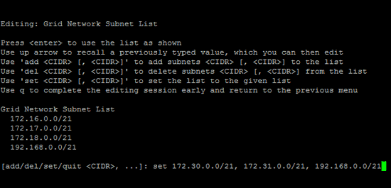

= Fügen Sie zu Subnetzlisten im Grid-Netzwerk hinzu oder ändern Sie diese
:allow-uri-read: 
:icons: font
:imagesdir: ../media/

[role="lead"]
Mithilfe des Tools IP ändern können Sie Subnetze im Grid Network hinzufügen oder ändern.

.Bevor Sie beginnen
* Sie haben die `Passwords.txt` Datei.

Sie können Subnetze in der Netznetznetznetznetznetznetzsubnetliste hinzufügen, löschen oder ändern. Änderungen wirken sich auf das Routing aller Knoten im Raster aus.

NOTE: Wenn Sie nur Änderungen an der Netznetzwerksubnetz-Liste vornehmen, verwenden Sie den Grid-Manager, um die Netzwerkkonfiguration hinzuzufügen oder zu ändern. Verwenden Sie andernfalls das Change IP-Tool, wenn der Grid Manager aufgrund eines Netzwerkkonfigurationsproblem nicht erreichbar ist, oder Sie führen gleichzeitig eine Änderung des Grid Network Routing und andere Netzwerkänderungen durch.

[NOTE]
====
Verwenden Sie keine Subnetze, die die folgenden IPv4-Adressen für das Grid-Netzwerk, das Admin-Netzwerk oder das Client-Netzwerk eines Knotens enthalten:

* 192.168.130.101
* 192.168.131.101
* 192.168.130.102
* 192.168.131.102
* 198.51.100.2
* 198.51.100.4

Verwenden Sie beispielsweise nicht die folgenden Subnetzbereiche für das Grid-Netzwerk, das Admin-Netzwerk oder das Client-Netzwerk eines Knotens:

* 192.168.130.0/24, da dieser Subnetzbereich die IP-Adressen 192.168.130.101 und 192.168.130.102 enthält
* 192.168.131.0/24, da dieser Subnetzbereich die IP-Adressen 192.168.131.101 und 192.168.131.102 enthält
* 198.51.100.0/24, da dieser Subnetzbereich die IP-Adressen 198.51.100.2 und 198.51.100.4 enthält

====
.Schritte
. Der externe SSH-Zugriff ist standardmäßig blockiert.  Falls erforderlich,link:../admin/manage-external-ssh-access.html["Zugriff vorübergehend erlauben"] .
. Melden Sie sich beim primären Admin-Node an:
+
.. Geben Sie den folgenden Befehl ein: `ssh admin@_primary_Admin_Node_IP_`
.. Geben Sie das in der Datei aufgeführte Passwort ein `Passwords.txt`.
.. Geben Sie den folgenden Befehl ein, um zu root zu wechseln: `su -`
.. Geben Sie das in der Datei aufgeführte Passwort ein `Passwords.txt`.

+
Wenn Sie als root angemeldet sind, wechselt die Eingabeaufforderung von `$` zu `#`.

. Starten Sie das Change IP-Tool, indem Sie den folgenden Befehl eingeben: `change-ip`
. Geben Sie an der Eingabeaufforderung die Provisionierungs-Passphrase ein.
+
Das Hauptmenü wird angezeigt.

+
image::../media/change_ip_tool_main_menu.png[Screenshot mit Willkommensbildschirm des Change IP-Tools]

. Wählen Sie im Hauptmenü die Option zum Bearbeiten von Subnetzen für das Grid-Netzwerk (Option *4*).
+

NOTE: Änderungen an der Netznetzwerksubnetz-Liste sind im gesamten Grid verfügbar.

. Folgenden Optionen wählbar:
+
--
** Fügen Sie ein Subnetz hinzu, indem Sie den folgenden Befehl eingeben: `add CIDR`
** Löschen Sie ein Subnetz, indem Sie den folgenden Befehl eingeben: `del CIDR`
** Legen Sie die Liste der Subnetze fest, indem Sie den folgenden Befehl eingeben: `set CIDR`

--
+
--

NOTE: Für alle Befehle können Sie in diesem Format mehrere Adressen eingeben: `add CIDR, CIDR`

Beispiel: `add 172.14.0.0/16, 172.15.0.0/16, 172.16.0.0/16`

TIP: Sie können die erforderliche Eingabe reduzieren, indem Sie mit dem Aufwärtspfeil zuvor eingegebene Werte auf die aktuelle Eingabeaufforderung abrufen und sie bei Bedarf bearbeiten.

Die unten stehende Beispieleingabe zeigt das Festlegen von Subnetzen für die Netzsubnetz-Liste:

--
. Wenn Sie bereit sind, geben Sie *q* ein, um zum Hauptmenü-Bildschirm zurückzukehren. Ihre Änderungen werden so lange gespeichert, bis sie gelöscht oder angewendet wurden.
. Folgenden Optionen wählbar:
+
** Wählen Sie die Option *5*, um Änderungen in der Ausgabe anzuzeigen, die isoliert sind, um nur das geänderte Element anzuzeigen. Änderungen werden grün (Zusätze) oder rot (Löschungen) hervorgehoben, wie in der Beispielausgabe unten gezeigt:
+
image::../media/change_ip_tool_gnsl_sample_output.gif[Screenshot, der durch umgebenden Text beschrieben wird]

** Wählen Sie die Option *6*, um Änderungen in der Ausgabe anzuzeigen, die die vollständige Konfiguration anzeigen. Änderungen werden grün (Ergänzungen) oder rot (Löschungen) markiert.
+

NOTE: Bestimmte Befehlszeilenschnittstellen zeigen möglicherweise Ergänzungen und Löschungen mithilfe von durchgestrickter Formatierung.

. Wählen Sie Option *7*, um alle stufenweisen Änderungen zu validieren.
+
Diese Validierung stellt sicher, dass die Regeln für Grid, Admin und Client-Netzwerke befolgt werden, z. B. die Verwendung überlappender Subnetze.

. Wählen Sie optional die Option *8*, um alle Änderungen in der Stufendschicht zu speichern und später zurückzukehren, um die Änderungen fortzusetzen.
+
Mit dieser Option können Sie das Tool IP ändern beenden und es später erneut starten, ohne dabei unangewendete Änderungen zu verlieren.

. Führen Sie einen der folgenden Schritte aus:
+
** Wählen Sie Option *9*, wenn Sie alle Änderungen löschen möchten, ohne die neue Netzwerkkonfiguration zu speichern oder anzuwenden.
** Wählen Sie Option *10*, wenn Sie bereit sind, Änderungen anzuwenden und die neue Netzwerkkonfiguration bereitzustellen. Während der Bereitstellung zeigt die Ausgabe den Status an, wenn Updates angewendet werden, wie in der folgenden Beispielausgabe gezeigt:
+
[listing]
----
Generating new grid networking description file...

Running provisioning...

Updating grid network configuration on Name
----

. Wenn Sie beim Ändern des Grid-Netzwerks die Option *10* ausgewählt haben, wählen Sie eine der folgenden Optionen aus:
+
** *Apply*: Die Änderungen sofort anwenden und bei Bedarf automatisch jeden Knoten neu starten.
+
Wenn die neue Netzwerkkonfiguration ohne externe Änderungen gleichzeitig mit der alten Netzwerkkonfiguration funktioniert, können Sie die Option *Apply* für eine vollautomatische Konfigurationsänderung verwenden.

** *Stufe*: Beim nächsten Neustart der Knoten die Änderungen anwenden.
+
Wenn Sie Änderungen an der physischen oder virtuellen Netzwerkkonfiguration vornehmen müssen, damit die neue Netzwerkkonfiguration funktioniert, müssen Sie die Option *Stage* verwenden, die betroffenen Knoten herunterfahren, die erforderlichen Änderungen am physischen Netzwerk vornehmen und die betroffenen Knoten neu starten.

+

NOTE: Wenn Sie die Option *Stage* verwenden, starten Sie den Knoten so schnell wie möglich nach dem Staging neu, um Unterbrechungen zu minimieren.

** *Cancel*: Nehmen Sie zu diesem Zeitpunkt keine Netzwerkänderungen vor.
+
Wenn Sie nicht wissen, dass für die vorgeschlagenen Änderungen ein Neustart von Nodes erforderlich ist, können Sie die Änderungen verschieben, um die Auswirkungen für den Benutzer zu minimieren. Mit der Option *Cancel* gelangen Sie zurück zum Hauptmenü und erhalten Ihre Änderungen, damit Sie sie später anwenden können.

+
Nachdem Sie Änderungen angewendet oder bereitgestellt haben, wird aufgrund der Änderung der Grid-Konfiguration ein neues Wiederherstellungspaket generiert.

. Wenn die Konfiguration aufgrund von Fehlern angehalten wird, stehen folgende Optionen zur Verfügung:
+
** Um das IP-Änderungsverfahren zu beenden und zum Hauptmenü zurückzukehren, geben Sie *A* ein.
** Um den fehlgeschlagenen Vorgang erneut zu versuchen, geben Sie *r* ein.
** Um mit der nächsten Operation fortzufahren, geben Sie *c* ein.
+
Der fehlgeschlagene Vorgang kann später erneut versucht werden, indem Sie im Hauptmenü die Option *10* (Änderungen übernehmen) wählen. Das IP-Änderungsverfahren wird erst abgeschlossen, wenn alle Vorgänge erfolgreich abgeschlossen wurden.

** Wenn Sie manuell eingreifen mussten (zum Beispiel um einen Knoten neu zu starten) und sich sicher sind, dass die Aktion, die das Tool für erfolgreich hält, tatsächlich erfolgreich abgeschlossen wurde, geben Sie *f* ein, um sie als erfolgreich zu markieren und zum nächsten Vorgang zu wechseln.

. Laden Sie ein neues Wiederherstellungspaket vom Grid Manager herunter.
+
.. Wählen Sie *Wartung* > *System* > *Wiederherstellungspaket*.
.. Geben Sie die Provisionierungs-Passphrase ein.

+

CAUTION: Die Wiederherstellungspaketdatei muss gesichert werden, da sie Verschlüsselungsschlüssel und Passwörter enthält, mit denen Daten aus dem StorageGRID -System abgerufen werden können.

. Wenn Sie externen SSH-Zugriff zugelassen haben,link:../admin/manage-external-ssh-access.html["Zugriff blockieren"] wenn Sie mit dem Hinzufügen oder Ändern der Subnetzlisten fertig sind.

