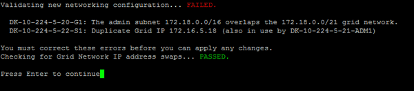

= Ändern der Node-Netzwerkkonfiguration
:allow-uri-read: 
:icons: font
:imagesdir: ../media/

[role="lead"]
Mit dem Change IP-Tool können Sie die Netzwerkkonfiguration für einen oder mehrere Knoten ändern. Sie können die Konfiguration des Grid-Netzwerks ändern oder den Administrator- oder Client-Netzwerk hinzufügen, ändern oder entfernen.

.Bevor Sie beginnen
Sie haben die `Passwords.txt` Datei.

.Über diese Aufgabe
*Linux:* Wenn Sie zum ersten Mal einen Grid-Knoten zum Admin-Netzwerk oder Client-Netzwerk hinzufügen und ADMIN_NETWORK_TARGET oder CLIENT_NETWORK_TARGET zuvor nicht in der Knotenkonfigurationsdatei konfiguriert haben, müssen Sie dies jetzt tun.  Zum StorageGRIDlink:../swnodes/index.html["Installationsanweisungen"] für Ihr Linux-Betriebssystem.

*Appliances:* bei StorageGRID Appliances, wenn das Client- oder Admin-Netzwerk während der Erstinstallation nicht im StorageGRID-Gerät-Installationsprogramm konfiguriert wurde, kann das Netzwerk nicht nur mit dem Change IP-Tool hinzugefügt werden. Zuerst müssen Sie https://docs.netapp.com/us-en/storagegrid-appliances/commonhardware/placing-appliance-into-maintenance-mode.html["Stellen Sie das Gerät in den Wartungsmodus"^] die Verbindungen konfigurieren, das Gerät wieder in den normalen Betriebsmodus versetzen und dann die Netzwerkkonfiguration mit dem Tool „IP ändern“ ändern. Siehe https://docs.netapp.com/us-en/storagegrid-appliances/installconfig/configuring-network-links.html["Verfahren zum Konfigurieren von Netzwerkverbindungen"^].

Sie können die IP-Adresse, die Subnetzmaske, das Gateway oder den MTU-Wert für einen oder mehrere Knoten in einem Netzwerk ändern.

Sie können auch einen Knoten aus einem Client-Netzwerk oder aus einem Admin-Netzwerk hinzufügen oder entfernen:

* Sie können einem Client-Netzwerk oder einem Admin-Netzwerk einen Knoten hinzufügen, indem Sie dem Knoten eine IP-Adresse/Subnetzmaske hinzufügen.
* Sie können einen Knoten aus einem Client-Netzwerk oder aus einem Admin-Netzwerk entfernen, indem Sie die IP-Adresse/Subnetzmaske für den Knoten in diesem Netzwerk löschen.
+
Knoten können nicht aus dem Grid-Netzwerk entfernt werden.

NOTE: Das Austauschen von IP-Adressen ist nicht zulässig. Wenn Sie IP-Adressen zwischen Grid-Nodes austauschen müssen, müssen Sie eine temporäre IP-Adresse verwenden.

NOTE: Wenn Single Sign-On (SSO) für Ihr StorageGRID System aktiviert ist und Sie die IP-Adresse eines Admin-Knotens ändern, beachten Sie, dass alle Vertrauensstellungen der vertrauenden Seite, die mit der IP-Adresse des Admin-Knotens (anstelle des vollqualifizierten Domänennamens, wie empfohlen) konfiguriert wurden, ungültig werden.  Sie können sich nicht mehr beim Knoten anmelden.  Unmittelbar nach der Änderung der IP-Adresse müssen Sie die Vertrauensstellung der vertrauenden Seite des Knotens in Active Directory Federation Services (AD FS) mit der neuen IP-Adresse aktualisieren oder neu konfigurieren.  Siehe die Anweisungen fürlink:../admin/configure-sso.html["SSO wird konfiguriert"] .

NOTE: Alle Änderungen, die Sie mit dem Change IP-Tool an das Netzwerk vornehmen, werden an die Installer-Firmware für die StorageGRID-Appliances übertragen. Auf diese Weise wird bei einer erneuten Installation der StorageGRID Software auf einer Appliance oder beim Einsatz einer Appliance in den Wartungsmodus die Netzwerkkonfiguration korrekt ausgeführt.

.Schritte
. Der externe SSH-Zugriff ist standardmäßig blockiert.  Falls erforderlich,link:../admin/manage-external-ssh-access.html["Zugriff vorübergehend erlauben"] .
. Melden Sie sich beim primären Admin-Node an:
+
.. Geben Sie den folgenden Befehl ein: `ssh admin@_primary_Admin_Node_IP_`
.. Geben Sie das in der Datei aufgeführte Passwort ein `Passwords.txt`.
.. Geben Sie den folgenden Befehl ein, um zu root zu wechseln: `su -`
.. Geben Sie das in der Datei aufgeführte Passwort ein `Passwords.txt`.

+
Wenn Sie als root angemeldet sind, wechselt die Eingabeaufforderung von `$` zu `#`.

. Starten Sie das Change IP-Tool, indem Sie den folgenden Befehl eingeben: `change-ip`
. Geben Sie an der Eingabeaufforderung die Provisionierungs-Passphrase ein.
+
Das Hauptmenü wird angezeigt.

+
image::../media/change_ip_tool_main_menu.png[Screenshot mit Willkommensbildschirm des Change IP-Tools]

. Wählen Sie optional *1* aus, um die zu aktualisierenden Knoten auszuwählen. Wählen Sie dann eine der folgenden Optionen aus:
+
** *1*: Einzelner Knoten -- nach Namen auswählen
** *2*: Single Node -- Wählen Sie nach Standort, dann nach Name
** *3*: Single Node -- Wählen Sie nach aktueller IP
** *4*: Alle Knoten an einem Standort
** *5*: Alle Knoten im Raster
+
*Hinweis:* Wenn Sie alle Knoten aktualisieren möchten, lassen Sie "alle" ausgewählt bleiben.

+
Nachdem Sie Ihre Auswahl getroffen haben, wird das Hauptmenü angezeigt, wobei das Feld *Ausgewählte Knoten* aktualisiert wird, um Ihre Auswahl zu berücksichtigen. Alle nachfolgenden Aktionen werden nur auf den angezeigten Nodes ausgeführt.

. Wählen Sie im Hauptmenü die Option *2*, um IP/Maske, Gateway und MTU-Informationen für die ausgewählten Knoten zu bearbeiten.
+
.. Wählen Sie das Netzwerk aus, in dem Sie Änderungen vornehmen möchten:
+
--
*** *1*: Netznetz
*** *2*: Admin-Netzwerk
*** *3*: Client-Netzwerk
*** *4*: Alle Netzwerke

--
+
--
Nachdem Sie die Auswahl getroffen haben, zeigt die Eingabeaufforderung den Knotennamen, den Netzwerknamen (Grid, Admin oder Client), den Datentyp (IP/Maske, Gateway oder MTU) und aktueller Wert.

Wenn Sie die IP-Adresse, die Präfixlänge, das Gateway oder die MTU einer DHCP-konfigurierten Schnittstelle bearbeiten, wird die Schnittstelle zu statisch geändert. Wenn Sie eine durch DHCP konfigurierte Schnittstelle ändern möchten, wird eine Warnung angezeigt, die Sie darüber informiert, dass sich die Schnittstelle in statisch ändert.

Als konfigurierte Schnittstellen `fixed` können nicht bearbeitet werden.

--
.. Um einen neuen Wert festzulegen, geben Sie ihn in das für den aktuellen Wert angezeigte Format ein.
.. Um den aktuellen Wert unverändert zu lassen, drücken Sie *Enter*.
.. Wenn der Datentyp lautet `IP/mask`, können Sie das Admin- oder Client-Netzwerk aus dem Knoten löschen, indem Sie *d* oder *0.0.0.0/0* eingeben.
.. Nachdem Sie alle Knoten bearbeitet haben, die Sie ändern möchten, geben Sie *q* ein, um zum Hauptmenü zurückzukehren.
+
Ihre Änderungen werden so lange gespeichert, bis sie gelöscht oder angewendet wurden.

. Überprüfen Sie Ihre Änderungen, indem Sie eine der folgenden Optionen auswählen:
+
** *5*: Zeigt Edits in der Ausgabe an, die isoliert sind, um nur das geänderte Element anzuzeigen. Änderungen werden grün (Ergänzungen) oder rot (Löschungen) hervorgehoben, wie in der Beispielausgabe dargestellt:
+
image::../media/change_ip_tool_edit_ip_mask_sample_output.png[Screenshot, der durch umgebenden Text beschrieben wird]

** *6*: Zeigt Änderungen in der Ausgabe an, die die vollständige Konfiguration anzeigen. Änderungen werden grün (Ergänzungen) oder rot (Löschungen) markiert.
+

NOTE: Bestimmte Befehlszeilenschnittstellen zeigen möglicherweise Ergänzungen und Löschungen mithilfe von durchgestrickter Formatierung. Die richtige Anzeige hängt von Ihrem Terminalclient ab, der die erforderlichen VT100-Escape-Sequenzen unterstützt.

. Wählen Sie Option *7*, um alle Änderungen zu validieren.
+
Durch diese Validierung wird sichergestellt, dass die Regeln für Grid-, Admin- und Client-Netzwerke, z. B. die Verwendung überlappender Subnetze, nicht verletzt werden.

+
In diesem Beispiel ergab die Validierung Fehler.

+

+
In diesem Beispiel wurde die Validierung erfolgreich bestanden.

+
image::../media/change_ip_tool_validate_sample_passed_messages.gif[Screenshot, der durch umgebenden Text beschrieben wird]

. Wählen Sie nach Abschluss der Validierung eine der folgenden Optionen:
+
** *8*: Speichern Sie nicht angewendete Änderungen.
+
Mit dieser Option können Sie das Tool IP ändern beenden und es später erneut starten, ohne dabei unangewendete Änderungen zu verlieren.

** *10*: Die neue Netzwerkkonfiguration anwenden.

. Wenn Sie die Option *10* ausgewählt haben, wählen Sie eine der folgenden Optionen:
+
** *Apply*: Die Änderungen sofort anwenden und bei Bedarf automatisch jeden Knoten neu starten.
+
Wenn für die neue Netzwerkkonfiguration keine Änderungen am physischen Netzwerk erforderlich sind, können Sie *Apply* auswählen, um die Änderungen sofort anzuwenden. Nodes werden bei Bedarf automatisch neu gestartet. Knoten, die neu gestartet werden müssen, werden angezeigt.

** *Stufe*: Beim nächsten manuellen Neustart der Knoten die Änderungen anwenden.
+
Wenn Sie Änderungen an der physischen oder virtuellen Netzwerkkonfiguration vornehmen müssen, damit die neue Netzwerkkonfiguration funktioniert, müssen Sie die Option *Stage* verwenden, die betroffenen Knoten herunterfahren, die erforderlichen Änderungen am physischen Netzwerk vornehmen und die betroffenen Knoten neu starten. Wenn Sie *Apply* wählen, ohne zuvor diese Netzwerkänderungen vornehmen zu müssen, schlagen die Änderungen normalerweise fehl.

+

NOTE: Wenn Sie die Option *Stage* verwenden, müssen Sie den Knoten nach der Staging so schnell wie möglich neu starten, um Störungen zu minimieren.

** *Cancel*: Nehmen Sie zu diesem Zeitpunkt keine Netzwerkänderungen vor.
+
Wenn Sie nicht wissen, dass für die vorgeschlagenen Änderungen ein Neustart von Nodes erforderlich ist, können Sie die Änderungen verschieben, um die Auswirkungen für den Benutzer zu minimieren. Mit der Option *Cancel* gelangen Sie zurück zum Hauptmenü und erhalten Ihre Änderungen, damit Sie sie später anwenden können.

+
Wenn Sie *Apply* oder *Stage* auswählen, wird eine neue Netzwerkkonfigurationsdatei generiert, die Bereitstellung durchgeführt und Knoten mit neuen Arbeitsinformationen aktualisiert.

+
Während der Bereitstellung wird der Status bei der Anwendung von Aktualisierungen angezeigt.

+
[listing]
----
Generating new grid networking description file...

Running provisioning...

Updating grid network configuration on Name
----

+
Nachdem Sie Änderungen angewendet oder bereitgestellt haben, wird aufgrund der Änderung der Grid-Konfiguration ein neues Wiederherstellungspaket generiert.

. Wenn Sie *Phase* ausgewählt haben, führen Sie nach Abschluss der Bereitstellung folgende Schritte aus:
+
.. Nehmen Sie die erforderlichen Änderungen am physischen oder virtuellen Netzwerk vor.
+
*Physische Netzwerkänderungen*: Nehmen Sie die erforderlichen Änderungen an der physischen Netzwerkumgebung vor, und fahren Sie den Knoten bei Bedarf sicher herunter.

+
*Linux*: Wenn Sie den Knoten zum ersten Mal einem Admin-Netzwerk oder Client-Netzwerk hinzufügen, stellen Sie sicher, dass Sie die Schnittstelle wie unter beschrieben hinzugefügt habenlink:linux-adding-interfaces-to-existing-node.html["Linux: Hinzufügen von Schnittstellen zu vorhandenem Node"].

.. Starten Sie die betroffenen Knoten neu.

. Wählen Sie *0* aus, um das Change IP-Tool nach Abschluss der Änderungen zu beenden.
. Laden Sie ein neues Wiederherstellungspaket vom Grid Manager herunter.
+
.. Wählen Sie *Wartung* > *System* > *Wiederherstellungspaket*.
.. Geben Sie die Provisionierungs-Passphrase ein.

. Wenn Sie externen SSH-Zugriff zugelassen haben,link:../admin/manage-external-ssh-access.html["Zugriff blockieren"] wenn Sie mit der Änderung der Knotennetzwerkkonfiguration fertig sind.

== Vorübergehende Änderung der LACP-PDU-Rate

Um Wartungsvorgänge an den in Ihrem Gerät installierten Netzwerkkomponenten durchzuführen, z. B. die Aktualisierung der NIC-Firmware, können Sie überprüfen, ob die aktuelle Einstellung der LACP-PDU-Rate den Timing-Anforderungen für die NIC-Kommunikation entspricht.  Sie können die LACP-PDU-Rate bei Bedarf nicht dauerhaft zwischen schnell (1 Sekunde Wartezeit) und langsam (30 Sekunden Wartezeit) umschalten.

NOTE: Um dauerhafte Änderungen an der LACP-PDU-Rate vorzunehmen, siehe https://docs.netapp.com/us-en/storagegrid-appliances/installconfig/configuring-network-links.html["Netzwerkverbindungen konfigurieren"^] .

.Bevor Sie beginnen
* Der Admin-Knoten ist installiert und läuft.
* Sie haben die `Passwords.txt` Datei.

.Schritte
. Melden Sie sich beim primären Admin-Node an:
+
.. Geben Sie den folgenden Befehl ein: `ssh admin@primary_Admin_Node_IP`
.. Geben Sie das in der Datei aufgeführte Passwort ein `Passwords.txt`.
.. Geben Sie den folgenden Befehl ein, um zu root zu wechseln: `su -`
.. Geben Sie das in der Datei aufgeführte Passwort ein `Passwords.txt`.
+
Wenn Sie als root angemeldet sind, wechselt die Eingabeaufforderung von `$` zu `#`.

. Um die aktuelle LACP-PDU-Rateneinstellung zu überprüfen, geben Sie den folgenden Befehl ein:
+
`run-each-node --parallel --port 8022 '/usr/sbin/set-lacp-rate.sh'`

. Um die LACP-PDU-Rate vorübergehend zu ändern, geben Sie den folgenden Befehl ein:
+
`run-each-node --parallel --port 8022 '/usr/sbin/set-lacp-rate.sh _<speed>_'`

+
Wo `_<speed>_` Ist `fast` oder `slow` .

Beim nächsten Neustart des Geräts wird die LACP-PDU-Rate auf die vorherige Einstellung zurückgesetzt.
