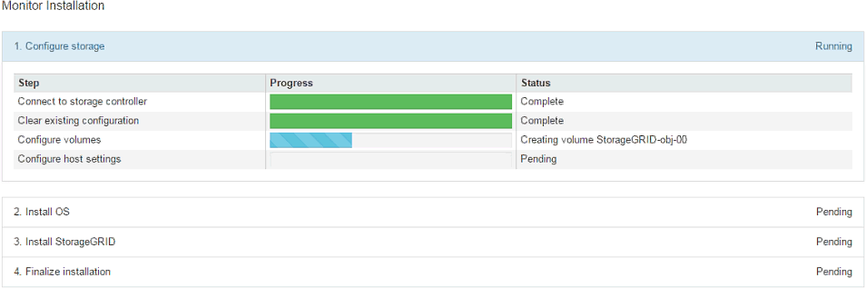

= Überwachen Sie die Installation der StorageGRID Appliance
:allow-uri-read: 
:icons: font
:imagesdir: ../media/

[role="lead"]
Das Installationsprogramm der StorageGRID Appliance stellt den Status bereit, bis die Installation abgeschlossen ist. Nach Abschluss der Softwareinstallation wird die Appliance neu gestartet.

.Schritte
. Um den Installationsfortschritt zu überwachen, klicken Sie in der Menüleiste auf *Installation überwachen*.
+
Auf der Seite Monitor-Installation wird der Installationsfortschritt angezeigt.

+

+
Die blaue Statusleiste zeigt an, welche Aufgabe zurzeit ausgeführt wird. Grüne Statusleisten zeigen Aufgaben an, die erfolgreich abgeschlossen wurden.

+

NOTE: Das Installationsprogramm stellt sicher, dass Aufgaben, die in einer früheren Installation ausgeführt wurden, nicht erneut ausgeführt werden. Wenn Sie eine Installation erneut ausführen, werden alle Aufgaben, die nicht erneut ausgeführt werden müssen, mit einer grünen Statusleiste und dem Status „Übersprungen“ angezeigt.

. Überprüfen Sie den Fortschritt der ersten beiden Installationsphasen.
+
** *1. Speicher konfigurieren*
+
Während dieser Phase stellt das Installationsprogramm eine Verbindung zum Storage Controller her, löscht alle vorhandenen Konfigurationen, kommuniziert mit SANtricity OS, um Volumes zu konfigurieren, und konfiguriert die Host-Einstellungen.

** *2. Installieren Sie das Betriebssystem*
+
In dieser Phase kopiert das Installationsprogramm das Betriebssystem-Image für StorageGRID auf die Appliance.

. Überwachen Sie den Installationsfortschritt weiter, bis die Phase *StorageGRID installieren* angehalten wird. Auf der eingebetteten Konsole wird eine Meldung angezeigt, in der Sie aufgefordert werden, diesen Knoten auf dem Admin-Knoten mithilfe des Grid-Managers zu genehmigen.
+
image::../media/monitor_installation_install_sgws.gif[Dieses Bild wird durch den umgebenden Text erläutert.]

. Gehen Sie zu link:selecting-start-recovery-to-configure-appliance-storage-node.html["Wählen Sie Wiederherstellung starten, um Appliance Storage Node zu konfigurieren"].

