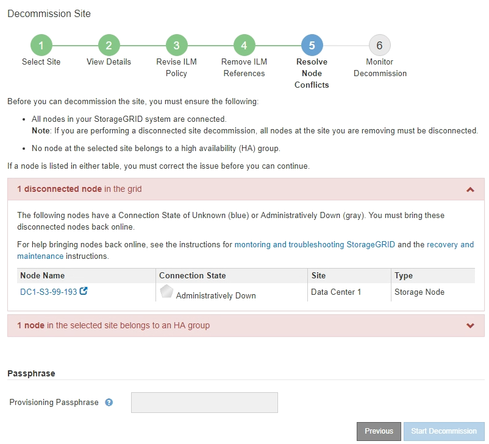

= Schritt 5: Auflösen von Knotenkonflikten (und Start der Stilllegung)
:allow-uri-read: 
:icons: font
:imagesdir: ../media/

[role="lead"]
Ab Schritt 5 (Auflösen von Knotenkonflikten) des Assistenten für die Dekommission-Website können Sie feststellen, ob Knoten in Ihrem StorageGRID-System getrennt sind oder ob Knoten am ausgewählten Standort zu einer HA-Gruppe gehören. Nachdem Konflikte mit Knoten behoben wurden, starten Sie den Vorgang zur Deaktivierung auf dieser Seite.

.Bevor Sie beginnen
Sie müssen sicherstellen, dass alle Nodes in Ihrem StorageGRID System den richtigen Status aufweisen, wie folgt:

* Alle Knoten in Ihrem StorageGRID-System müssen verbunden sein (image:../media/icon_alert_green_checkmark.png["Symbol Warnung Grün Häkchen"]).
+

NOTE: Wenn Sie eine getrennte Site außer Betrieb nehmen, müssen alle Nodes an der entfernenden Site getrennt sein. Alle Nodes an allen anderen Standorten müssen verbunden sein.

+

NOTE: Die Stilllegung wird nicht gestartet, wenn ein oder mehrere Volumes offline (unmounted) sind oder online (gemountet) sind, sondern sich in einem Fehlerzustand befinden.

+

NOTE: Wenn ein oder mehrere Volumes offline geschaltet werden, während eine Deaktivierung durchgeführt wird, wird die Deaktivierung durchgeführt, nachdem diese Volumes wieder online geschaltet wurden.

* Kein Node an dem gerade entfernenden Standort kann eine Schnittstelle besitzen, die zu einer HA-Gruppe (High Availability, Hochverfügbarkeit) gehört.

.Über diese Aufgabe
Wenn ein Knoten für Schritt 5 (Auflösen von Knotenkonflikten) aufgeführt ist, müssen Sie das Problem beheben, bevor Sie den Stilllegen starten können.

Prüfen Sie vor dem Starten des Verfahrens zur Deaktivierung der Website auf dieser Seite die folgenden Aspekte:

* Sie müssen genügend Zeit haben, bis der Stilllegen abgeschlossen ist.
+

NOTE: Das Verschieben oder Löschen von Objektdaten von einem Standort kann Tage, Wochen oder sogar Monate dauern, abhängig von der Datenmenge am Standort, der Systemlast, den Netzwerklatenzen und der Art der erforderlichen ILM-Änderungen.

* Während die Deaktivierung der Website läuft:
+
** Sie können keine ILM-Regeln erstellen, die sich auf den deaktivierten Standort beziehen. Sie können auch keine vorhandene ILM-Regel bearbeiten, um auf den Standort zu verweisen.
** Sie können keine anderen Wartungsverfahren wie Erweiterungen oder Upgrades durchführen.
+

NOTE: Wenn Sie während der Stilllegung einer verbundenen Site einen weiteren Wartungsvorgang durchführen müssen, können Sie den Vorgang unterbrechen, während die Storage-Nodes entfernt werden. Die Schaltfläche *Pause* wird während der Phase „Decommissioning Replicated and Erasure-coded Data“ aktiviert.

** Falls Nodes nach dem Starten der Deaktivierung der Website wiederhergestellt werden müssen, müssen Sie den Support kontaktieren.

.Schritte
. Überprüfen Sie den Abschnitt „getrennte Knoten“ in Schritt 5 (Knotenkonflikte lösen), um festzustellen, ob Knoten in Ihrem StorageGRID-System den Verbindungsstatus Unbekannt () oder Administrativ Down ( )image:../media/icon_alarm_gray_administratively_down.png["Icon Alarm Grau Administrativ Nach Unten"] habenimage:../media/icon_alarm_blue_unknown.png["Symbolalarm Blau Unbekannt"].
+

. Wenn Knoten getrennt werden, bringen Sie sie wieder in den Online-Modus.
+
Siehe link:../maintain/grid-node-procedures.html["Node-Verfahren"]. Wenden Sie sich an den technischen Support, wenn Sie Hilfe benötigen.

. Wenn alle getrennten Nodes wieder in den Online-Modus versetzt wurden, überprüfen Sie den Abschnitt HA-Gruppen in Schritt 5 (Auflösen von Node-Konflikten).
+
In dieser Tabelle werden alle Nodes am ausgewählten Standort aufgelistet, die zu einer HA-Gruppe (High Availability, Hochverfügbarkeit) gehören.

+
image::../media/decommission_site_step_5_ha_groups.png[Mustern Sie Schritt 5 HA-Gruppen auf]

. Wenn alle Knoten aufgelistet sind, führen Sie einen der folgenden Schritte aus:
+
** Bearbeiten Sie jede betroffene HA-Gruppe, um die Node-Schnittstelle zu entfernen.
** Entfernen Sie eine HA-Gruppe, die nur Nodes aus diesem Standort enthält. Lesen Sie die Anweisungen zum Verwalten von StorageGRID.

+
Wenn alle Nodes verbunden sind und keine Nodes am ausgewählten Standort in einer HA-Gruppe verwendet werden, ist das Feld *Provisioning-Passphrase* aktiviert.

. Geben Sie die Provisionierungs-Passphrase ein.
+
Die Schaltfläche *Start Decommission* wird aktiviert.

+
image::../media/decommission_site_step_5_provision_passphrase.png[Legen Sie Die Bereitstellpassphrase Für Standortschritt 5 Außer Betrieb]

. Wenn Sie bereit sind, den Vorgang zur Deaktivierung der Website zu starten, wählen Sie *Start Decommission*.
+
Eine Warnung zeigt den Standort und die Knoten, die entfernt werden. Sie werden daran erinnert, dass es Tage, Wochen oder sogar Monate dauern kann, die Website vollständig zu entfernen.

+
image::../media/decommission_site_step_5_warning.png[Warnung Für Site-Schritt 5 Ausmustern]

. Überprüfen Sie die Warnung. Wenn Sie bereit sind, zu beginnen, wählen Sie *OK*.
+
Beim Generieren der neuen Grid-Konfiguration wird eine Meldung angezeigt. Dieser Prozess kann je nach Typ und Anzahl der nicht mehr verwendeten Grid-Nodes einige Zeit in Anspruch nehmen.

+
image::../media/decommission_site_step_5_grid_configuration.png[Deaktivieren Sie Die Grid-Konfiguration Für Site Schritt 5]

+
Wenn die neue Grid-Konfiguration generiert wurde, wird Schritt 6 (Monitor Decommission) angezeigt.

+

NOTE: Die Schaltfläche * Previous* bleibt deaktiviert, bis die Stilllegung abgeschlossen ist.

