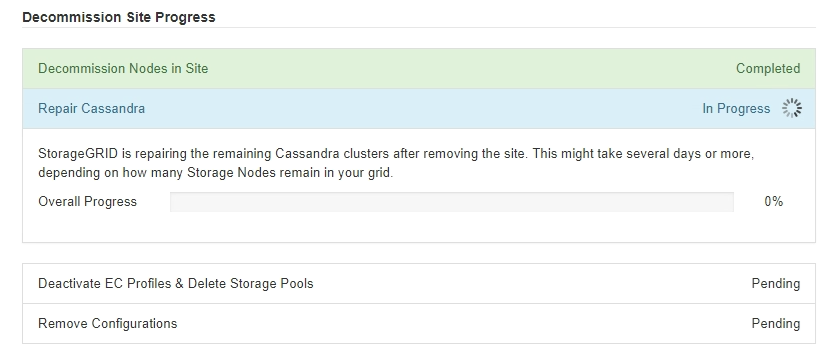

= Schritt 6: Überwachung Der Dekommission
:allow-uri-read: 
:icons: font
:imagesdir: ../media/

[role="lead"]
Ab Schritt 6 (Überwachung der Dekommission) des Seitenassistenten der Decommission-Website können Sie den Fortschritt überwachen, während die Site entfernt wird.

.Über diese Aufgabe
Wenn StorageGRID einen verbundenen Standort entfernt, werden Nodes in dieser Reihenfolge entfernt:

. Gateway-Nodes
. Admin-Nodes
. Storage-Nodes

Wenn StorageGRID einen getrennten Standort entfernt, werden Nodes in dieser Reihenfolge entfernt:

. Gateway-Nodes
. Storage-Nodes
. Admin-Nodes

Jeder Gateway-Node oder Admin-Node kann möglicherweise nur ein paar Minuten oder eine Stunde entfernt werden. Storage-Nodes können jedoch Tage oder Wochen in Anspruch nehmen.

.Schritte
. Sobald ein neues Wiederherstellungspaket erstellt wurde, laden Sie die Datei herunter.
+
image::../media/decommission_site_step_6_recovery_package.png[Site Decommission Schritt 6 Recovery Package]

+

NOTE: Laden Sie das Wiederherstellungspaket so schnell wie möglich herunter, um sicherzustellen, dass Sie Ihr Grid wiederherstellen können, wenn während des Stillfalls etwas schief geht.

+
.. Wählen Sie den Link in der Nachricht aus, oder wählen Sie *WARTUNG* > *System* > *Wiederherstellungspaket*.
.. Laden Sie die `.zip` Datei herunter.
+
Siehe die Anleitung für link:downloading-recovery-package.html["Herunterladen des Wiederherstellungspakets"].

+

NOTE: Die Recovery Package-Datei muss gesichert sein, weil sie Verschlüsselungsschlüssel und Passwörter enthält, die zum Abrufen von Daten vom StorageGRID-System verwendet werden können.

. Überwachen Sie mithilfe des Diagramms für die Datenverschiebung das Verschieben von Objektdaten von dieser Seite zu anderen Standorten.
+
Datenverschiebung gestartet, als Sie die neue ILM-Richtlinie in Schritt 3 aktiviert haben (ILM-Richtlinie überarbeiten). Die Datenverschiebung findet während der gesamten Außerbetriebnahme statt.

+
image::../media/decommission_site_step_6_data_movement.png[Deaktivieren Sie Die Datenverschiebung Von Schritt 6 Des Standorts]

. Überwachen Sie im Abschnitt Status des Knotens der Seite den Fortschritt des Stillstandsvorgangs, wenn Nodes entfernt werden.
+
Wenn ein Speicherknoten entfernt wird, durchläuft jeder Knoten eine Reihe von Phasen. Obwohl die meisten dieser Phasen schnell oder sogar unmerklich auftreten, müssen Sie möglicherweise Tage oder sogar Wochen warten, bis andere Phasen abgeschlossen sind, je nachdem, wie viele Daten verschoben werden müssen. Zur Verwaltung von Daten, die mit Erasure Coding versehen sind, und zur Neubewertung von ILM-Verfahren ist zusätzlicher Zeit erforderlich.

+
image::../media/decommission_site_step_6_storage_node.png[Deaktivieren Sie Site Schritt 6 Storage Node]

+
Wenn Sie den Fortschritt der Deaktivierung einer verbundenen Site überwachen, lesen Sie diese Tabelle, um die Phasen zur Ausmusterung eines Storage Node zu verstehen:

+
[cols="1a,2a"]
|===
| Stufe | Geschätzte Dauer 

 a| 
Ausstehend
 a| 
Minuten oder weniger

 a| 
Warten Sie auf Sperren
 a| 
Minuten

 a| 
Aufgabe Vorbereiten
 a| 
Minuten oder weniger

 a| 
Markieren von LDR deaktiviert
 a| 
Minuten

 a| 
Stilllegung von replizierten und mit Erasure codierten Daten
 a| 
Stunden, Tage oder Wochen, basierend auf der Datenmenge

*Hinweis*: Wenn Sie weitere Wartungsarbeiten durchführen müssen, können Sie die Deaktivierung der Website während dieser Phase unterbrechen.

 a| 
LDR-Status gesetzt
 a| 
Minuten

 a| 
Audit-Warteschlangen Leeren
 a| 
Minuten bis Stunden, basierend auf der Anzahl der Nachrichten und der Netzwerklatenz.

 a| 
Vollständig
 a| 
Minuten

|===
+
Wenn Sie den Fortschritt der Deaktivierung einer getrennten Site überwachen, lesen Sie diese Tabelle, um weitere Informationen zur Ausmusterung von Storage Nodes zu erhalten:

+
[cols="1a,1a"]
|===
| Stufe | Geschätzte Dauer 

 a| 
Ausstehend
 a| 
Minuten oder weniger

 a| 
Warten Sie auf Sperren
 a| 
Minuten

 a| 
Aufgabe Vorbereiten
 a| 
Minuten oder weniger

 a| 
Externe Dienste Deaktivieren
 a| 
Minuten

 a| 
Widerruf Des Zertifikats
 a| 
Minuten

 a| 
Knoten Nicht Registrieren
 a| 
Minuten

 a| 
Storage-Klasse Nicht Registrieren
 a| 
Minuten

 a| 
Entfernung Von Speichergruppen
 a| 
Minuten

 a| 
Entfernen Der Einheit
 a| 
Minuten

 a| 
Vollständig
 a| 
Minuten

|===
. Sobald alle Nodes abgeschlossen sind, warten Sie, bis der restliche Standort außer Betrieb ist.
+
** Im Schritt *Cassandra reparieren* führt StorageGRID alle erforderlichen Reparaturen an den Cassandra-Clustern durch, die in Ihrem Grid verbleiben. Je nachdem, wie viele Speicherknoten im Raster verbleiben, kann diese Reparaturen mehrere Tage oder länger dauern.
+

** Während des Schritts *EC-Profile deaktivieren & Speicherpools löschen* werden folgende ILM-Änderungen vorgenommen:
+
*** Alle Löschungsprofile, die auf die Site verwiesen haben, werden deaktiviert.
*** Alle Speicherpools, die auf den Standort verwiesen werden gelöscht.
+

NOTE: Der Speicherpool Alle Speicherknoten (StorageGRID 11.6 und früher) wird ebenfalls entfernt, da er den Standort Alle Standorte verwendet.

** Schließlich werden im Schritt *Konfiguration entfernen* alle verbleibenden Verweise auf die Site und ihre Knoten aus dem Rest des Rasters entfernt.
+
image::../media/decommission_site_step_6_remove_configuration.png[Deaktivieren Sie Site Schritt 6 Konfiguration Entfernen]

. Nach Abschluss des Stilllegen-Verfahrens wird auf der Seite Decommission Site eine Meldung angezeigt, die den entfernten Standort nicht mehr anzeigt.
+
image::../media/decommission_site_success_message.png[Success Message Zur Deaktivierung Von Website]

.Nachdem Sie fertig sind
Führen Sie diese Aufgaben nach Abschluss des Verfahrens zur Deaktivierung der Website durch:

* Stellen Sie sicher, dass die Laufwerke aller Storage-Nodes am ausgemusterten Standort sauber gelöscht werden. Verwenden Sie ein handelsübliches Datenwischwerkzeug oder einen Dienst, um die Daten dauerhaft und sicher von den Laufwerken zu entfernen.
* Wenn die Site einen oder mehrere Admin-Nodes enthält und Single Sign-On (SSO) für Ihr StorageGRID-System aktiviert ist, entfernen Sie alle Vertrauensstellen für die Site aus Active Directory Federation Services (AD FS).
* Nachdem die Knoten im Rahmen der Deaktivierung des angeschlossenen Standorts automatisch ausgeschaltet wurden, entfernen Sie die zugehörigen virtuellen Maschinen.

