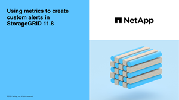

= Erstellen benutzerdefinierter Warnungsregeln
:allow-uri-read: 
:icons: font
:imagesdir: ../media/

[role="lead"]
Sie können benutzerdefinierte Alarmregeln erstellen, um eigene Bedingungen für das Auslösen von Warnmeldungen zu definieren.

.Bevor Sie beginnen
* Sie sind im Grid Manager mit einem angemeldetlink:../admin/web-browser-requirements.html["Unterstützter Webbrowser"].
* Sie haben die link:../admin/admin-group-permissions.html["Managen von Warnmeldungen oder Root-Zugriffsberechtigungen"].
* Sie kennen die link:commonly-used-prometheus-metrics.html["Häufig verwendete Prometheus-Kennzahlen"].
* Sie verstehen die https://prometheus.io/docs/prometheus/latest/querying/basics/["Syntax der Prometheus-Abfragen"^].
* Optional haben Sie sich das Video angesehen: https://netapp.hosted.panopto.com/Panopto/Pages/Viewer.aspx?id=54af90c4-9a38-4136-9621-b1ff008604a3["Video: Benutzerdefinierte Alarme"^].
+
[link=https://netapp.hosted.panopto.com/Panopto/Pages/Viewer.aspx?id=54af90c4-9a38-4136-9621-b1ff008604a3]

.Über diese Aufgabe
StorageGRID validiert keine benutzerdefinierten Warnmeldungen. Wenn Sie sich für die Erstellung benutzerdefinierter Warnungsregeln entscheiden, befolgen Sie die folgenden allgemeinen Richtlinien:

* Informieren Sie sich über die Bedingungen für die Standardwarnregeln und verwenden Sie sie als Beispiele für Ihre benutzerdefinierten Warnungsregeln.
* Wenn Sie mehrere Bedingungen für eine Warnungsregel definieren, verwenden Sie denselben Ausdruck für alle Bedingungen. Ändern Sie dann den Schwellenwert für jede Bedingung.
* Prüfen Sie jede Bedingung sorgfältig auf Tippfehler und Logikfehler.
* Verwenden Sie nur die in der Grid Management API aufgeführten Metriken.
* Beachten Sie beim Testen eines Ausdrucks mit der Grid Management API, dass eine „erfolgreiche“ Antwort möglicherweise ein leerer Antworttext ist (keine Warnung ausgelöst). Um zu überprüfen, ob die Meldung tatsächlich ausgelöst wird, können Sie vorübergehend einen Schwellenwert auf einen Wert festlegen, der Ihrer Meinung nach derzeit „true“ ist.
+
Um zum Beispiel den Ausdruck zu testen `node_memory_MemTotal_bytes < 24000000000`, führen Sie zuerst aus `node_memory_MemTotal_bytes >= 0` und stellen Sie sicher, dass Sie die erwarteten Ergebnisse erhalten (alle Knoten geben einen Wert zurück). Ändern Sie dann den Operator und den Schwellenwert wieder auf die gewünschten Werte und führen Sie die Ausführung erneut aus. Keine Ergebnisse zeigen an, dass für diesen Ausdruck keine aktuellen Warnmeldungen vorhanden sind.

* Gehen Sie nicht davon aus, dass eine benutzerdefinierte Warnung funktioniert, es sei denn, Sie haben bestätigt, dass die Warnmeldung erwartungsgemäß ausgelöst wird.

.Schritte
. Wählen Sie *ALERTS* > *Regeln*.
+
Die Seite Alarmregeln wird angezeigt.

. Wählen Sie *eigene Regel erstellen*.
+
Das Dialogfeld „Benutzerdefinierte Regel erstellen“ wird angezeigt.

+
image::../media/alerts_create_custom_rule.png[Alarme > Benutzerdefinierte Regel Erstellen]

. Aktivieren oder deaktivieren Sie das Kontrollkästchen *enabled*, um zu bestimmen, ob diese Warnungsregel aktuell aktiviert ist.
+
Wenn eine Warnungsregel deaktiviert ist, werden ihre Ausdrücke nicht ausgewertet und es werden keine Warnungen ausgelöst.

. Geben Sie die folgenden Informationen ein:
+
[cols="1a,2a"]
|===
| Feld | Beschreibung 

 a| 
Eindeutiger Name
 a| 
Ein eindeutiger Name für diese Regel. Der Name der Alarmregel wird auf der Seite „Meldungen“ angezeigt und ist außerdem Betreff für E-Mail-Benachrichtigungen. Die Namen für Warnungsregeln können zwischen 1 und 64 Zeichen umfassen.

 a| 
Beschreibung
 a| 
Eine Beschreibung des Problems. Die Beschreibung ist die auf der Seite „Meldungen“ und in E-Mail-Benachrichtigungen angezeigte Warnmeldung. Die Beschreibungen für Warnungsregeln können zwischen 1 und 128 Zeichen umfassen.

 a| 
Empfohlene Maßnahmen
 a| 
Optional sind die zu ergriffenen Maßnahmen verfügbar, wenn diese Meldung ausgelöst wird. Geben Sie empfohlene Aktionen als Klartext ein (keine Formatierungscodes). Die empfohlenen Aktionen für Warnungsregeln können zwischen 0 und 1,024 Zeichen liegen.

|===
. Geben Sie im Abschnitt Bedingungen einen Prometheus-Ausdruck für eine oder mehrere der Schweregrade für Warnmeldungen ein.
+
Ein Grundausdruck ist in der Regel die Form:

+
`[metric] [operator] [value]`

+
Ausdrücke können eine beliebige Länge haben, aber in einer einzigen Zeile in der Benutzeroberfläche angezeigt werden. Mindestens ein Ausdruck ist erforderlich.

+
Dieser Ausdruck bewirkt, dass eine Warnung ausgelöst wird, wenn die Menge des installierten RAM für einen Knoten weniger als 24,000,000,000 Byte (24 GB) beträgt.

+
`node_memory_MemTotal_bytes < 24000000000`

+
Um die verfügbaren Metriken anzuzeigen und Prometheus-Ausdrücke zu testen, wählen Sie das Hilfesymbol aus image:../media/icon_nms_question.png["Fragezeichen-Symbol"]und folgen dem Link zum Abschnitt „Metriken“ der Grid Management API.

. Geben Sie im Feld *Dauer* den Zeitraum ein, den eine Bedingung kontinuierlich wirksam bleiben muss, bevor die Warnung ausgelöst wird, und wählen Sie eine Zeiteinheit aus.
+
Um sofort eine Warnung auszulösen, wenn eine Bedingung wahr wird, geben Sie *0* ein. Erhöhen Sie diesen Wert, um zu verhindern, dass temporäre Bedingungen Warnungen auslösen.

+
Die Standardeinstellung ist 5 Minuten.

. Wählen Sie *Speichern*.
+
Das Dialogfeld wird geschlossen, und die neue benutzerdefinierte Alarmregel wird in der Tabelle Alarmregeln angezeigt.

