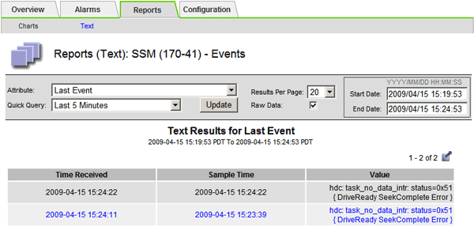

= Monitoring von Ereignissen
:allow-uri-read: 
:icons: font
:imagesdir: ../media/

[role="lead"]
Sie können Ereignisse überwachen, die von einem Grid-Node erkannt werden, einschließlich benutzerdefinierter Ereignisse, die Sie erstellt haben, um Ereignisse zu verfolgen, die auf dem Syslog-Server protokolliert werden. Die Meldung Letztes Ereignis, die im Grid Manager angezeigt wird, enthält weitere Informationen zum letzten Ereignis.

Ereignismeldungen werden auch in der Protokolldatei aufgelistet `/var/local/log/bycast-err.log`. Siehe link:logs-files-reference.html["Referenz für Protokolldateien"].

Der SMTT-Alarm (Total Events) kann wiederholt durch Probleme wie Netzwerkprobleme, Stromausfälle oder Upgrades ausgelöst werden. Dieser Abschnitt enthält Informationen zur Untersuchung von Ereignissen, sodass Sie besser verstehen können, warum diese Alarme aufgetreten sind. Wenn ein Ereignis aufgrund eines bekannten Problems aufgetreten ist, können die Ereigniszähler sicher zurückgesetzt werden.

.Schritte
. Überprüfen Sie die Systemereignisse für jeden Grid-Node:
+
.. Wählen Sie *SUPPORT* > *Tools* > *Grid-Topologie* aus.
.. Wählen Sie *_site_* > *_GRID Node_* > *SSM* > *Events* > *Übersicht* > *Main*.

. Erstellen Sie eine Liste früherer Ereignismeldungen, um Probleme zu isolieren, die in der Vergangenheit aufgetreten sind:
+
.. Wählen Sie *SUPPORT* > *Tools* > *Grid-Topologie* aus.
.. Wählen Sie *_site_* > *_GRID Node_* > *SSM* > *Events* > *Berichte* aus.
.. Wählen Sie *Text*.
+
Das Attribut *Letztes Ereignis* wird nicht im angezeigtlink:using-charts-and-reports.html["Diagrammansicht"]. So zeigen Sie es an:

.. Ändern Sie *Attribut* in *Letztes Ereignis*.
.. Wählen Sie optional einen Zeitraum für *Quick Query* aus.
.. Wählen Sie *Aktualisieren*.
+

== Erstellen benutzerdefinierter Syslog-Ereignisse

Benutzerdefinierte Ereignisse ermöglichen die Verfolgung aller Kernel-, Daemon-, Fehler- und kritischen Benutzerereignisse auf der Ebene, die beim Syslog-Server protokolliert werden. Ein benutzerdefiniertes Ereignis kann nützlich sein, um das Auftreten von Systemprotokollmeldungen zu überwachen (und damit Netzwerksicherheitsereignisse und Hardwarefehler).

.Über diese Aufgabe
Ziehen Sie in Betracht, benutzerdefinierte Ereignisse zu erstellen, um wiederkehrende Probleme zu überwachen. Die folgenden Überlegungen gelten für benutzerdefinierte Ereignisse.

* Nach der Erstellung eines benutzerdefinierten Ereignisses wird jeder Vorgang überwacht.
* Um ein benutzerdefiniertes Ereignis basierend auf Schlüsselwörtern in den Dateien zu erstellen `/var/local/log/messages`, müssen die Protokolle in diesen Dateien folgende sein:
+
** Vom Kernel generiert
** Wird vom Daemon oder vom Benutzerprogramm auf der Fehler- oder kritischen Ebene generiert

*Hinweis:* nicht alle Einträge in den `/var/local/log/messages` Dateien werden abgeglichen, es sei denn, sie erfüllen die oben genannten Anforderungen.

.Schritte
. Wählen Sie *SUPPORT* > *Alarme (alt)* > *Benutzerdefinierte Ereignisse*.
. Klicken Sie auf *Bearbeiten*  (oder *Einfügen*image:../media/icon_nms_insert.gif["Plus-Symbol"], wenn dies nicht das erste Ereignis ist).
. Geben Sie eine benutzerdefinierte Ereigniszeichenfolge ein, z. B. Herunterfahren
+
image::../media/custom_events.png[Screenshot mit der Eingabe benutzerdefinierter Ereigniszeichenfolge]

. Wählen Sie *Änderungen Anwenden*.
. Wählen Sie *SUPPORT* > *Tools* > *Grid-Topologie* aus.
. Wählen Sie *_Grid Node_* > *SSM* > *Events* aus.
. Suchen Sie den Eintrag für benutzerdefinierte Ereignisse in der Ereignistabelle, und überwachen Sie den Wert für *Zählung*.
+
Wenn die Anzahl erhöht wird, wird ein benutzerdefiniertes Ereignis, das Sie überwachen, auf diesem Grid-Node ausgelöst.

+
image::../media/custom_events_count.png[SSM > Ereignisse > Übersichtsseite]

== Setzen Sie die Anzahl der benutzerdefinierten Ereignisse auf Null zurück

Wenn Sie den Zähler nur für benutzerdefinierte Ereignisse zurücksetzen möchten, müssen Sie die Seite Grid Topology im Menü Support verwenden.

Beim Zurücksetzen eines Zählers wird der Alarm durch das nächste Ereignis ausgelöst. Wenn Sie einen Alarm quittieren, wird dieser Alarm dagegen nur erneut ausgelöst, wenn der nächste Schwellwert erreicht wird.

.Schritte
. Wählen Sie *SUPPORT* > *Tools* > *Grid-Topologie* aus.
. Wählen Sie *_Grid Node_* > *SSM* > *Events* > *Konfiguration* > *Main* aus.
. Aktivieren Sie das Kontrollkästchen *Zurücksetzen* für benutzerdefinierte Ereignisse.
+
image::../media/custom_events_reset.gif[Screenshot unter SSM > Ereignisse > Konfiguration > Main]

. Wählen Sie *Änderungen Anwenden*.

