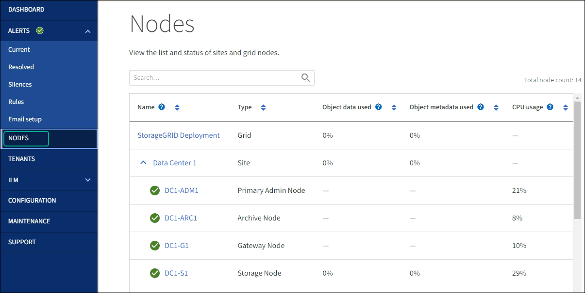

= Überwachen Sie Netzwerk- und Systemressourcen
:allow-uri-read: 
:icons: font
:imagesdir: ../media/

[role="lead"]
Die Integrität und Bandbreite des Netzwerks zwischen Knoten und Standorten sowie die Ressourcennutzung einzelner Grid-Nodes sind für einen effizienten Betrieb von entscheidender Bedeutung.

== Überwachen Sie Netzwerkverbindungen und Performance

Netzwerkkonnektivität und Bandbreite sind besonders wichtig, wenn Ihre Richtlinien für Information Lifecycle Management (ILM) replizierte Objekte zwischen Standorten kopieren oder Erasure Coding-codierte Objekte mit einem Schema speichern, das Site-Loss-Schutz bietet. Wenn das Netzwerk zwischen Standorten nicht verfügbar ist, die Netzwerklatenz zu hoch ist oder die Netzwerkbandbreite nicht ausreicht, können einige ILM-Regeln Objekte möglicherweise nicht an den erwarteten Stellen platzieren. Dies kann zu Aufnahmeausfällen (wenn die strikte Aufnahmeoption für ILM-Regeln ausgewählt wird) oder zu schlechter Aufnahme-Performance und ILM-Rückprotokollen führen.

Überwachen Sie die Konnektivität und die Netzwerk-Performance mit dem Grid Manager, damit Sie bei Problemen umgehend auf Probleme reagieren können.

Denken Sie darüber hinaus daranlink:../admin/managing-traffic-classification-policies.html["Erstellen von Klassifizierungsrichtlinien für den Netzwerkverkehr"], dass Sie den Datenverkehr zu bestimmten Mandanten, Buckets, Subnetzen oder Endpunkten des Load Balancer überwachen können. Sie können Richtlinien zur Begrenzung des Datenverkehrs nach Bedarf festlegen.

.Schritte
. Wählen Sie *KNOTEN*.
+
Die Seite Knoten wird angezeigt. Jeder Knoten im Raster wird im Tabellenformat aufgelistet.

+

. Wählen Sie den Grid-Namen, einen bestimmten Datacenter-Standort oder einen Grid-Node aus, und wählen Sie dann die Registerkarte *Netzwerk* aus.
+
Das Diagramm „Netzwerk-Traffic“ bietet eine Zusammenfassung des gesamten Netzwerkverkehr für das gesamte Grid, den Datacenter-Standort oder für den Node.

+
image::../media/nodes_page_network_traffic_graph.png[Knoten Seite Netzwerk Verkehr Diagramm]

+
.. Wenn Sie einen Rasterknoten ausgewählt haben, scrollen Sie nach unten, um den Abschnitt *Netzwerkschnittstellen* auf der Seite anzuzeigen.
+
image::../media/nodes_page_network_interfaces.png[Knoten Seite Netzwerkschnittstellen]

.. Blättern Sie bei Rasterknoten nach unten, um den Abschnitt *Netzwerkkommunikation* auf der Seite anzuzeigen.
+
Die Tabellen „Empfangen und Senden“ zeigen, wie viele Bytes und Pakete über jedes Netzwerk empfangen und gesendet wurden, sowie andere Empfangs- und Übertragungstabellen.

+
image::../media/nodes_page_network_communication.png[Knoten Seite Netzwerk Komm]

. Verwenden Sie die Metriken für Ihre Traffic-Klassifizierungsrichtlinien zur Überwachung des Netzwerkverkehrs.
+
.. Wählen Sie *CONFIGURATION* > *Network* > *traffic classification*.
+
Die Seite Richtlinien zur Klassifizierung von Verkehrsdaten wird angezeigt, und die vorhandenen Richtlinien sind in der Tabelle aufgeführt.

+
image::../media/traffic_classification_policies_main_screen_w_examples.png[Beispiel für eine Verkehrsrichtlinie für Grafik]

.. Um Diagramme anzuzeigen, die die mit einer Richtlinie verknüpften Netzwerkmetriken anzeigen, wählen Sie das Optionsfeld links neben der Richtlinie aus, und klicken Sie dann auf *Metriken*.
.. Überprüfen Sie die Diagramme, um den mit der Richtlinie verknüpften Netzwerkverkehr zu verstehen.
+
Wenn eine Richtlinie zur Klassifizierung von Verkehrsströmen darauf ausgelegt ist, den Netzwerkverkehr zu begrenzen, analysieren Sie, wie oft der Datenverkehr begrenzt ist, und entscheiden Sie, ob die Richtlinie Ihre Anforderungen weiterhin erfüllt. Von Zeit zu Zeit, link:../admin/managing-traffic-classification-policies.html["Passen Sie jede Richtlinie zur Verkehrsklassifizierung nach Bedarf an"].

.Verwandte Informationen
* link:viewing-network-tab.html["Zeigen Sie die Registerkarte Netzwerk an"]
* link:monitoring-system-health.html#monitor-node-connection-states["Überwachen Sie die Status der Node-Verbindung"]

== Monitoring von Ressourcen auf Node-Ebene

Überwachen Sie einzelne Grid-Nodes, um deren Ressourcenverbrauch zu prüfen. Sind Nodes konsistent überlastet, sind möglicherweise mehr Nodes erforderlich, um einen effizienten Betrieb zu gewährleisten.

.Schritte
. Wählen Sie auf der Seite *NODES* den Knoten aus.
. Wählen Sie die Registerkarte *Hardware* aus, um Grafiken der CPU-Auslastung und der Speicherauslastung anzuzeigen.
+
image::../media/nodes_page_hardware_tab_graphs.png[Registerkarte Knoten Hardware]

. Um ein anderes Zeitintervall anzuzeigen, wählen Sie eines der Steuerelemente oberhalb des Diagramms oder Diagramms aus. Sie können die verfügbaren Informationen für Intervalle von 1 Stunde, 1 Tag, 1 Woche oder 1 Monat anzeigen. Sie können auch ein benutzerdefiniertes Intervall festlegen, mit dem Sie Datum und Zeitbereiche festlegen können.
. Wenn der Node auf einer Storage Appliance oder einer Services Appliance gehostet wird, scrollen Sie nach unten, um die Komponententabellen anzuzeigen. Der Status aller Komponenten sollte „nominal“ lauten. Untersuchen Sie Komponenten, die einen anderen Status haben.

.Verwandte Informationen
* link:viewing-hardware-tab.html#view-information-about-appliance-storage-nodes["Zeigen Sie Informationen zu Appliance Storage Nodes an"]
* link:viewing-hardware-tab.html#view-information-about-appliance-admin-nodes-and-gateway-nodes["Zeigen Sie Informationen zu Appliance Admin Nodes und Gateway Nodes an"]

