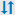

= Systemzustand überwachen
:allow-uri-read: 
:icons: font
:imagesdir: ../media/

[role="lead"]
Überwachen Sie täglich den Gesamtzustand Ihres StorageGRID Systems.

.Über diese Aufgabe
Das StorageGRID System kann weiter betrieben werden, wenn Teile des Grids nicht verfügbar sind. Potenzielle Probleme, die durch Warnmeldungen angezeigt werden, sind nicht unbedingt Probleme mit dem Systembetrieb. Untersuchen Sie die auf der Statuskarte „Systemzustand“ des Grid Manager-Dashboards zusammengefassten Probleme.

Um Benachrichtigungen zu erhalten, sobald sie ausgelöst werden, können Sie https://docs.netapp.com/us-en/storagegrid-appliances/installconfig/setting-up-email-notifications-for-alerts.html["Richten Sie E-Mail-Benachrichtigungen für Warnmeldungen ein"^] oder link:using-snmp-monitoring.html["Konfigurieren Sie SNMP-Traps"].

image::../media/health_status_card.png[Zustandskarte – Dashboard]

Wenn Probleme bestehen, werden Links angezeigt, mit denen Sie weitere Details anzeigen können:

[cols="1a,2a"]
|===
| Verlinken | Wird angezeigt, wenn... 

 a| 
Grid-Details
 a| 
Alle Knoten sind getrennt (Verbindungsstatus Unbekannt oder Administrativ inaktiv).

 a| 
Aktuelle Warnmeldungen (kritisch, Haupt, Nebenfach)
 a| 
Warnungen sind <<Anzeige aktueller und aufgelöster Warnmeldungen,Derzeit aktiv>>.

 a| 
Kürzlich behobene Warnmeldungen
 a| 
In der vergangenen Woche ausgelöste Alarme <<Anzeige aktueller und aufgelöster Warnmeldungen,Jetzt behoben>>.

 a| 
Lizenz
 a| 
Es liegt ein Problem mit der Softwarelizenz für dieses StorageGRID-System vor. Sie können link:../admin/updating-storagegrid-license-information.html["Aktualisieren Sie die Lizenzinformationen nach Bedarf"].

|===

== Überwachen Sie die Status der Node-Verbindung

Wenn ein oder mehrere Nodes vom Grid getrennt werden, können kritische StorageGRID-Vorgänge beeinträchtigt werden. Überwachen Sie den Verbindungsstatus des Knotens, und beheben Sie alle Probleme umgehend.

[cols="1a,3a,3a"]
|===
| Symbol | Beschreibung | Handeln erforderlich 

 a| 
image:../media/icon_alarm_blue_unknown.png["Blaues Fragezeichen-Symbol"]
 a| 
*Nicht verbunden - Unbekannt*

Aus einem unbekannten Grund ist die Verbindung zu einem Node unterbrochen, oder Dienste auf dem Node wurden unerwartet heruntergefahren. Beispielsweise wird ein Service auf dem Node möglicherweise angehalten, oder der Node hat aufgrund eines Stromausfalls oder eines unerwarteten Ausfalls seine Netzwerkverbindung verloren.

Die Warnung * kann nicht mit Node* kommunizieren. Andere Warnmeldungen können ebenfalls aktiv sein.
 a| 
Erfordert sofortige Aufmerksamkeit. <<Anzeige aktueller und aufgelöster Warnmeldungen,Wählen Sie jede Warnmeldung aus>> Und befolgen Sie die empfohlenen Maßnahmen.

Beispielsweise müssen Sie einen Dienst neu starten, der angehalten wurde, oder den Host für den Node neu starten.

*Hinweis*: Ein Knoten kann während des verwalteten Herunterfahrens als Unbekannt erscheinen. In diesen Fällen können Sie den Status Unbekannt ignorieren.

 a| 
image:../media/icon_alarm_gray_administratively_down.png["Graues Fragensymbol"]
 a| 
*Nicht verbunden - Administrativ unten*

Aus einem erwarteten Grund ist der Node nicht mit dem Grid verbunden.

Beispielsweise wurde der Node oder die Services für den Node ordnungsgemäß heruntergefahren, der Node neu gebootet oder die Software wird aktualisiert. Mindestens ein Alarm ist möglicherweise auch aktiv.

Aufgrund des zugrunde liegenden Problems sind diese Nodes oft ohne Eingriff wieder online.
 a| 
Ermitteln Sie, ob Warnmeldungen Auswirkungen auf diesen Node haben.

Wenn eine oder mehrere Warnungen aktiv sind, <<Anzeige aktueller und aufgelöster Warnmeldungen,Wählen Sie jede Warnmeldung aus>> und befolgen Sie die empfohlenen Maßnahmen.

 a| 
image:../media/icon_alert_green_checkmark.png["Symbol Warnung grünes Häkchen"]
 a| 
* Verbunden*

Der Knoten ist mit dem Raster verbunden.
 a| 
Keine Aktion erforderlich.

|===

== Anzeige aktueller und aufgelöster Warnmeldungen

*Aktuelle Alarme*: Wenn ein Alarm ausgelöst wird, wird ein Warnsymbol auf dem Dashboard angezeigt. Auf der Seite Knoten wird auch ein Warnungssymbol für den Knoten angezeigt. Wenn link:email-alert-notifications.html["Benachrichtigungen für Warnmeldungen sind konfiguriert"], wird auch eine E-Mail-Benachrichtigung gesendet, es sei denn, die Benachrichtigung wurde stummgeschaltet.

*Aufgelöste Warnungen*: Sie können einen Verlauf von Warnungen suchen und anzeigen, die behoben wurden.

Optional haben Sie das Video angesehen:

.Übersicht über Warnungen
video::2eea81c5-8323-417f-b0a0-b1ff008506c1[panopto]
In der folgenden Tabelle werden die im Grid Manager angezeigten Informationen zu aktuellen und behobenen Warnmeldungen beschrieben.

[cols="1a,3a"]
|===
| Spaltenüberschrift | Beschreibung 

 a| 
Name oder Titel
 a| 
Der Name der Warnmeldung und deren Beschreibung.

 a| 
Schweregrad
 a| 
Der Schweregrad der Meldung. Wenn bei aktuellen Warnmeldungen mehrere Warnmeldungen gruppiert werden, zeigt die Titelzeile an, wie viele Instanzen dieser Warnmeldung bei jedem Schweregrad auftreten.

image:../media/icon_alert_red_critical.png["Symbol Warnung Rot Kritisch"] *Kritisch*: Es existiert eine anormale Bedingung, die den normalen Betrieb eines StorageGRID-Knotens oder -Dienstes gestoppt hat. Sie müssen das zugrunde liegende Problem sofort lösen. Wenn das Problem nicht behoben ist, kann es zu Serviceunterbrechungen und Datenverlusten kommen.

image:../media/icon_alert_orange_major.png["Icon Alert Orange Major"] *Major*: Es gibt einen anormalen Zustand, der entweder den aktuellen Betrieb beeinträchtigt oder sich dem Schwellenwert für einen kritischen Alarm nähert. Sie sollten größere Warnmeldungen untersuchen und alle zugrunde liegenden Probleme beheben, um sicherzustellen, dass die anormale Bedingung den normalen Betrieb eines StorageGRID Node oder Service nicht beendet.

image:../media/icon_alert_yellow_minor.png["Symbol Alarm Gelb Minor"] *Minor*: Das System funktioniert normal, aber es gibt einen ungewöhnlichen Zustand, der die Fähigkeit des Systems beeinflussen könnte, wenn es weitergeht. Sie sollten kleinere Warnmeldungen überwachen und beheben, die nicht von selbst geklärt werden, um sicherzustellen, dass sie nicht zu einem schwerwiegenderen Problem führen.

 a| 
Auslösezeit
 a| 
*Aktuelle Alarme*: Das Datum und die Uhrzeit, zu der der Alarm in Ihrer Ortszeit und in UTC ausgelöst wurde. Wenn mehrere Warnungen gruppiert sind, zeigt die Titelzeile Zeiten für die letzte Instanz der Warnmeldung (_neueste_) und die älteste Instanz der Warnmeldung (_älteste_) an.

*Resolved Alerts*: Wie lange ist es her, dass der Alarm ausgelöst wurde.

 a| 
Standort/Knoten
 a| 
Der Name des Standorts und des Knotens, an dem die Warnung auftritt oder aufgetreten ist.

 a| 
Status
 a| 
Gibt an, ob die Warnmeldung aktiv, stummgeschaltet oder behoben ist. Wenn mehrere Warnungen gruppiert sind und *Alle Alarme* in der Dropdown-Liste ausgewählt ist, zeigt die Titelzeile an, wie viele Instanzen dieser Warnung aktiv sind und wie viele Instanzen zum Schweigen gebracht wurden.

 a| 
Behobene Zeit (nur behobene Warnmeldungen)
 a| 
Wie lange zuvor wurde die Warnung behoben.

 a| 
Aktuelle Werte oder _Datenwerte_
 a| 
Der Wert der Metrik, der den Auslöser der Meldung verursacht hat. Für manche Warnmeldungen werden zusätzliche Werte angezeigt, die Ihnen helfen, die Warnmeldung zu verstehen und zu untersuchen. Die Werte für eine Meldung mit * Objekt-Datenspeicher* enthalten beispielsweise den Prozentsatz des verwendeten Festplattenspeichers, die Gesamtmenge des Speicherplatzes und die Menge des verwendeten Festplattenspeichers.

*Hinweis:* Wenn mehrere aktuelle Warnungen gruppiert werden, werden die aktuellen Werte nicht in der Titelzeile angezeigt.

 a| 
Ausgelöste Werte (nur gelöste Warnmeldungen)
 a| 
Der Wert der Metrik, der den Auslöser der Meldung verursacht hat. Für manche Warnmeldungen werden zusätzliche Werte angezeigt, die Ihnen helfen, die Warnmeldung zu verstehen und zu untersuchen. Die Werte für eine Meldung mit * Objekt-Datenspeicher* enthalten beispielsweise den Prozentsatz des verwendeten Festplattenspeichers, die Gesamtmenge des Speicherplatzes und die Menge des verwendeten Festplattenspeichers.

|===
.Schritte
. Wählen Sie den Link *Aktuelle Alarme* oder *gelöste Warnmeldungen* aus, um eine Liste der Warnungen in diesen Kategorien anzuzeigen. Sie können die Details für eine Warnmeldung auch anzeigen, indem Sie *Nodes* > *_Node_* > *Übersicht* auswählen und dann die Warnmeldung aus der Tabelle Alerts auswählen.
+
Standardmäßig werden aktuelle Warnmeldungen wie folgt angezeigt:

+
** Die zuletzt ausgelösten Warnmeldungen werden zuerst angezeigt.
** Mehrere Warnmeldungen desselben Typs werden als Gruppe angezeigt.
** Alarme, die stummgeschaltet wurden, werden nicht angezeigt.
** Wenn für eine bestimmte Warnmeldung auf einem bestimmten Node die Schwellenwerte für mehr als einen Schweregrad erreicht werden, wird nur die schwerste Warnmeldung angezeigt. Wenn also Alarmschwellenwerte für kleinere, größere und kritische Schweregrade erreicht werden, wird nur die kritische Warnung angezeigt.
+
Die Seite Aktuelle Warnmeldungen wird alle zwei Minuten aktualisiert.

. Wählen Sie zum erweitern von Warengruppen das Menü ausimage:../media/icon_alert_caret_down.png["Nach unten fahrlässiges Symbol"]. Um einzelne Warnungen in einer Gruppe auszublenden, wählen Sie das up-Caret ausimage:../media/icon_alert_caret_up.png["Nach-oben-Symbol"], oder wählen Sie den Namen der Gruppe aus.
. Um einzelne Warnungen anstelle von Warengruppen anzuzeigen, deaktivieren Sie das Kontrollkästchen *Gruppenwarnungen*.
. Um aktuelle Warnmeldungen oder Warnungsgruppen zu sortieren, wählen Sie die nach-oben-/nach-unten-Pfeile  in jeder Spaltenüberschrift aus.
+
** Wenn *Group Alerts* ausgewählt ist, werden sowohl die Warnungsgruppen als auch die einzelnen Alarme innerhalb jeder Gruppe sortiert. Sie können beispielsweise die Warnungen in einer Gruppe nach *Zeit ausgelöst* sortieren, um die aktuellste Instanz eines bestimmten Alarms zu finden.
** Wenn *Group Alerts* gelöscht wird, wird die gesamte Liste der Alerts sortiert. Beispielsweise können Sie alle Warnungen nach *Node/Site* sortieren, um alle Warnungen anzuzeigen, die einen bestimmten Knoten betreffen.

. Um aktuelle Warnmeldungen nach Status (*Alle Alarme*, *aktiv* oder *quittiert*) zu filtern, verwenden Sie das Dropdown-Menü oben in der Tabelle.
+
Siehe link:silencing-alert-notifications.html["Benachrichtigung über Stille"].

. So sortieren Sie behobene Warnmeldungen:
+
** Wählen Sie im Dropdown-Menü *When Triggered* einen Zeitraum aus.
** Wählen Sie eine oder mehrere Schweregrade aus dem Dropdown-Menü *Schweregrad* aus.
** Wählen Sie im Dropdown-Menü *Warnregel* eine oder mehrere Standard- oder benutzerdefinierte Warnungsregeln aus, um nach aufgelösten Warnmeldungen zu filtern, die mit einer bestimmten Alarmregel zusammenhängen.
** Wählen Sie im Dropdown-Menü *Node* einen oder mehrere Knoten aus, um nach aufgelösten Warnmeldungen zu filtern, die mit einem bestimmten Knoten verbunden sind.

. Um Details für eine bestimmte Warnmeldung anzuzeigen, wählen Sie die Warnmeldung aus. Ein Dialogfeld enthält Details und empfohlene Aktionen für die ausgewählte Warnmeldung.
. (Optional) Wählen Sie für einen bestimmten Alarm die Option Diese Warnung stummschalten, um die Alarmregel, die diese Warnung ausgelöst hat, stummzuschalten.
+
Sie müssen über den verfügenlink:../admin/admin-group-permissions.html["Managen von Warnmeldungen oder Root-Zugriffsberechtigungen"], um eine Warnungsregel stumm zu schalten.

+

CAUTION: Seien Sie vorsichtig, wenn Sie sich entscheiden, eine Alarmregel zu stummzuschalten. Wenn eine Alarmregel stumm geschaltet ist, können Sie ein zugrunde liegendes Problem möglicherweise erst erkennen, wenn ein kritischer Vorgang abgeschlossen wird.

. So zeigen Sie die aktuellen Bedingungen für die Meldungsregel an:
+
.. Wählen Sie aus den Warnungsdetails *Bedingungen anzeigen*.
+
Es wird ein Popup-Fenster mit dem Prometheus-Ausdruck für jeden definierten Schweregrad angezeigt.

.. Um das Popup-Fenster zu schließen, klicken Sie außerhalb des Popup-Dialogfenster auf eine beliebige Stelle.

. Wählen Sie optional *Regel bearbeiten*, um die Warnungsregel zu bearbeiten, die diese Warnung ausgelöst hat.
+
Sie müssen über den verfügenlink:../admin/admin-group-permissions.html["Managen von Warnmeldungen oder Root-Zugriffsberechtigungen"], um eine Warnungsregel zu bearbeiten.

+

CAUTION: Seien Sie vorsichtig, wenn Sie sich entscheiden, eine Warnungsregel zu bearbeiten. Wenn Sie die Triggerwerte ändern, können Sie möglicherweise ein zugrunde liegendes Problem erst erkennen, wenn ein kritischer Vorgang nicht abgeschlossen werden kann.

. Um die Alarmdetails zu schließen, wählen Sie *Schließen*.

