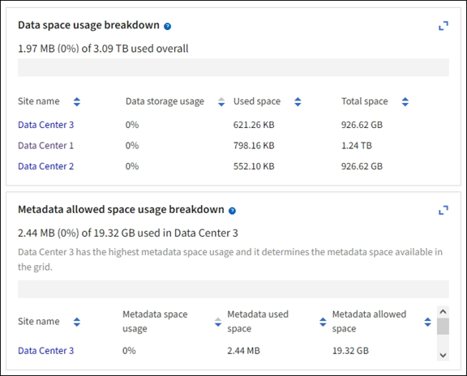
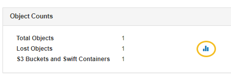

= Verwenden Sie Diagramme und Diagramme
:allow-uri-read: 
:icons: font
:imagesdir: ../media/

[role="lead"]
Mithilfe von Diagrammen und Berichten lässt sich der Zustand des StorageGRID Systems überwachen und Probleme beheben.

NOTE: Der Grid Manager wird mit jeder Version aktualisiert und stimmt möglicherweise nicht mit den Beispielbildern auf dieser Seite überein.

== Diagrammtypen

Diagramme und Diagramme fassen die Werte bestimmter StorageGRID-Metriken und -Attribute zusammen.

Das Grid Manager-Dashboard enthält Karten, die den verfügbaren Speicher für das Grid und jeden Standort zusammenfassen.

Im Fenster Storage Usage im Tenant Manager-Dashboard werden folgende Informationen angezeigt:

* Eine Liste der größten Buckets (S3) oder Container (Swift) für die Mandanten
* Ein Balkendiagramm, das die relative Größe der größten Buckets oder Container darstellt
* Der insgesamt verwendete Speicherplatz und, wenn ein Kontingent festgelegt ist, die Menge und der Prozentsatz des verbleibenden Speicherplatzes

image::../media/tenant_dashboard_with_buckets.png[Mandanten-Dashboard]

Darüber hinaus stehen Diagramme zur Verfügung, die zeigen, wie sich StorageGRID-Metriken und -Attribute im Laufe der Zeit ändern, auf der Seite Knoten und auf der Seite *UNTERSTÜTZUNG* > *Tools* > *Grid-Topologie*.

Es gibt vier Arten von Diagrammen:

* *Grafana-Diagramme*: Auf der Seite Knoten werden Grafana-Diagramme verwendet, um die Werte der Prometheus-Kennzahlen im Laufe der Zeit zu zeichnen. Die Registerkarte *NODES* > *Netzwerk* für einen Storage Node enthält beispielsweise ein Grafana-Diagramm für den Netzwerk-Traffic.
+
image::../media/nodes_page_network_tab.png[Registerkarte Knoten Netzwerk]

+

NOTE: Grafana-Diagramme sind auch auf den vorkonfigurierten Dashboards enthalten, die auf der Seite *UNTERSTÜTZUNG* > *Tools* > *Metriken* verfügbar sind.

* *Liniendiagramme*: Verfügbar auf der Seite Knoten und auf der Seite *SUPPORT* > *Extras* > *Gittertopologie* (wählen Sie das Diagrammsymbol  nach einem Datenwert) werden Liniendiagramme image:../media/icon_chart_new_for_11_5.png["Symboldiagramm (Neu)"]verwendet, um die Werte von StorageGRID-Attributen zu zeichnen, die einen Einheitenwert haben (wie z.B. NTP-Frequenzversatz in ppm). Die Wertänderungen werden im Laufe der Zeit in regelmäßigen Datenintervallen (Bins) dargestellt.
+
image::../media/line_graph.gif[Liniendiagramm]

* *Flächendiagramme*: Verfügbar auf der Seite Knoten und auf der Seite *SUPPORT* > *Tools* > *Gittertopologie* (wählen Sie das Diagrammsymbol  nach einem Datenwert) werden Flächendiagramme image:../media/icon_chart_new_for_11_5.png["Symboldiagramm (Neu)"]verwendet, um volumetrische Attributmengen, wie z.B. Objektanzahl oder Service-Lastwerte, zu zeichnen. Die Flächendiagramme ähneln den Liniendiagrammen, enthalten jedoch eine hellbraune Schattierung unter der Linie. Die Wertänderungen werden im Laufe der Zeit in regelmäßigen Datenintervallen (Bins) dargestellt.
+
image::../media/area_graph.gif[Flächendiagramm]

* Einige Diagramme sind mit einem anderen Diagrammsymbol gekennzeichnet image:../media/icon_chart_new_for_11_5.png["Diagrammsymbol"]und haben ein anderes Format:
+
image::../media/charts_lost_object_detected.png[Diagramme Verlorenes Objekt Erkannt]

* *Statusdiagramm*: Verfügbar auf der Seite *SUPPORT* > *Tools* > *Gittertopologie* (wählen Sie das Diagrammsymbol image:../media/icon_chart_new_for_11_5.png["Symboldiagramm (Neu)"] nach einem Datenwert) werden Statusdiagramme verwendet, um Attributwerte zu zeichnen, die unterschiedliche Zustände darstellen, z. B. einen Dienststatus, der online, Standby oder offline sein kann. Statusdiagramme sind ähnlich wie Liniendiagramme, aber der Übergang ist ununterbrochen, d. h. der Wert springt von einem Statuswert zum anderen.
+
image::../media/state_graph.gif[Statusdiagramm]

.Verwandte Informationen
* link:viewing-nodes-page.html["Zeigen Sie die Seite Knoten an"]
* link:viewing-grid-topology-tree.html["Sehen Sie sich den Baum der Grid Topology an"]
* link:reviewing-support-metrics.html["Prüfen von Support-Kennzahlen"]

== Diagrammlegende

Die Linien und Farben, die zum Zeichnen von Diagrammen verwendet werden, haben eine besondere Bedeutung.

[cols="1a,3a"]
|===
| Beispiel | Bedeutung 

 a| 
image:../media/dark_green_chart_line.gif["Screenshot mit dunkelgrüner Linie"]
 a| 
Gemeldete Attributwerte werden mit dunkelgrünen Linien dargestellt.

 a| 
image:../media/light_green_chart_line.gif["Screenshot mit Schattierung, die auf das Datenverdünnen hinweist"]
 a| 
Hellgrüne Schattierungen um dunkelgrüne Linien zeigen an, dass die tatsächlichen Werte in diesem Zeitbereich variieren und für eine schnellere Darstellung „binniert“ wurden. Die dunkle Linie stellt den gewichteten Durchschnitt dar. Der Bereich in hellgrün zeigt die maximalen und minimalen Werte innerhalb des Fachs an. Für Flächendiagramme wird ein hellbrauner Schattierung verwendet, um volumetrische Daten anzuzeigen.

 a| 
image:../media/no_data_plotted_chart.gif["Screenshot mit leeren Bereichen auf der Plotzeile"]
 a| 
Leere Bereiche (keine Daten dargestellt) zeigen an, dass die Attributwerte nicht verfügbar waren. Der Hintergrund kann blau, grau oder eine Mischung aus grau und blau sein, je nach Status des Dienstes, der das Attribut meldet.

 a| 
image:../media/light_blue_chart_shading.gif["Screenshot mit hellblauer Schattierung, die auf unbestimmte Werte hinweist"]
 a| 
Hellblaue Schattierung zeigt an, dass einige oder alle Attributwerte zu diesem Zeitpunkt unbestimmt waren; das Attribut war keine Meldung von Werten, da der Dienst sich in einem unbekannten Zustand befand.

 a| 
image:../media/gray_chart_shading.gif["Screenshot mit grauem Schattierung aufgrund unbekannter Werte"]
 a| 
Graue Schattierung zeigt an, dass einige oder alle Attributwerte zu diesem Zeitpunkt nicht bekannt waren, da der Dienst, der die Attribute meldet, administrativ herabgesetzt war.

 a| 
image:../media/gray_blue_chart_shading.gif["Screenshot mit einer Mischung aus unbestimmten und unbekannten Werten"]
 a| 
Eine Mischung aus grauem und blauem Schatten zeigt an, dass einige der Attributwerte zu diesem Zeitpunkt unbestimmt waren (weil der Dienst sich in einem unbekannten Zustand befand), während andere nicht bekannt waren, weil der Dienst, der die Attribute meldet, administrativ nach unten lag.

|===

== Zeigen Sie Diagramme und Diagramme an

Die Seite Nodes enthält die Diagramme und Diagramme, auf die Sie regelmäßig zugreifen sollten, um Attribute wie Speicherkapazität und Durchsatz zu überwachen. In einigen Fällen, vor allem bei der Arbeit mit technischem Support, können Sie die Seite *SUPPORT* > *Tools* > *Grid Topology* verwenden, um auf zusätzliche Diagramme zuzugreifen.

.Bevor Sie beginnen
Sie müssen im Grid-Manager mit einem angemeldet seinlink:../admin/web-browser-requirements.html["Unterstützter Webbrowser"].

.Schritte
. Wählen Sie *KNOTEN*. Wählen Sie dann einen Knoten, einen Standort oder das gesamte Raster aus.
. Wählen Sie die Registerkarte aus, auf der Informationen angezeigt werden sollen.
+
Einige Registerkarten enthalten eine oder mehrere Grafana-Diagramme, mit denen die Werte der Prometheus-Kennzahlen im Laufe der Zeit dargestellt werden. Die Registerkarte *NODES* > *Hardware* für einen Knoten enthält beispielsweise zwei Grafana-Diagramme.

+
image::../media/nodes_page_hardware_tab_graphs.png[Registerkarte „Knoten“ – Grafiken Auf Der Hardware-Registerkarte]

. Setzen Sie den Cursor optional auf das Diagramm, um detailliertere Werte für einen bestimmten Zeitpunkt anzuzeigen.
+
image::../media/nodes_page_memory_usage_details.png[Details Zur Verwendung Von Knotenpunkten Für Die Speicherseite]

. Bei Bedarf können Sie oft ein Diagramm für ein bestimmtes Attribut oder eine bestimmte Metrik anzeigen. Wählen Sie in der Tabelle auf der Seite Knoten das Diagrammsymbol rechts neben dem Attributnamen ausimage:../media/icon_chart_new_for_11_5.png["Diagrammsymbol"].
+

NOTE: Diagramme sind nicht für alle Metriken und Attribute verfügbar.

+
*Beispiel 1*: Auf der Registerkarte Objekte eines Storage Node können Sie das Diagramm-Symbol auswählenimage:../media/icon_chart_new_for_11_5.png["Diagrammsymbol"], um die Gesamtzahl der erfolgreichen Metadaten-Speicherabfragen für den Storage Node anzuzeigen.

+
image::../media/nodes_page_objects_successful_metadata_queries.png[Erfolgreiche Metadatenabfragen]

+
image::../media/nodes_page-objects_chart_successful_metadata_queries.png[Zeigt Erfolgreiche Metadatenabfragen An]

+
*Beispiel 2*: Auf der Registerkarte Objekte eines Storage Node können Sie das Diagramm-Symbol auswählenimage:../media/icon_chart_new_for_11_5.png["Diagrammsymbol"], um die Grafana-Grafik der Anzahl der verlorenen Objekte zu sehen, die im Laufe der Zeit erkannt wurden.

+

+
image::../media/charts_lost_object_detected.png[Diagramme Verlorenes Objekt Erkannt]

. Um Diagramme für Attribute anzuzeigen, die nicht auf der Seite Knoten angezeigt werden, wählen Sie *SUPPORT* > *Tools* > *Grid-Topologie*.
. Wählen Sie *_Grid Node_* > *_Component oder Service_* > *Übersicht* > *Main* aus.
+
image::../media/nms_chart.gif[Screenshot, der durch umgebenden Text beschrieben wird]

. Wählen Sie das Diagrammsymbol image:../media/icon_chart_new_for_11_5.png["Diagrammsymbol"] neben dem Attribut aus.
+
Das Display wechselt automatisch zur Seite *Berichte* > *Diagramme*. Das Diagramm zeigt die Daten des Attributs über den letzten Tag an.

== Diagramme generieren

Diagramme zeigen eine grafische Darstellung der Attributdatenwerte an. Die Berichte können an Datacenter-Standorten, Grid-Node, Komponenten oder Service erstellt werden.

.Bevor Sie beginnen
* Sie müssen im Grid-Manager mit einem angemeldet seinlink:../admin/web-browser-requirements.html["Unterstützter Webbrowser"].
* Sie haben link:../admin/admin-group-permissions.html["Bestimmte Zugriffsberechtigungen"].

.Schritte
. Wählen Sie *SUPPORT* > *Tools* > *Grid-Topologie* aus.
. Wählen Sie *_Grid Node_* > *_Component oder Service_* > *Berichte* > *Diagramme* aus.
. Wählen Sie das Attribut aus der Dropdown-Liste *Attribut* aus, für das ein Bericht erstellt werden soll.
. Um den Start der Y-Achse bei Null zu erzwingen, deaktivieren Sie das Kontrollkästchen *Vertikale Skalierung*.
. Um Werte mit voller Genauigkeit anzuzeigen, aktivieren Sie das Kontrollkästchen *Rohdaten* oder um Werte auf maximal drei Dezimalstellen zu runden (z. B. für als Prozentsätze gemeldete Attribute), deaktivieren Sie das Kontrollkästchen *Rohdaten*.
. Wählen Sie den Zeitraum aus der Dropdown-Liste *Quick Query* aus, für den Sie einen Bericht erstellen möchten.
+
Wählen Sie die Option Benutzerdefinierte Abfrage aus, um einen bestimmten Zeitbereich auszuwählen.

+
Das Diagramm erscheint nach wenigen Augenblicken. Lassen Sie mehrere Minuten für die Tabulierung von langen Zeitbereichen.

. Wenn Sie Benutzerdefinierte Abfrage ausgewählt haben, passen Sie den Zeitraum für das Diagramm an, indem Sie die Optionen *Startdatum* und *Enddatum* eingeben.
+
Verwenden Sie das Format `_YYYY/MM/DDHH:MM:SS_` in Ortszeit. Führende Nullen sind für das Format erforderlich. Beispiel: 2017/4/6 7:30:00 schlägt die Validierung fehl. Das richtige Format ist: 2017/04/06 07:30:00.

. Wählen Sie *Aktualisieren*.
+
Nach einigen Sekunden wird ein Diagramm erzeugt. Lassen Sie mehrere Minuten für die Tabulierung von langen Zeitbereichen. Abhängig von der für die Abfrage festgelegten Dauer wird entweder ein RAW-Textbericht oder ein aggregierter Textbericht angezeigt.

