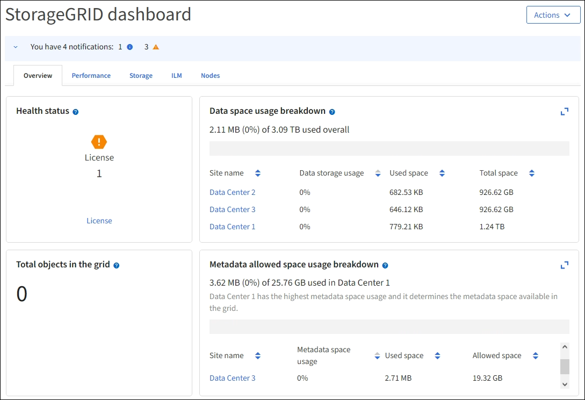

= Das Dashboard anzeigen und verwalten
:allow-uri-read: 
:icons: font
:imagesdir: ../media/

[role="lead"]
Über das Dashboard können Sie Systemaktivitäten auf einen Blick überwachen. Sie können benutzerdefinierte Dashboards erstellen, um die Implementierung von StorageGRID zu überwachen.

TIP: Um die Einheiten für die im Grid-Manager angezeigten Speicherwerte zu ändern, wählen Sie das Benutzer-Dropdown oben rechts im Grid-Manager aus, und wählen Sie dann *Benutzereinstellungen* aus.

Ihr Dashboard kann je nach Systemkonfiguration unterschiedlich sein.

== Dashboard anzeigen

Die Konsole besteht aus Registerkarten mit spezifischen Informationen zum StorageGRID System. Jede Registerkarte enthält Informationskategorien, die auf Karten angezeigt werden.

Sie können das vom System bereitgestellte Dashboard wie dargestellt verwenden. Außerdem können Sie benutzerdefinierte Dashboards erstellen, die nur die Registerkarten und Karten enthalten, die für die Überwachung Ihrer Implementierung von StorageGRID relevant sind.

Die vom System bereitgestellten Dashboard-Registerkarten enthalten Karten mit den folgenden Informationstypen:

[cols="1a,3a"]
|===
| Im vom System bereitgestellten Dashboard | Enthält 

 a| 
Überblick
 a| 
Allgemeine Informationen über das Raster, wie aktive Warnmeldungen, Speicherplatznutzung und Gesamtobjekte in der Tabelle.

 a| 
Performance
 a| 
Speichernutzung, verwendeter Storage im Zeitverlauf, S3-Vorgänge, Anfragedauer, Fehlerrate.

 a| 
Storage
 a| 
Nutzung von Mandantenkontingenten und logischer Speicherplatznutzung. Prognosen zur Speicherplatznutzung für Benutzerdaten und Metadaten.

 a| 
ILM
 a| 
Information Lifecycle Management-Warteschlange und Evaluierungsrate.

 a| 
Knoten
 a| 
CPU-, Daten- und Arbeitsspeicherverbrauch pro Node S3-Vorgänge pro Node. Verteilung von Knoten zu Standort.

|===
Einige der Karten können für eine einfachere Anzeige maximiert werden. Wählen Sie das Symbol Maximieren image:../media/icon_dashboard_card_maximize.png["Symbol maximieren"]in der oberen rechten Ecke der Karte. Um eine maximierte Karte zu schließen, wählen Sie das Minimieren-Symbol image:../media/icon_dashboard_card_minimize.png["Symbol minimieren"] oder wählen *Schließen*.

== Managen von Dashboards

Wenn Sie Root-Zugriff haben (siehe link:../admin/admin-group-permissions.html["Berechtigungen für Admin-Gruppen"]), können Sie die folgenden Verwaltungsaufgaben für Dashboards ausführen:

* Erstellen Sie ein benutzerdefiniertes Dashboard von Grund auf. Sie können benutzerdefinierte Dashboards verwenden, um zu steuern, welche StorageGRID-Informationen angezeigt werden und wie diese Informationen organisiert sind.
* Klonen Sie ein Dashboard zur Erstellung benutzerdefinierter Dashboards.
* Legen Sie ein aktives Dashboard für einen Benutzer fest. Das aktive Dashboard kann entweder das vom System bereitgestellte Dashboard oder ein benutzerdefiniertes Dashboard sein.
* Legen Sie ein Standard-Dashboard fest, das allen Benutzern angezeigt wird, es sei denn, sie aktivieren ihr eigenes Dashboard.
* Bearbeiten Sie einen Dashboard-Namen.
* Bearbeiten Sie ein Dashboard, um Registerkarten und Karten hinzuzufügen oder zu entfernen. Sie können mindestens 1 und maximal 20 Registerkarten haben.
* Entfernen Sie ein Dashboard.

NOTE: Wenn Sie neben dem Root-Zugriff über eine andere Berechtigung verfügen, können Sie nur ein aktives Dashboard einrichten.

Um Dashboards zu verwalten, wählen Sie *actions* > *Manage Dashboards*.

image::../media/dashboard_manage.png[Managen von Dashboards]

== Dashboards konfigurieren

Um ein neues Dashboard durch Klonen des aktiven Dashboards zu erstellen, wählen Sie *actions* > *Clone Active Dashboard*.

Um ein vorhandenes Dashboard zu bearbeiten oder zu klonen, wählen Sie *actions* > *Manage Dashboards*.

NOTE: Das vom System bereitgestellte Dashboard kann nicht bearbeitet oder entfernt werden.

Folgende Möglichkeiten stehen beim Konfigurieren eines Dashboards zur Verfügung:

* Registerkarten hinzufügen oder entfernen
* Benennen Sie die Registerkarten um und geben Sie neue eindeutige Namen
* Karten für jede Registerkarte hinzufügen, entfernen oder neu anordnen (ziehen)
* Wählen Sie die Größe der einzelnen Karten aus, indem Sie oben auf der Karte *S*, *M*, *L* oder *XL* auswählen

image::../media/dashboard_configure.png[Dashboard konfigurieren]
