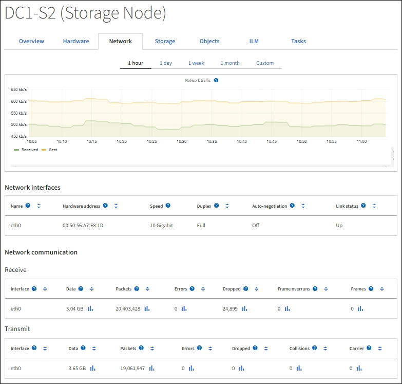

= Zeigen Sie die Registerkarte Netzwerk an
:allow-uri-read: 
:icons: font
:imagesdir: ../media/

[role="lead"]
Auf der Registerkarte Netzwerk wird ein Diagramm angezeigt, in dem der empfangene und gesendete Netzwerkdatenverkehr über alle Netzwerkschnittstellen auf dem Node, am Standort oder im Raster angezeigt wird.

Die Registerkarte Netzwerk wird für alle Nodes, jeden Standort und das gesamte Raster angezeigt.

Um ein anderes Zeitintervall anzuzeigen, wählen Sie eines der Steuerelemente oberhalb des Diagramms oder Diagramms aus. Sie können die verfügbaren Informationen für Intervalle von 1 Stunde, 1 Tag, 1 Woche oder 1 Monat anzeigen. Sie können auch ein benutzerdefiniertes Intervall festlegen, mit dem Sie Datum und Zeitbereiche festlegen können.

Für Nodes bietet die Tabelle Netzwerkschnittstellen Informationen zu den physischen Netzwerkports jedes Node. Die Netzwerkkommunikationstabelle enthält Details zu den Empfangs- und Übertragungsvorgängen jedes Knotens sowie alle vom Treiber gemeldeten Fehlerzähler.

.Verwandte Informationen
link:monitoring-network-connections-and-performance.html["Überwachen Sie Netzwerkverbindungen und Performance"]
