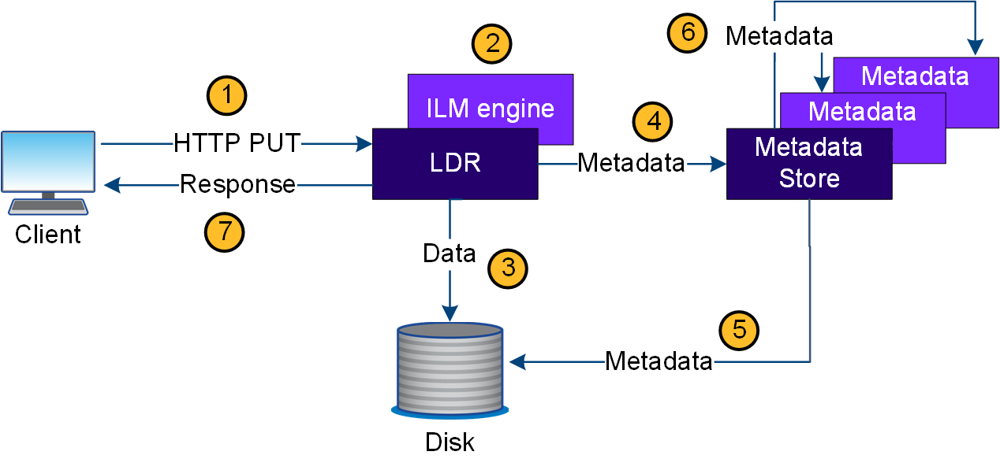

= Wie StorageGRID die Objektaufnahme handhabt
:allow-uri-read: 
:icons: font
:imagesdir: ../media/

[role="lead"]
Ein Aufnahme- oder Speichervorgang besteht aus einem definierten Datenfluss zwischen dem Client und dem StorageGRID System.

== Datenfluss

Wenn ein Client ein Objekt in das StorageGRID-System einspeist, verarbeitet der LDR-Service auf Storage-Nodes die Anforderung und speichert die Metadaten und Daten auf der Festplatte.

. Die Client-Applikation erstellt das Objekt und sendet es über eine HTTP PUT-Anforderung an das StorageGRID System.
. Das Objekt wird anhand der ILM-Richtlinie des Systems bewertet.
. Der LDR-Service speichert die Objektdaten als replizierte Kopie oder als Kopie, die zur Fehlerkorrektur codiert wurde. (Das Diagramm zeigt eine vereinfachte Version zum Speichern einer replizierten Kopie auf Festplatte.)
. Der LDR-Service sendet die Objektmetadaten an den Metadatenspeicher.
. Der Metadaten-Speicher speichert die Objekt-Metadaten auf der Festplatte.
. Der Metadatenspeicher überträgt Kopien von Objektmetadaten an andere Storage-Nodes. Diese Kopien werden auch auf der Festplatte gespeichert.
. Der LDR-Dienst gibt eine HTTP 200 OK-Antwort an den Client zurück, um zu bestätigen, dass das Objekt aufgenommen wurde.

