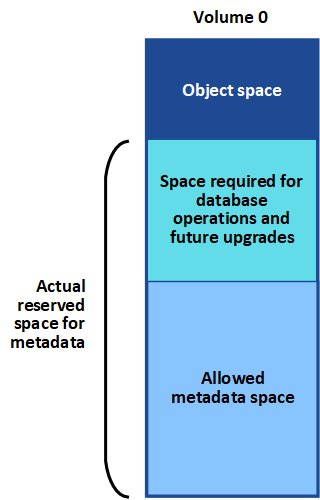

= Behebung von Metadatenproblemen
:allow-uri-read: 
:icons: font
:imagesdir: ../media/

[role="lead"]
Wenn Metadatenprobleme auftreten, werden Sie über die Ursache des Fehlers und über die empfohlenen Maßnahmen informiert. Sie müssen insbesondere neue Storage-Nodes hinzufügen, wenn die Warnmeldung zur Speicherung geringer Metadaten ausgelöst wird.

.Bevor Sie beginnen
Sie sind im Grid Manager mit einem angemeldetlink:../admin/web-browser-requirements.html["Unterstützter Webbrowser"].

.Über diese Aufgabe
Befolgen Sie die empfohlenen Aktionen für jede Metadatenbezogene Warnmeldung, die ausgelöst wird. Wenn die Warnung * Storage* mit niedrigen Metadaten ausgelöst wird, müssen Sie neue Storage-Nodes hinzufügen.

StorageGRID reserviert eine bestimmte Menge an Speicherplatz auf Volume 0 jedes Storage-Nodes für Objekt-Metadaten. Dieser als _actual reserved space_ bekannte Speicherplatz wird in den für Objektmetadaten erlaubten Speicherplatz (den erlaubten Metadatenraum) und den für wichtige Datenbankvorgänge wie Data-Compaction und Repair erforderlichen Speicherplatz unterteilt. Der zulässige Metadatenspeicherplatz bestimmt die gesamte Objektkapazität.

Wenn Objektmetadaten mehr als 100 % des für Metadaten zulässigen Speicherplatzes verbrauchen, können Datenbankvorgänge nicht effizient ausgeführt werden und es treten Fehler auf.

Sie können link:../monitor/monitoring-storage-capacity.html#monitor-object-metadata-capacity-for-each-storage-node["Überwachen der Objekt-Metadaten-Kapazität für jeden Storage Node"]Ihnen dabei helfen, Fehler vorherzusehen und zu korrigieren, bevor sie auftreten.

StorageGRID verwendet die folgende Prometheus Kennzahl, um den vollen Umfang des zulässigen Metadaten-Speicherplatzes zu messen:

[listing]
----
storagegrid_storage_utilization_metadata_bytes/storagegrid_storage_utilization_metadata_allowed_bytes
----
Wenn dieser Prometheus-Ausdruck bestimmte Schwellenwerte erreicht, wird die Warnung *Low Metadaten Storage* ausgelöst.

* *Minor*: Objektmetadaten verwenden 70% oder mehr des zulässigen Metadaten-Speicherplatzes. Sie sollten so bald wie möglich neue Storage-Nodes hinzufügen.
* *Major*: Objektmetadaten verwenden 90% oder mehr des zulässigen Metadaten-Speicherplatzes. Sie müssen sofort neue Storage-Nodes hinzufügen.
+

CAUTION: Wenn Objektmetadaten 90 % oder mehr des zulässigen Metadatenspeichers verwenden, wird eine Warnung im Dashboard angezeigt. Wenn diese Warnung angezeigt wird, müssen Sie sofort neue Speicherknoten hinzufügen. Es ist nicht zulässig, dass Objektmetadaten mehr als 100 % des zulässigen Speicherplatzes nutzen.

* *Kritisch*: Objektmetadaten verbrauchen 100% oder mehr des zulässigen Metadaten-Speicherplatzes und verbrauchen den für wichtige Datenbankvorgänge erforderlichen Speicherplatz. Sie müssen die Aufnahme neuer Objekte beenden und sofort neue Speicherknoten hinzufügen.

CAUTION: Wenn die Größe von Volume 0 kleiner ist als die Option „Metadatenreservierter Speicherplatz“ (z. B. in einer nicht-Produktionsumgebung), kann die Berechnung für die Warnmeldung * Low Metadaten Storage* fehlerhaft sein.

.Schritte
. Wählen Sie *ALERTS* > *Current*.
. Erweitern Sie, falls erforderlich, aus der Warnmeldungstabelle die Warnungsgruppe *Low-Metadaten-Speicher* und wählen Sie die spezifische Warnung aus, die Sie anzeigen möchten.
. Überprüfen Sie die Details im Dialogfeld „Warnung“.
. Wenn eine wichtige oder kritische Warnung für * Storage-Systeme mit niedrigen Metadaten* ausgelöst wurde, führen Sie eine Erweiterung durch, um Storage-Nodes sofort hinzuzufügen.
+

NOTE: Da StorageGRID komplette Kopien aller Objektmetadaten an jedem Standort speichert, wird die Metadaten-Kapazität des gesamten Grid durch die Metadaten-Kapazität des kleinsten Standorts begrenzt. Wenn Sie einem Standort Metadaten-Kapazität hinzufügen müssen, sollten Sie ebenfalls link:../expand/adding-grid-nodes-to-existing-site-or-adding-new-site.html["Erweitern Sie alle anderen Standorte"]die gleiche Anzahl von Storage-Nodes verwenden.

+
Nach der Erweiterung verteilt StorageGRID die vorhandenen Objekt-Metadaten neu auf die neuen Nodes, wodurch die allgemeine Metadaten des Grid erhöht werden. Es ist keine Benutzeraktion erforderlich. Die Warnung * Speicherung von niedrigen Metadaten* wird gelöscht.

