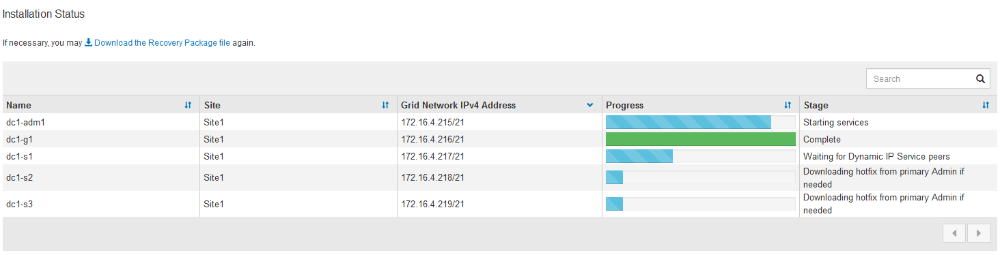

= Überprüfung der Konfiguration und vollständige Installation
:allow-uri-read: 
:icons: font
:imagesdir: ../media/

[role="lead"]
Sie müssen die von Ihnen eingegebenen Konfigurationsinformationen sorgfältig prüfen, um sicherzustellen, dass die Installation erfolgreich abgeschlossen wurde.

.Schritte
. Öffnen Sie die Seite *Übersicht*.
+
image::../media/11_gmi_installer_summary_page.gif[Die Seite mit der Übersicht zum Grid Manager Installer]

. Vergewissern Sie sich, dass alle Informationen zur Grid-Konfiguration korrekt sind. Verwenden Sie die Links zum Ändern auf der Seite Zusammenfassung, um zurück zu gehen und Fehler zu beheben.
. Klicken Sie Auf *Installieren*.
+

NOTE: Wenn ein Knoten für die Verwendung des Client-Netzwerks konfiguriert ist, wechselt das Standard-Gateway für diesen Knoten vom Grid-Netzwerk zum Client-Netzwerk, wenn Sie auf *Installieren* klicken. Wenn die Verbindung unterbrochen wird, müssen Sie sicherstellen, dass Sie über ein zugängliches Subnetz auf den primären Admin-Node zugreifen. Weitere Informationen finden Sie unter link:../network/index.html["Netzwerkrichtlinien"] .

. Klicken Sie Auf *Download Wiederherstellungspaket*.
+
Wenn die Installation bis zu dem Punkt fortschreitet, an dem die Rastertopologie definiert ist, werden Sie aufgefordert, die Wiederherstellungspaket-Datei herunterzuladen (`.zip`) und zu bestätigen, dass Sie erfolgreich auf den Inhalt dieser Datei zugreifen können. Sie müssen die Recovery Package-Datei herunterladen, damit Sie das StorageGRID-System wiederherstellen können, wenn ein oder mehrere Grid-Knoten ausfallen. Die Installation wird im Hintergrund fortgesetzt, aber Sie können die Installation nicht abschließen und erst auf das StorageGRID-System zugreifen, wenn Sie diese Datei herunterladen und überprüfen.

. Vergewissern Sie sich, dass Sie den Inhalt der Datei extrahieren und anschließend an zwei sicheren und separaten Speicherorten speichern können `.zip`.
+

CAUTION: Die Recovery Package-Datei muss gesichert sein, weil sie Verschlüsselungsschlüssel und Passwörter enthält, die zum Abrufen von Daten vom StorageGRID-System verwendet werden können.

. Aktivieren Sie das Kontrollkästchen *Ich habe die Wiederherstellungspaket-Datei erfolgreich heruntergeladen und verifiziert*, und klicken Sie auf *Weiter*.
+
Wenn die Installation noch läuft, wird die Statusseite angezeigt. Auf dieser Seite wird der Installationsfortschritt für jeden Grid-Knoten angezeigt.

+

+
Wenn die komplette Phase für alle Grid-Knoten erreicht ist, wird die Anmeldeseite für den Grid Manager angezeigt.

. Melden Sie sich beim Grid Manager mit dem „root“-Benutzer und dem Passwort an, das Sie während der Installation angegeben haben.

